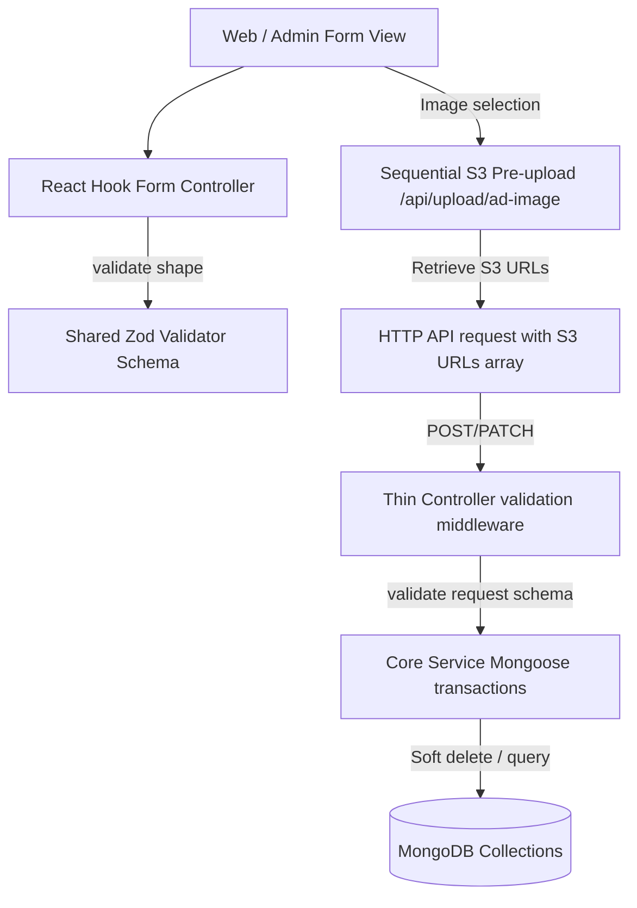

# Canonical Implementation Flows

This reference details the mandatory code execution flows across the Esparex platform. All new form submissions and service operations must adhere strictly to these architectural tracks.

---

## 1. Unified Listing Form Submission Flow

### Flow Execution Steps
1. **User enters data** in Web or Admin view portals.
2. **React Hook Form (RHF)** processes inputs using `zodResolver(schema)`.
3. **Form Schema** derives its Zod constraints (min/max lengths, strings) by picking and composing fields from shared schemas in `@esparex/shared`.
4. **Image Uploads** (for ads, service listings, spare parts):
   - Handled via `useListingImages` hook.
   - Files are validated locally, deduplicated using MD5 hashes, and compressed.
   - Sent sequentially to `/api/upload/ad-image`.
   - Form state stores only the resulting S3 URL string array.
5. **JSON Request Body** (containing S3 URL references instead of raw binary data or base64) is posted to the backend routes.
6. **Express Route Handler** executes request validation middleware.
7. **Controller** extracts body contents and calls the matching core service class.
8. **Core Service** opens a mongoose session, runs business logic, and saves the document to MongoDB.

---

## 2. Global Search Flow
- **State Management**: Search values and pagination parameter logic must be managed by the canonical `useHeaderSearch` hook.
- **Header Component Mappings**: Both `UserHeader.tsx` (desktop view) and `MobileHeader.tsx` (mobile view) must consume standard query handlers from `useSharedHeaderLogic.ts`. Do **not** write independent, page-local search input query states.
