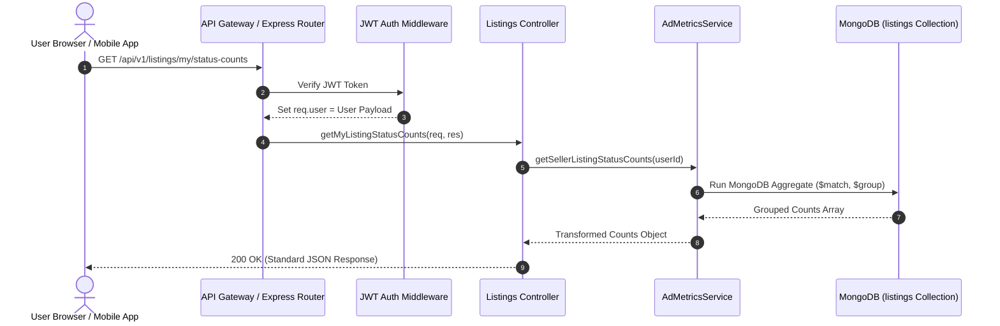
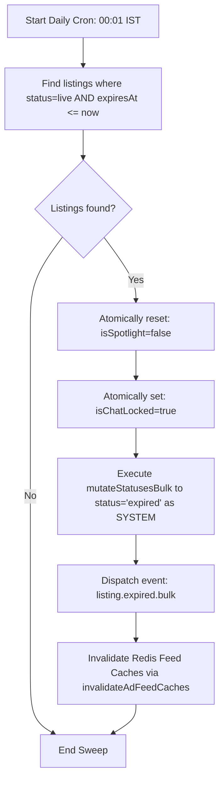

# 📊 Esparex Dashboard "My Ads" Status Tabs: Backend Architecture & Business Logic

This architectural specification defines the authoritative backend business logic, security boundaries, database models, aggregation pipelines, and lifecycle transitions for the **"My Ads" Status Tabs** in the Esparex electronics marketplace dashboard.

---

## 🛠️ 1. Full Backend Architecture

To achieve absolute consistency and maintain the Single Source of Truth (SSOT), Esparex implements a **strictly decoupled, layered backend architecture** for resolving user dashboard listing counts and listings.

### 🏗️ Layered Request-to-Database Flow



### 🧠 Core Architectural Invariants

1. **Database as SSOT**: Tab counts must **never** be cached inside the user document, nor should they be trusted from client payloads. They are recalculated dynamically from the canonical `listings` collection using highly optimized, indexed aggregations.
2. **Implicit Ownership Boundary**: The seller identity is extracted solely from the validated JWT token (`req.user._id`). The client cannot pass a custom `sellerId` query parameter to counts or user-scoped retrieval endpoints.
3. **Soft-Delete Filtering**: Listings with `isDeleted: true` (which sets a non-null `deletedAt` timestamp via the `softDeletePlugin`) must be **strictly excluded** from all counting and list results.
4. **Decoupled Side Effects**: Core mutations (e.g., automated expiry, sold marking) are executed within atomic database sessions and status updates are propagated via an asynchronous, event-driven architecture using `lifecycleEvents.dispatch`.

---

## 📡 2. API Contract

All Esparex endpoints conform to the **JSON-only payload and standard error response structure**.

### 🔍 Endpoint A: GET /api/v1/listings/my/status-counts

Retrieve the real-time aggregated counts for each listing status tab belonging to the authenticated user.

* **Method**: `GET`
* **Path**: `/api/v1/listings/my/status-counts`
* **Authentication**: Required (`Authorization: Bearer <JWT_TOKEN>`)
* **Headers**: `Accept: application/json`

#### 🟢 Success Response (200 OK)
```json
{
  "success": true,
  "data": {
    "live": 2,
    "pending": 0,
    "sold": 0,
    "expired": 0,
    "rejected": 0,
    "deactivated": 1,
    "total": 3
  }
}
```

#### 🔴 Error Response (401 Unauthorized)
```json
{
  "success": false,
  "error": "Unauthorized",
  "path": "/api/v1/listings/my/status-counts",
  "status": 401
}
```

---

### 🔍 Endpoint B: GET /api/v1/listings/my

Retrieve the list of listings belonging to the authenticated user, optionally filtered by the requested status tab.

* **Method**: `GET`
* **Path**: `/api/v1/listings/my`
* **Authentication**: Required (`Authorization: Bearer <JWT_TOKEN>`)
* **Query Parameters**:
  * `status` (Optional): `active` | `pending` | `sold` | `expired` | `rejected` | `deactivated`
  * `page` (Optional): Default `1`
  * `limit` (Optional): Default `20`

#### 🟢 Success Response (200 OK)
```json
{
  "success": true,
  "data": {
    "items": [
      {
        "id": "663ebc0128cb50a11aefc301",
        "title": "iPhone 15 Pro Max - 256GB - Blue Titanium",
        "price": 105000,
        "status": "live",
        "createdAt": "2026-05-01T10:00:00.000Z",
        "expiresAt": "2026-05-31T10:00:00.000Z",
        "views": {
          "total": 124,
          "unique": 92,
          "favorites": 14,
          "chats": 5
        },
        "images": ["https://assets.esparex.in/listings/ip15-1.webp"]
      }
    ],
    "pagination": {
      "total": 2,
      "page": 1,
      "limit": 20,
      "hasMore": false
    }
  }
}
```

---

## 🎮 3. Controller Logic (TypeScript / Express)

Implementing the Express request handlers in alignment with Esparex controller norms.

```typescript
import { Request, Response } from 'express';
import { sendErrorResponse } from '@esparex/core/utils/errorResponse';
import { sendSuccessResponse } from '@esparex/core/utils/respond';
import logger from '@esparex/core/utils/logger';
import * as AdMetricsService from '@esparex/core/services/ad/AdMetricsService';
import * as AdAggregationService from '@esparex/core/services/ad/AdAggregationService';

/**
 * GET /api/v1/listings/my/status-counts
 * Resolves status counts for "My Ads" dashboard pills.
 */
export const getMyListingStatusCounts = async (req: Request, res: Response) => {
    try {
        const userId = req.user?._id?.toString();
        if (!userId) {
            return sendErrorResponse(req, res, 401, 'Unauthorized', '/api/v1/listings/my/status-counts');
        }

        const counts = await AdMetricsService.getSellerListingStatusCounts(userId);
        return sendSuccessResponse(res, counts);
    } catch (error) {
        logger.error('Failed to aggregate dashboard listing status counts', { userId: req.user?._id, error });
        return sendErrorResponse(
            req, 
            res, 
            500, 
            'Failed to fetch listing status counts', 
            '/api/v1/listings/my/status-counts'
        );
    }
};

/**
 * GET /api/v1/listings/my
 * Fetches current seller listings partitioned by requested tab status.
 */
export const getMyListings = async (req: Request, res: Response) => {
    try {
        const userId = req.user?._id;
        if (!userId) {
            return sendErrorResponse(req, res, 401, 'Unauthorized', '/api/v1/listings/my');
        }

        const { status, page = 1, limit = 20 } = req.query;
        const { getStatusMatchCriteria } = await import('@esparex/core/utils/statusQueryMapper');

        // Impose strict ownership and soft-delete boundaries
        const query: Record<string, unknown> = {
            sellerId: userId,
            isDeleted: { $ne: true }
        };

        // If status query is provided, map UI tab string to database status values
        if (status) {
            const mappedStatus = String(status).trim().toLowerCase();
            // UI 'active' tab corresponds to DB status 'live'
            const searchStatus = mappedStatus === 'active' ? 'live' : mappedStatus;
            query.status = getStatusMatchCriteria(searchStatus);
        }

        const { items, total } = await AdAggregationService.getOwnerListings(
            query, 
            Number(page), 
            Number(limit)
        );

        return sendSuccessResponse(res, {
            items,
            pagination: {
                total,
                page: Number(page),
                limit: Number(limit),
                hasMore: total > Number(page) * Number(limit)
            }
        });
    } catch (error) {
        logger.error('Failed to fetch user-scoped tab listings', { userId: req.user?._id, error });
        return sendErrorResponse(req, res, 500, 'Failed to retrieve listings', '/api/v1/listings/my');
    }
};
```

---

## ⚙️ 4. Service Logic (TypeScript)

Implementing the Service Layer aggregation methods in `AdMetricsService.ts`.

```typescript
import { mongoose, Ad, normalizeAdStatus } from './_shared/adServiceBase';

interface AggregationOutput {
    _id: string; // The status string (e.g. 'live', 'pending')
    count: number;
}

export interface SellerDashboardCounts {
    live: number;
    pending: number;
    sold: number;
    expired: number;
    rejected: number;
    deactivated: number;
    total: number;
}

/**
 * Recalculates and aggregates real-time listing status counts for a seller.
 * Eliminates cache-drift and avoids client tampering.
 */
export const getSellerListingStatusCounts = async (sellerId: string): Promise<SellerDashboardCounts> => {
    if (!mongoose.Types.ObjectId.isValid(sellerId)) {
        throw new Error('Invalid Seller ID');
    }

    const oId = new mongoose.Types.ObjectId(sellerId);

    // Run high-performance match & group aggregate
    const results = await Ad.aggregate<AggregationOutput>([
        {
            $match: {
                sellerId: oId,
                isDeleted: { $ne: true } // Exclude soft-deleted listings
            }
        },
        {
            $group: {
                _id: '$status',
                count: { $sum: 1 }
            }
        }
    ]);

    // Initialise empty counts dashboard block
    const counts: SellerDashboardCounts = {
        live: 0,
        pending: 0,
        sold: 0,
        expired: 0,
        rejected: 0,
        deactivated: 0,
        total: 0
    };

    // Distribute aggregate buckets across dashboard mappings
    results.forEach((bucket) => {
        // Safe mapping using canonical normalisation logic (active/approved -> live)
        const normalizedStatus = normalizeAdStatus(bucket._id);
        const countValue = bucket.count;

        switch (normalizedStatus) {
            case 'live':
                counts.live += countValue;
                break;
            case 'pending':
                counts.pending += countValue;
                break;
            case 'sold':
                counts.sold += countValue;
                break;
            case 'expired':
                counts.expired += countValue;
                break;
            case 'rejected':
                counts.rejected += countValue;
                break;
            case 'deactivated':
                counts.deactivated += countValue;
                break;
            default:
                // Log unmapped fallback status structures to monitor anomalies
                break;
        }
        
        // Sum total listings (excluding soft-deleted ones)
        counts.total += countValue;
    });

    return counts;
};
```

---

## 📊 5. MongoDB Aggregation Pipeline

To resolve counts in a single network round-trip, we avoid executing multiple `countDocuments` checks. We execute an optimized aggregate pipeline that utilizes the index.

### The Aggregation Pipeline
```javascript
[
  {
    "$match": {
      "sellerId": ObjectId("663ebc0128cb50a11aefc000"),
      "isDeleted": { "$ne": true }
    }
  },
  {
    "$group": {
      "_id": "$status",
      "count": { "$sum": 1 }
    }
  }
]
```

### Transformation Mapping Layer (In-Memory processing)

The MongoDB pipeline returns a list of matched status groups like this:
```json
[
  { "_id": "live", "count": 2 },
  { "_id": "deactivated", "count": 1 }
]
```

Our mapping logic processes the results in-memory to guarantee stability, mapping:
* `live` (including legacy `'active'` or `'approved'`) ➡️ `live`
* `pending` (including legacy `'held_for_review'`) ➡️ `pending`
* `sold` ➡️ `sold`
* `expired` ➡️ `expired`
* `rejected` ➡️ `rejected`
* `deactivated` ➡️ `deactivated`

Any statuses not falling into this strict, client-facing matrix are excluded from specific buckets but counted toward the `total` to prevent interface representation issues.

---

## 🗂️ 6. Index Requirements

To optimize aggregation and listing performance, we create a specialized, explicitly named compound index on the `listings` collection.

```javascript
AdSchema.index(
    { sellerId: 1, isDeleted: 1, status: 1, createdAt: -1 },
    { name: 'idx_listings_seller_dashboard_lookup' }
);
```

### Why this Index is Extremely Optimal:

1. **Exact-to-Range Prefix Alignment**: Follows the MongoDB Equality, Sort, Range (ESR) rule.
   * **sellerId** (Equality Match): Prunes the search space instantly to a single seller.
   * **isDeleted** (Equality/Boolean Match): Filters out soft-deleted listings at index level.
   * **status** (Grouping & Filtering Range): Satisfies both status tab matching and status grouping aggregate.
   * **createdAt** (Sorting): Covers tab listing sorting (`createdAt: -1`) to yield high-efficiency covered queries without needing in-memory sort phases.
2. **Covered Aggregation Query**: Because all fields requested by our aggregation match and grouping pipeline (`sellerId`, `isDeleted`, `status`) are located inside the index structure, MongoDB reads the index leaf nodes directly without jumping to the document heap (Index Only Scan).

---

## 🛡️ 7. Security Controls & Invariants

Security is built into our core schemas and endpoints.

* **Owner Isolation Enforcement**:
  `sellerId` is **always derived from the backend JWT validation layer** (`req.user._id`). The frontend has no capability to query another user's dashboard listings.
* **Server-Controlled Transitions**:
  Sellers **cannot** directly update the `status` field. All status changes must run through controller handlers calling the centralized `StatusMutationService.mutateStatus` which strictly asserts the transition against `LifecycleGuard` validation.
* **Soft Delete Boundary**:
  A standard delete request (`DELETE /api/v1/listings/:id`) triggers the `softDelete()` method of the `softDeletePlugin`. It marks `isDeleted = true` and updates `deletedAt` without physically deleting records. All query utilities and aggregates explicitly filter using `isDeleted: { $ne: true }`.
* **Verification Gate**:
  Only verified admins can trigger bypass-approvals (`moderationStatus = 'manual_approved'`). All seller edit states immediately downgrade the listing moderation status to `held_for_review` and status to `pending` to undergo re-evaluation.

---

## 🔄 8. Status Transition Matrix

Listing state changes are validated against the `LifecycleGuard` matrix mapped to logical lifecycles in `StatusMutationService`:

| Current Status | Target Status | Allowed? | Actor | Core Business Rules & Triggering Event | Side-Effects |
| :--- | :--- | :---: | :---: | :--- | :--- |
| **pending** | **live** | ✅ | Admin | Admin approves listing. | sets `approvedAt = now()`, calculates `expiresAt` (30 days), invalidates feed cache |
| **pending** | **rejected** | ✅ | Admin | Admin rejects listing (must supply reason). | sets `rejectedAt = now()`, records `rejectionReason` |
| **live** | **pending** | ✅ | Seller | Seller edits their live ad. Re-moderation is forced. | downgrades `moderationStatus` to `held_for_review`, locks public feed visibility |
| **live** | **sold** | ✅ | Seller | Seller clicks "Mark as Sold" in dashboard. | sets `soldAt = now()`, captures `soldReason` (e.g. platform/outside) |
| **live** | **expired** | ✅ | System | Automated nightly sweep identifies expired listings. | spotlight promotions terminated, related chats locked (read-only) |
| **live** | **deactivated**| ✅ | Admin | Admin deactivates listing due to policy issue. | locks public visibility, locks related chat conversation channels |
| **deactivated**| **live** | ✅ | Admin | Admin clears issue and reactivates listing. | restores public visibility, unlocks related chat channels |
| **rejected** | **pending** | ✅ | Seller | Seller edits their rejected listing and resubmits. | increments `reviewVersion`, triggers moderation queue placement |
| **expired** | **pending** | ✅ | Seller | Seller renews or reposts their expired listing. | resets timestamps, triggers verification queue |

---

## ⏰ 9. Daily Cron Behavior (Automated Expiry Sweep)

A daily cron job runs at **00:01 IST** executing the automated expiry sweep logic via the centralized `ListingExpiryService`:



### Invariant Checks Executed Under the Hood:
1. **Atomic Spotlight Terminations**: Spotlight boost records are turned off instantly upon expiry.
2. **Chat Locking**: All conversations associated with the expired listing are set to `isChatLocked: true` by dispatching the changed lifecycle state, locking the message stream and preventing user communications on expired inventory.
3. **Cache Invalidation**: `invalidateAdFeedCaches()` is executed asynchronously to purge stagnant records from the homepage and discovery channels.

---

## 🧪 10. QA Checklist & Verification Scenarios

The following scenarios are executed during test verification suites:

### 1. Verification of Count Increments during Creation
* **Pre-condition**: Seller has 0 listings. Dashboard counts: all 0.
* **Action**: Seller submits a new listing.
* **Verification**: Listing status is set to `'pending'`. Count API returns: `pending: 1`, `total: 1`. All other status fields remain `0`.

### 2. Admin Moderation Transition Counts
* **Pre-condition**: Counts API returns `pending: 1`, `live: 0`.
* **Action**: Admin approves the listing.
* **Verification**: Listing status becomes `'live'`. Count API returns: `pending: 0`, `live: 1`, `total: 1`.

### 3. Seller Dashboard Marking as Sold
* **Pre-condition**: Counts API returns `live: 1`, `sold: 0`.
* **Action**: Seller marks the listing as sold.
* **Verification**: Listing status becomes `'sold'`. `soldAt` is set. Count API returns: `live: 0`, `sold: 1`, `total: 1`.

### 4. Cron Expiry Sweep Integration
* **Pre-condition**: Listing status is `'live'`, `expiresAt` is in the past. Counts: `live: 1`, `expired: 0`.
* **Action**: Expiry cron execution sweeps.
* **Verification**: Listing status becomes `'expired'`. Chat lock is enabled. Counts: `live: 0`, `expired: 1`, `total: 1`.

### 5. Isolation Guarantee Check
* **Pre-condition**: Seller A has 5 listings. Seller B has 0 listings.
* **Action**: Request counts API under Seller B's session.
* **Verification**: API returns all 0 counts. Seller A's records are completely isolated and excluded.

### 6. Soft Delete Count Exclusion
* **Pre-condition**: Counts API returns `live: 1`, `total: 1`.
* **Action**: Seller deletes the listing.
* **Verification**: Listing's `isDeleted` becomes `true`. Counts API returns all 0 counts. Total is 0.

---

## 🚀 11. Production Recommendations

To maintain exceptional sub-millisecond latencies under high request volume, implement the following best practices in production:

1. **Aggregation Latency Tracking**:
   Observe Count API execution times. Integrate tracking metrics using Prometheus or the metrics middleware to log queries exceeding **100ms** so database indexing health is monitored.
2. **Execution Plan Auditing**:
   Periodically run `.explain('executionStats')` on the dashboard aggregation query. Verify that the query plan indicates a `IXSCAN` on the compound index `idx_listings_seller_dashboard_lookup` and reports zero document scans (`docsExamined: 0`).
3. **Database Partitioning (Sharding)**:
   For high-volume growth, select `{ sellerId: 1 }` as the shard key for the `listings` collection. Since all user dashboard lookups, status counts, and edits contain `sellerId`, lookups will always route to a single shard, preventing costly scatter-gather cluster queries.
4. **Resilient Cache Busting**:
   Perform cache invalidations outside the main Mongoose save transactions. Leverage `setImmediate` or task queues so that Redis timeouts do not trigger database write failures during core lifecycle state updates.
