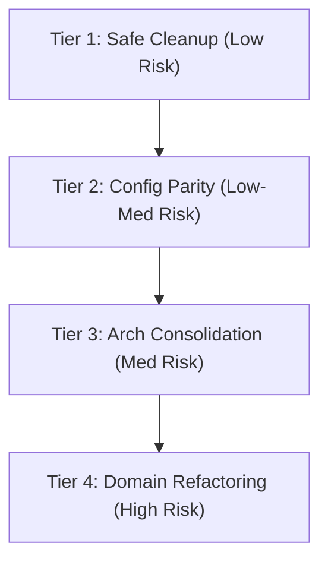

# Phase 16: Cleanup Roadmap (Remediation Backlog)

## 1. Executive Summary
This document consolidates findings from all 15 audit phases of the Esparex repository. The findings are organized into a prioritized, risk-aware remediation backlog. Remediations are divided into four tiers based on risk profile and operational impact:
- **Tier 1 (Safe Cleanup)**: Low-risk deletions, relative path corrections, and repository hygiene.
- **Tier 2 (Configuration Parity)**: Compiler synchronization, CI/CD pipeline integrations, and template alignment.
- **Tier 3 (Architectural Consolidation)**: Gating admin namespaces, removing React dependencies from shared modules, and pruning route duplications.
- **Tier 4 (Domain Refactoring)**: High-impact changes to location utility splits, listing service layout overlaps, and database index optimization.

---

## 2. Scope
This roadmap governs all repository refactoring and cleanups following approval. It contains actionable work items, risk classifications, verification requirements, and implementation sequencing.

---

## 3. Inventory of Backlog Items

---

## 4. Prioritized Backlog

### Tier 1: Safe Cleanup & Hygiene (Risk: Low)
These items can be executed immediately with zero code break risk, improving repository hygiene.

1. **Delete Empty Stubs and Dead Files**
   - *Action*: Delete `apps/web/src/hooks/useImageDomainSync.ts`, `backend/user/src/controllers/admin/adminCatalogSyncController.ts`, empty `ChatService.ts`, and the duplicate `shared/constants` directory.
   - *Verification*: Confirm workspace builds pass.

2. **Remove Committed Build and Test Logs**
   - *Action*: Run `git rm` on `apps/web/playwright-account-*.png`, `apps/web/test-output*.txt`, and `apps/admin/test.png`. Untrack `.eslintcache` and `*.tsbuildinfo` files so they are ignored.
   - *Verification*: `git status` displays clean workspaces on rebuild.

3. **Convert Navigation Index to Relative Paths**
   - *Action*: Edit `docs/00-index.md` to replace absolute paths (`file:///Users/admin/...`) with relative links.
   - *Verification*: Click links within editor/browser.

4. **Introduce Prettier Config**
   - *Action*: Create a root `.prettierrc` configuration file.
   - *Verification*: Format workspace code files.

---

### Tier 2: Configuration & Pipeline Parity (Risk: Low-Medium)
Updates dependencies and compiler settings to establish workspace parity and build speed.

5. **Align TypeScript compiler configurations**
   - *Action*: Set `"composite": true` in `core/tsconfig.json` to match root project references.
   - *Verification*: Compile via `npm run type-check`.

6. **Synchronize TypeScript and Sentry Versions**
   - *Action*: Align TypeScript version (`^5.9.3`) and Sentry dependencies across all workspaces.
   - *Verification*: Clean root install (`npm install`) and workspace builds.

7. **Integrate Skipped Tests into CI/CD Pipeline**
   - *Action*: Update root `ci:strict` script to run `npm run ci:guardrails` (admin UI/regressions) and frontend vitest suite.
   - *Verification*: Ensure GHA workflow runs all test commands.

---

### Tier 3: Architectural Consolidation (Risk: Medium)
Refactors structural boundaries to clean route declarations and package dependencies.

8. **Activate Admin Authentication Middleware**
   - *Action*: Create `apps/admin/src/middleware.ts` to export and run the `proxy` helper session gate.
   - *Verification*: Unauthenticated access requests to `/ads` route correctly redirect to `/login`.

9. **Decouple React Code from Shared Library**
   - *Action*: Move `usePopupQueue.ts` hook out of `@esparex/shared` into `@esparex/apps-web` hooks directory and prune shared barrel index exports.
   - *Verification*: Confirm `shared` builds without react types or dependency compilation.

10. **Prune Duplicate Route Verbs & Consolidate Admin Entrypoints**
    - *Action*:
      - Delete duplicate `POST` verb registrations for moderation actions in `adminRoutes.ts`.
      - Mount `adminCatalogRoutes` and `adminCatalogRequestRoutes` inside `adminRoutes.ts` to route admin namespaces through a unified ingress gate.
    - *Verification*: Perform moderation actions using E2E regression tests.

---

### Tier 4: Domain & Database Refactoring (Risk: High)
Deep structural cleanups. Requires regression smoke testing.

11. **Consolidate Split Classified Listing (Ad) Services**
    - *Action*: Move the 9 flat services in `core/src/services/` (e.g. `AdCreationService`) into `core/src/services/ad/` subdirectory and consolidate model exports.
    - *Verification*: Run integration tests for listings creation/mutations.

12. **Unify Fragmented Geolocation (Location) Logic**
    - *Action*: Consolidate duplicate location primitive calculations from the 6 separate utility paths into a single module: `shared/src/location/`.
    - *Verification*: Verify search, geofencing, and proximity calculations match.

13. **Classified Ads Index Optimization**
    - *Action*: Prune overlapping and duplicate B-tree indexes from `Ad.ts` schema (down from 30+ to essential query paths).
    - *Verification*: Execute database benchmarking to verify write latency reduction.

14. **Align Database Collection Names**
    - *Action*: Update `AdSchema` configuration with `{ collection: 'listings' }` (or modify `DOMAIN_MODEL_SSOT.md` schema mappings to `ads`) to establish name parity.
    - *Verification*: Run migration checks on MongoDB.

---

## 5. Evidence
Backlog details and justifications are compiled across individual audit reports:
- Structural cleanup: [PHASE_1_STRUCTURE_REPORT.md](file:///c:/Users/Administrator/Documents/GitHub/Esparex/docs/repository-audit/PHASE_1_STRUCTURE_REPORT.md)
- Dependency alignment: [PHASE_3_DEPENDENCY_AUDIT.md](file:///c:/Users/Administrator/Documents/GitHub/Esparex/docs/repository-audit/PHASE_3_DEPENDENCY_AUDIT.md)
- Architectural gating: [PHASE_4_ARCHITECTURE_AUDIT.md](file:///c:/Users/Administrator/Documents/GitHub/Esparex/docs/repository-audit/PHASE_4_ARCHITECTURE_AUDIT.md)
- API/Admin gateways: [PHASE_7_API_AUDIT.md](file:///c:/Users/Administrator/Documents/GitHub/Esparex/docs/repository-audit/PHASE_7_API_AUDIT.md)
- DB naming/indexes: [PHASE_8_DATABASE_AUDIT.md](file:///c:/Users/Administrator/Documents/GitHub/Esparex/docs/repository-audit/PHASE_8_DATABASE_AUDIT.md)

---

## 6. Risk Level
- **Cleanup Phase Operational Risk**: **Medium**
- Tier 1 and 2 tasks are safe to run sequentially, while Tier 3 and 4 tasks require thorough validation to avoid disrupting listing creation and payment flows.

---

## 7. Recommendations
Execute the backlog in phased, reviewable pull requests matching the Tier structure, starting with Tier 1 and Tier 2. Do not proceed to Tier 3 or Tier 4 without comprehensive manual validation.

---

## 8. Out-of-Scope Items
- Changing CSS frameworks or UI library configurations.

---

## 9. Next Steps
- Update Dashboard Status.
- Proceed to **Phase 17 — Cleanup Execution** (awaiting User implementation plan approval).
