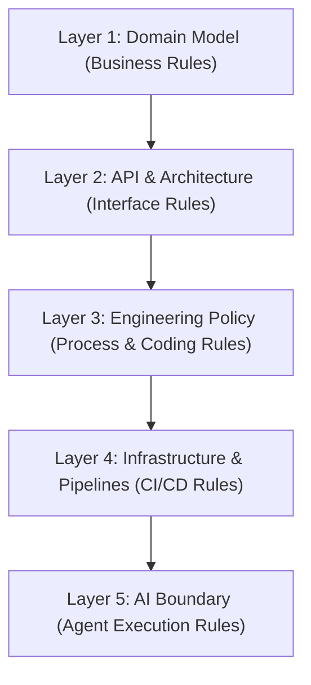
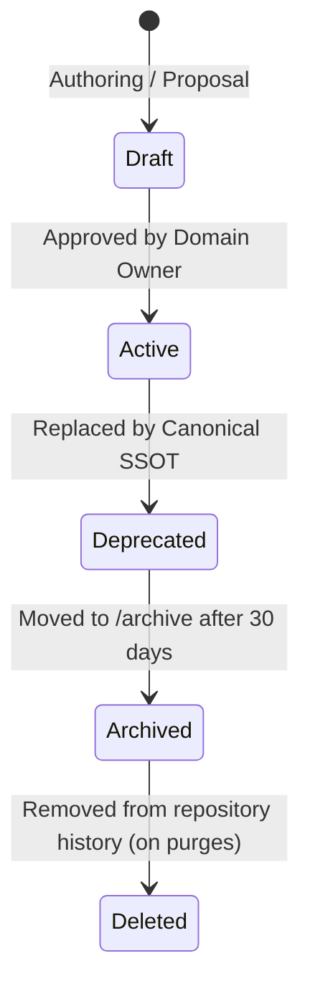

# Esparex Master Document Registry

This is the **Single Source of Truth (SSOT)** for all documentation, governance, and instruction files across the Esparex platform. Any document not registered here is considered non-authoritative and will fail platform governance lints.

---

## 1. 5-Layer Governance Hierarchy

To prevent circular authority, overlapping definitions, and context drift, all platform documents follow a strict 5-layer hierarchy. Rules defined in higher layers override lower layers in case of conflict:

---

## 2. Document Registry

All files must belong to exactly one tier. Tiers are defined below:

### Tier 1: Canonical (authoritative SSOTs; maximum 6–7 documents)

| File Path | Domain / Scope | Owner | Status | Governance Lifecycle | Validated By |
| :--- | :--- | :--- | :--- | :--- | :--- |
| `docs/ssot/DOMAIN_MODEL_SSOT.md` | User Identity, Roles, Ad Status, Location indexes | Product | Active | canonical_active | `guard:ad-ssot` |
| `docs/ssot/API_CONTRACT_SSOT.md` | API routes, namespaces, HTTP methods, errors | Architecture | Active | canonical_active | `guard:api-surface` |
| `docs/ssot/ARCHITECTURE_FLOW_SSOT.md` | Post/Edit Ad, Location prompts, Admin Approval | Architecture | Active | canonical_active | `test:ui` |
| `docs/ssot/CI_CD_SSOT.md` | Pipelines, automated guards, branch rules | Ops / Infra | Active | canonical_active | `docs:lint` |
| `docs/governance/GOVERNANCE_POLICY.md` | Developer standards, coding casing, lifecycle | Engineering | Active | canonical_active | `guard:naming` |
| `docs/governance/AI_GOVERNANCE_BOUNDARY.md` | AI instructions, prompt limits, agent scopes | AI Gov | Active | canonical_active | `guard:ai-governance` |

### Tier 2: Supporting (reference-only, non-authoritative documents)

| File Path | Domain / Scope | Owner | Status | Governance Lifecycle | Validated By |
| :--- | :--- | :--- | :--- | :--- | :--- |
| `docs/supporting/catalog_atlas_search_indexes.md` | Reference Atlas Search index configuration | Data | Active | supporting_active | Manual |
| `docs/supporting/listing-edit-e2e.md` | Playwright edit ad E2E suite strategy details | Testing | Active | supporting_active | `test:e2e` |
| `docs/environment/ENVIRONMENT_BOOTSTRAP.md` | Environment Bootstrap Guide | Ops | Active | supporting_active | Manual |
| `docs/environment/ENVIRONMENT_DEPLOYMENT.md` | Environment Deployment Guide | Ops | Active | supporting_active | Manual |
| `docs/environment/ENVIRONMENT_GOVERNANCE.md` | Environment Governance Guide | Ops | Active | supporting_active | Manual |
| `docs/environment/ENVIRONMENT_LOADING_FLOW.md` | Environment Loading Flow Guide | Ops | Active | supporting_active | Manual |
| `docs/environment/ENVIRONMENT_PLATFORM_MATRIX.md` | Environment Platform Matrix Guide | Ops | Active | supporting_active | Manual |
| `docs/environment/ENVIRONMENT_RISK_REGISTER.md` | Environment Risk Register Guide | Ops | Active | supporting_active | Manual |
| `docs/environment/ENVIRONMENT_SECURITY.md` | Environment Security Guide | Ops | Active | supporting_active | Manual |
| `docs/environment/ENVIRONMENT_SSOT.md` | Environment SSOT Guide | Ops | Active | supporting_active | Manual |
| `docs/environment/ENVIRONMENT_VALIDATION.md` | Environment Validation Guide | Ops | Active | supporting_active | Manual |
| `docs/environment/ENVIRONMENT_VARIABLE_MATRIX.md` | Environment Variable Matrix Guide | Ops | Active | supporting_active | Manual |
| `docs/environment/MASTER_SSOT.md` | Environment Master SSOT Guide | Ops | Active | supporting_active | Manual |
| `docs/environment/README.md` | Environment Registry Overview | Ops | Active | supporting_active | Manual |

### Tier 3: Deprecated (superseded or obsolete documents; no longer used for implementation)

| File Path | Replacement Document | Owner | Status | Governance Lifecycle | Validated By |
| :--- | :--- | :--- | :--- | :--- | :--- |
| `docs/deprecated/08-deployment-runbook.md` | `docs/ssot/CI_CD_SSOT.md` | Ops | Deprecated | deprecated_marker | `docs:lint` |

### Tier 4: Archived (historical audit and migration reports; completely excluded from runs/lints)

All historical files residing inside `/archive/legacy/` are classified as Tier 4. They are non-executable, excluded from all search indexes, lints, and AI context loading.

| File Path | Original Purpose | Owner | Status | Governance Lifecycle |
| :--- | :--- | :--- | :--- | :--- |
| `archive/legacy/2026-05/BUSINESS_REGISTRATION_AUDIT.md` | One-time business registration process audit | Product | Archived | archived_historical |
| `archive/legacy/2026-05/frontend_params_audit.md` | One-time UI param and route query sync audit | Frontend | Archived | archived_historical |

---

## 3. Governance Lifecycle States

Every document in this repository must operate under the following state machine transitions:

- **Draft**: Temporary document. Allowed only for active proposals. Checked manually.
- **Active**: Official repository authority. MUST have a canonical owner and automated validation in the registry.
- **Deprecated**: Superseded. MUST contain the explicit `# DEPRECATED` header pointing to its replacement.
- **Archived**: Historical reference. MUST live under `/archive/legacy/YYYY-MM/` and be non-executable.
- **Deleted**: Completely removed from the repository.
