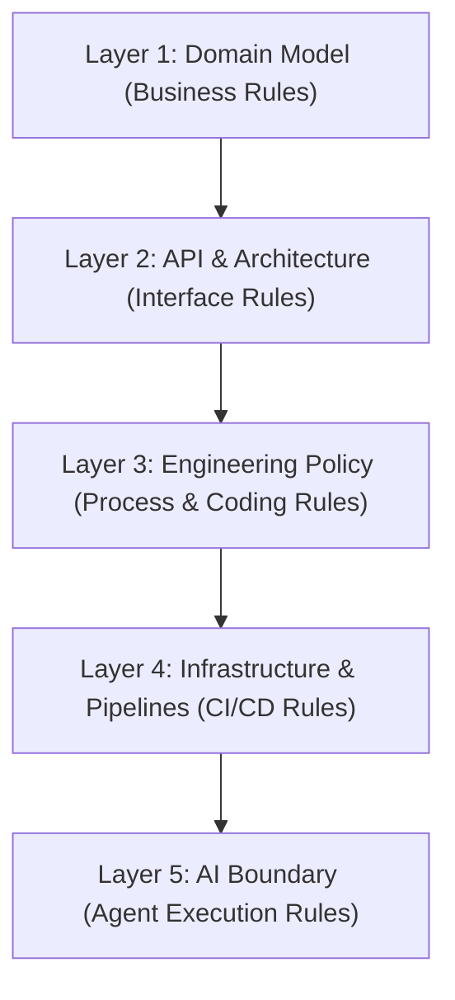
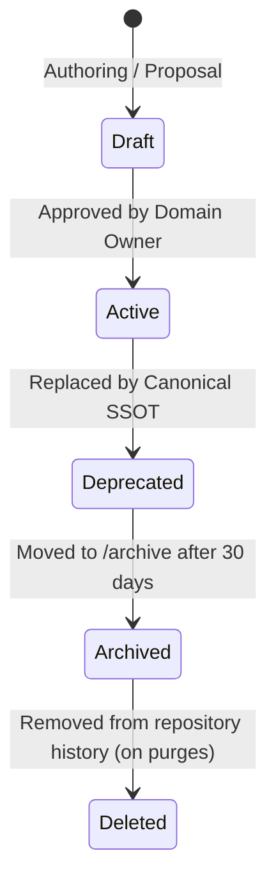

# Esparex Master Document Registry

This is the **Single Source of Truth (SSOT)** for all documentation, governance, and instruction files across the Esparex platform. Any document not registered here is considered non-authoritative and will fail platform governance lints.

---

## 1. 5-Layer Governance Hierarchy

To prevent circular authority, overlapping definitions, and context drift, all platform documents follow a strict 5-layer hierarchy. Rules defined in higher layers override lower layers in case of conflict:

---

## 2. Document Registry

All files must belong to exactly one tier. Tiers are defined below:

### Tier 1: Canonical (authoritative SSOTs; maximum 6–7 documents)

| File Path | Domain / Scope | Owner | Status | Governance Lifecycle | Validated By |
| :--- | :--- | :--- | :--- | :--- | :--- |
| `AGENTS.md` | AI agent entry point: context discovery, conflict resolution, SSOT loading | AI Gov | Active | canonical_active | `docs:lint` |
| `docs/AI_RUNTIME_SPEC.md` | AI runtime architecture, execution flow, CLI reference, skill taxonomy | AI Gov | Active | canonical_active | `docs:lint` |
| `docs/architecture/adr/ADR-001-core-package.md` | Decision record for Core package responsibilities and transport neutrality | Architecture | Active | canonical_active | `docs:lint` |
| `docs/architecture/adr/ADR-002-shared-package.md` | Decision record for Shared package responsibilities and decoupling | Architecture | Active | canonical_active | `docs:lint` |
| `docs/architecture/adr/ADR-003-backend-api.md` | Decision record for API gateway architecture and namespaces | Architecture | Active | canonical_active | `docs:lint` |
| `docs/architecture/adr/ADR-004-boundaries.md` | Decision record for monorepo import boundaries and public APIs | Architecture | Active | canonical_active | `docs:lint` |
| `docs/architecture/adr/ADR-005-monorepo.md` | Decision record for monorepo layout and phased execution | Architecture | Active | canonical_active | `docs:lint` |
| `docs/architecture/CURRENT_ARCHITECTURE.md` | Current system package graph, request flows, authentication, payments and chat lifecycles | Architecture | Active | canonical_active | `docs:lint` |
| `docs/architecture/PACKAGE_CONTRACT.md` | Monorepo package dependencies, boundaries, and import constraints | Architecture | Active | canonical_active | `docs:lint` |
| `docs/architecture/REPOSITORY_DIRECTORY_STANDARD.md` | Allowed directory contents, package structure templates, and folder layout rules | Architecture | Active | canonical_active | `docs:lint` |
| `docs/architecture/REPOSITORY_SINGLE_SOURCE_OF_TRUTH.md` | Master repository architecture SSOT, layer layouts, coding, naming, build and test rules | Architecture | Active | canonical_active | `docs:lint` |
| `docs/governance/AI_GOVERNANCE_BOUNDARY.md` | AI instructions, prompt limits, agent scopes | AI Gov | Active | canonical_active | `guard:ai-governance` |
| `docs/governance/GOVERNANCE_POLICY.md` | Developer standards, coding casing, lifecycle | Engineering | Active | canonical_active | `guard:naming` |
| `docs/governance/VERIFICATION_STANDARD.md` | Evidence standards, verification gates, and reporting rules | Engineering | Active | canonical_active | `docs:lint` |
| `docs/SSOT_INDEX.md` | Consolidated index of all Single Sources of Truth with tier hierarchy | AI Gov | Active | canonical_active | `docs:lint` |
| `docs/ssot/API_CONTRACT_SSOT.md` | API routes, namespaces, HTTP methods, errors | Architecture | Active | canonical_active | `guard:api-surface` |
| `docs/ssot/ARCHITECTURE_FLOW_SSOT.md` | Post/Edit Ad, Location prompts, Admin Approval | Architecture | Active | canonical_active | `test:ui` |
| `docs/ssot/CI_CD_SSOT.md` | Pipelines, automated guards, branch rules | Ops / Infra | Active | canonical_active | `docs:lint` |
| `docs/ssot/DOMAIN_MODEL_SSOT.md` | User Identity, Roles, Ad Status, Location indexes | Product | Active | canonical_active | `guard:ad-ssot` |

### Tier 2: Supporting (reference-only, non-authoritative documents)

| File Path | Domain / Scope | Owner | Status | Governance Lifecycle | Validated By |
| :--- | :--- | :--- | :--- | :--- | :--- |
| `docs/architecture/ADR_INDEX.md` | Auto-registered | Engineering | Active | supporting_active | `docs:lint` |
| `docs/architecture/adr/ADR-001-ui-package-boundary.md` | Auto-registered | Engineering | Active | supporting_active | `docs:lint` |
| `docs/architecture/adr/ADR-002-theme-contract.md` | Auto-registered | Engineering | Active | supporting_active | `docs:lint` |
| `docs/architecture/adr/ADR-003-public-api-freeze.md` | Auto-registered | Engineering | Active | supporting_active | `docs:lint` |
| `docs/architecture/adr/ADR-004-component-lifecycle.md` | Auto-registered | Engineering | Active | supporting_active | `docs:lint` |
| `docs/architecture/adr/ADR-006-namespace-governance.md` | Auto-registered | Engineering | Active | supporting_active | `docs:lint` |
| `docs/architecture/adr/ADR-007-architecture-enforcement.md` | Auto-registered | Engineering | Active | supporting_active | `docs:lint` |
| `docs/architecture/ARCHITECTURE_VERSION.md` | Auto-registered | Engineering | Active | supporting_active | `docs:lint` |
| `docs/architecture/CORE_PUBLIC_API.md` | Auto-registered | Engineering | Active | supporting_active | `docs:lint` |
| `docs/architecture/PUBLIC_API.md` | Auto-registered | Engineering | Active | supporting_active | `docs:lint` |
| `docs/archive/adr/ADR-001-SSOT.md` | Auto-registered | Engineering | Archived | supporting_archived | `docs:lint` |
| `docs/archive/adr/ADR-002-Branch-Strategy.md` | Auto-registered | Engineering | Archived | supporting_archived | `docs:lint` |
| `docs/archive/adr/ADR-003-Deployment.md` | Auto-registered | Engineering | Archived | supporting_archived | `docs:lint` |
| `docs/archive/adr/ADR-004-API-Versioning.md` | Auto-registered | Engineering | Archived | supporting_archived | `docs:lint` |
| `docs/archive/adr/ADR-005-Governance.md` | Auto-registered | Engineering | Archived | supporting_archived | `docs:lint` |
| `docs/archive/ai/MAD_AI_OPERATING_INSTRUCTIONS.md` | Auto-registered | Engineering | Archived | supporting_archived | `docs:lint` |
| `docs/audit/admin-mobile-shell-audit.md` | Auto-registered | Engineering | Active | supporting_active | `docs:lint` |
| `docs/audit/auth-duplication-report.md` | Auto-registered | Engineering | Active | supporting_active | `docs:lint` |
| `docs/audit/auth-state-consistency.md` | Auto-registered | Engineering | Active | supporting_active | `docs:lint` |
| `docs/audit/booking-status-verification-audit.md` | Auto-registered | Engineering | Active | supporting_active | `docs:lint` |
| `docs/audit/email-delivery-regression.md` | Auto-registered | Engineering | Active | supporting_active | `docs:lint` |
| `docs/audit/google-auth-regression.md` | Auto-registered | Engineering | Active | supporting_active | `docs:lint` |
| `docs/audit/mad-500-runtime-audit.md` | Auto-registered | Engineering | Active | supporting_active | `docs:lint` |
| `docs/audit/README.md` | Auto-registered | Engineering | Active | supporting_active | `docs:lint` |
| `docs/audit/refresh-token-race-condition.md` | Auto-registered | Engineering | Active | supporting_active | `docs:lint` |
| `docs/audit/refund/REFUND-001-EVIDENCE.md` | Auto-registered | Engineering | Active | supporting_active | `docs:lint` |
| `docs/audit/refund/REFUND-001-EXECUTIVE-SUMMARY.md` | Auto-registered | Engineering | Active | supporting_active | `docs:lint` |
| `docs/audit/refund/REFUND-001-FINDINGS.md` | Auto-registered | Engineering | Active | supporting_active | `docs:lint` |
| `docs/audit/refund/REFUND-002-ARCHITECTURE.md` | Auto-registered | Engineering | Active | supporting_active | `docs:lint` |
| `docs/audit/refund/REFUND-002-EVIDENCE.md` | Auto-registered | Engineering | Active | supporting_active | `docs:lint` |
| `docs/audit/refund/REFUND-002-IMPLEMENTATION-PLAN.md` | Auto-registered | Engineering | Active | supporting_active | `docs:lint` |
| `docs/audit/refund/REFUND-003-VALIDATION-AUDIT.md` | Auto-registered | Engineering | Active | supporting_active | `docs:lint` |
| `docs/audit/session-regression.md` | Auto-registered | Engineering | Active | supporting_active | `docs:lint` |
| `docs/audit/ticket-retrieval-portal-audit.md` | Auto-registered | Engineering | Active | supporting_active | `docs:lint` |
| `docs/cleanup/ROLLBACK.md` | Reversion git commands and tags map for rollback checkpoints | Architecture | Active | supporting_active | `docs:lint` |
| `docs/cleanup/transport-separation-audit.md` | Dynamic file classification and consumer audit inventory for transport separation | Architecture | Active | supporting_active | `docs:lint` |
| `docs/decisions/ADR_INDEX.md` | Auto-registered | Engineering | Active | supporting_active | `docs:lint` |
| `docs/decisions/ADR_TEMPLATE.md` | Auto-registered | Engineering | Active | supporting_active | `docs:lint` |
| `docs/decisions/ADR-001-booking-ownership.md` | Auto-registered | Engineering | Active | supporting_active | `docs:lint` |
| `docs/decisions/ADR-002-governance-persistence-v2.md` | Auto-registered | Engineering | Active | supporting_active | `docs:lint` |
| `docs/decisions/ADR-003-governance-status-semantics.md` | Auto-registered | Engineering | Active | supporting_active | `docs:lint` |
| `docs/decisions/ADR-004-governance-execution-engine.md` | Auto-registered | Engineering | Active | supporting_active | `docs:lint` |
| `docs/decisions/ADR-005-git-governance-engine-design-principles.md` | Auto-registered | Engineering | Active | supporting_active | `docs:lint` |
| `docs/decisions/ADR-006-public-contract-freeze.md` | Auto-registered | Engineering | Active | supporting_active | `docs:lint` |
| `docs/decisions/ADR-007-rule-engine-architecture.md` | Auto-registered | Engineering | Active | supporting_active | `docs:lint` |
| `docs/decisions/ADR-008-cleanup-planner-architecture.md` | Auto-registered | Engineering | Active | supporting_active | `docs:lint` |
| `docs/decisions/ADR-009-payment-refund-decomposition.md` | Auto-registered | Engineering | Active | supporting_active | `docs:lint` |
| `docs/decisions/ADR-010-admin-refund-decomposition.md` | Auto-registered | Engineering | Active | supporting_active | `docs:lint` |
| `docs/decisions/ADR-011-database-governance-standard.md` | Auto-registered | Engineering | Active | supporting_active | `docs:lint` |
| `docs/decisions/ADR-012-entity-lifecycle-state-machines.md` | Auto-registered | Engineering | Active | supporting_active | `docs:lint` |
| `docs/decisions/README.md` | Auto-registered | Engineering | Active | supporting_active | `docs:lint` |
| `docs/design-system/backlog/BACKLOG.md` | Auto-registered | Engineering | Active | supporting_active | `docs:lint` |
| `docs/design-system/future-themes.md` | Auto-registered | Engineering | Active | supporting_active | `docs:lint` |
| `docs/design-system/journeys/ADMIN_MANAGEMENT_JOURNEY.md` | Auto-registered | Engineering | Active | supporting_active | `docs:lint` |
| `docs/design-system/journeys/AUTHENTICATION_JOURNEY.md` | Auto-registered | Engineering | Active | supporting_active | `docs:lint` |
| `docs/design-system/journeys/BROWSE_AND_BOOK_JOURNEY.md` | Auto-registered | Engineering | Active | supporting_active | `docs:lint` |
| `docs/design-system/patterns/_SCHEMA.md` | Auto-registered | Engineering | Active | supporting_active | `docs:lint` |
| `docs/design-system/patterns/AUTHENTICATION.md` | Auto-registered | Engineering | Active | supporting_active | `docs:lint` |
| `docs/design-system/patterns/BOOKING.md` | Auto-registered | Engineering | Active | supporting_active | `docs:lint` |
| `docs/design-system/patterns/CHECKOUT.md` | Auto-registered | Engineering | Active | supporting_active | `docs:lint` |
| `docs/design-system/patterns/CONFIRMATION_DIALOGS.md` | Auto-registered | Engineering | Active | supporting_active | `docs:lint` |
| `docs/design-system/patterns/DASHBOARD.md` | Auto-registered | Engineering | Active | supporting_active | `docs:lint` |
| `docs/design-system/patterns/DELETE_FLOWS.md` | Auto-registered | Engineering | Active | supporting_active | `docs:lint` |
| `docs/design-system/patterns/EMPTY_STATES.md` | Auto-registered | Engineering | Active | supporting_active | `docs:lint` |
| `docs/design-system/patterns/ERROR_STATES.md` | Auto-registered | Engineering | Active | supporting_active | `docs:lint` |
| `docs/design-system/patterns/FILTERING.md` | Auto-registered | Engineering | Active | supporting_active | `docs:lint` |
| `docs/design-system/patterns/FORMS.md` | Auto-registered | Engineering | Active | supporting_active | `docs:lint` |
| `docs/design-system/patterns/LOADING_STATES.md` | Auto-registered | Engineering | Active | supporting_active | `docs:lint` |
| `docs/design-system/patterns/NAVIGATION.md` | Auto-registered | Engineering | Active | supporting_active | `docs:lint` |
| `docs/design-system/patterns/OTP_VERIFICATION.md` | Auto-registered | Engineering | Active | supporting_active | `docs:lint` |
| `docs/design-system/patterns/PAGINATION.md` | Auto-registered | Engineering | Active | supporting_active | `docs:lint` |
| `docs/design-system/patterns/PAYMENT.md` | Auto-registered | Engineering | Active | supporting_active | `docs:lint` |
| `docs/design-system/patterns/SEARCH.md` | Auto-registered | Engineering | Active | supporting_active | `docs:lint` |
| `docs/design-system/patterns/SORTING.md` | Auto-registered | Engineering | Active | supporting_active | `docs:lint` |
| `docs/design-system/patterns/SUCCESS_STATES.md` | Auto-registered | Engineering | Active | supporting_active | `docs:lint` |
| `docs/design-system/patterns/TABLES.md` | Auto-registered | Engineering | Active | supporting_active | `docs:lint` |
| `docs/design-system/PHASE4_BACKLOG.md` | Auto-registered | Engineering | Active | supporting_active | `docs:lint` |
| `docs/design-system/releases/1.2.0.md` | Auto-registered | Engineering | Active | supporting_active | `docs:lint` |
| `docs/design-system/releases/1.3.0.md` | Auto-registered | Engineering | Active | supporting_active | `docs:lint` |
| `docs/design-system/releases/1.4.0.md` | Auto-registered | Engineering | Active | supporting_active | `docs:lint` |
| `docs/design-system/standards/API_STABILITY.md` | Auto-registered | Engineering | Active | supporting_active | `docs:lint` |
| `docs/design-system/standards/THEME_CONTRACT.md` | Auto-registered | Engineering | Active | supporting_active | `docs:lint` |
| `docs/design-system/UX_COMPLIANCE_REPORT.md` | Auto-registered | Engineering | Active | supporting_active | `docs:lint` |
| `docs/environment/ENVIRONMENT_BOOTSTRAP.md` | Environment Bootstrap Guide | Ops | Active | supporting_active | Manual |
| `docs/environment/ENVIRONMENT_DEPLOYMENT.md` | Environment Deployment Guide | Ops | Active | supporting_active | Manual |
| `docs/environment/ENVIRONMENT_GOVERNANCE.md` | Environment Governance Guide | Ops | Active | supporting_active | Manual |
| `docs/environment/ENVIRONMENT_LOADING_FLOW.md` | Environment Loading Flow Guide | Ops | Active | supporting_active | Manual |
| `docs/environment/ENVIRONMENT_PLATFORM_MATRIX.md` | Environment Platform Matrix Guide | Ops | Active | supporting_active | Manual |
| `docs/environment/ENVIRONMENT_RISK_REGISTER.md` | Environment Risk Register Guide | Ops | Active | supporting_active | Manual |
| `docs/environment/ENVIRONMENT_SECURITY.md` | Environment Security Guide | Ops | Active | supporting_active | Manual |
| `docs/environment/ENVIRONMENT_SSOT.md` | Environment SSOT Guide | Ops | Active | supporting_active | Manual |
| `docs/environment/ENVIRONMENT_VALIDATION.md` | Environment Validation Guide | Ops | Active | supporting_active | Manual |
| `docs/environment/ENVIRONMENT_VARIABLE_MATRIX.md` | Environment Variable Matrix Guide | Ops | Active | supporting_active | Manual |
| `docs/environment/MASTER_SSOT.md` | Environment Master SSOT Guide | Ops | Active | supporting_active | Manual |
| `docs/environment/README.md` | Environment Registry Overview | Ops | Active | supporting_active | Manual |
| `docs/finding_classification_todo.md` | Auto-registered | Engineering | Active | supporting_active | `docs:lint` |
| `docs/governance/BASELINE.md` | Auto-registered | Engineering | Active | supporting_active | `docs:lint` |
| `docs/governance/CANONICAL_OWNERSHIP_RULES.md` | Auto-registered | Engineering | Active | supporting_active | `docs:lint` |
| `docs/governance/DEPENDENCY_POLICY.md` | Auto-registered | Engineering | Active | supporting_active | `docs:lint` |
| `docs/governance/EXECUTION_ENGINE.md` | Auto-registered | Engineering | Active | supporting_active | `docs:lint` |
| `docs/governance/EXECUTION_PIPELINE.md` | Auto-registered | Engineering | Active | supporting_active | `docs:lint` |
| `docs/governance/FILE_LIFECYCLE.md` | Auto-registered | Engineering | Active | supporting_active | `docs:lint` |
| `docs/governance/GOVERNANCE_ARCHITECTURE.md` | Auto-registered | Engineering | Active | supporting_active | `docs:lint` |
| `docs/governance/GOVERNANCE_REGISTRY.md` | Auto-registered | Engineering | Active | supporting_active | `docs:lint` |
| `docs/governance/GOVERNANCE_VERSION.md` | Auto-registered | Engineering | Active | supporting_active | `docs:lint` |
| `docs/governance/NAMING_CONVENTIONS.md` | Auto-registered | Engineering | Active | supporting_active | `docs:lint` |
| `docs/governance/REGISTRY.md` | Auto-registered | Engineering | Active | supporting_active | `docs:lint` |
| `docs/governance/REPOSITORY_POLICY.md` | Auto-registered | Engineering | Active | supporting_active | `docs:lint` |
| `docs/governance/REPOSITORY_STRUCTURE.md` | Auto-registered | Engineering | Active | supporting_active | `docs:lint` |
| `docs/governance/ROADMAP.md` | Auto-registered | Engineering | Active | supporting_active | `docs:lint` |
| `docs/governance/rules/ADR_GAP.md` | Auto-registered | Engineering | Active | supporting_active | `docs:lint` |
| `docs/governance/rules/ADR_STATUS_MISMATCH.md` | Auto-registered | Engineering | Active | supporting_active | `docs:lint` |
| `docs/governance/rules/ADR_TITLE_MISMATCH.md` | Auto-registered | Engineering | Active | supporting_active | `docs:lint` |
| `docs/governance/rules/AST_PARSE_WARNING.md` | Auto-registered | Engineering | Active | supporting_active | `docs:lint` |
| `docs/governance/rules/BROKEN_ANCHOR.md` | Auto-registered | Engineering | Active | supporting_active | `docs:lint` |
| `docs/governance/rules/BROKEN_LINK_TARGET.md` | Auto-registered | Engineering | Active | supporting_active | `docs:lint` |
| `docs/governance/rules/BROKEN_REF_LINK.md` | Auto-registered | Engineering | Active | supporting_active | `docs:lint` |
| `docs/governance/rules/CIRCULAR_DOC.md` | Auto-registered | Engineering | Active | supporting_active | `docs:lint` |
| `docs/governance/rules/DUPLICATE_ADR_NUM.md` | Auto-registered | Engineering | Active | supporting_active | `docs:lint` |
| `docs/governance/rules/DUPLICATE_HEADING.md` | Auto-registered | Engineering | Active | supporting_active | `docs:lint` |
| `docs/governance/rules/DUPLICATE_POLICY.md` | Auto-registered | Engineering | Active | supporting_active | `docs:lint` |
| `docs/governance/rules/EMPTY_MERMAID.md` | Auto-registered | Engineering | Active | supporting_active | `docs:lint` |
| `docs/governance/rules/INVALID_ADR_DATE.md` | Auto-registered | Engineering | Active | supporting_active | `docs:lint` |
| `docs/governance/rules/INVALID_ADR_NAMING.md` | Auto-registered | Engineering | Active | supporting_active | `docs:lint` |
| `docs/governance/rules/INVALID_ADR_STATUS.md` | Auto-registered | Engineering | Active | supporting_active | `docs:lint` |
| `docs/governance/rules/INVALID_MERMAID_CONNECTION.md` | Auto-registered | Engineering | Active | supporting_active | `docs:lint` |
| `docs/governance/rules/INVALID_MERMAID_TYPE.md` | Auto-registered | Engineering | Active | supporting_active | `docs:lint` |
| `docs/governance/rules/INVALID_METADATA_DATE.md` | Auto-registered | Engineering | Active | supporting_active | `docs:lint` |
| `docs/governance/rules/INVALID_SSOT_DATE.md` | Auto-registered | Engineering | Active | supporting_active | `docs:lint` |
| `docs/governance/rules/MALFORMED_ATX_HEADING.md` | Auto-registered | Engineering | Active | supporting_active | `docs:lint` |
| `docs/governance/rules/MALFORMED_H1.md` | Auto-registered | Engineering | Active | supporting_active | `docs:lint` |
| `docs/governance/rules/MALFORMED_MERMAID_ENCLOSURE.md` | Auto-registered | Engineering | Active | supporting_active | `docs:lint` |
| `docs/governance/rules/MALFORMED_MERMAID_QUOTES.md` | Auto-registered | Engineering | Active | supporting_active | `docs:lint` |
| `docs/governance/rules/MALFORMED_TABLE.md` | Auto-registered | Engineering | Active | supporting_active | `docs:lint` |
| `docs/governance/rules/MISSING_ADR_AUTHORS.md` | Auto-registered | Engineering | Active | supporting_active | `docs:lint` |
| `docs/governance/rules/MISSING_ADR_DATE.md` | Auto-registered | Engineering | Active | supporting_active | `docs:lint` |
| `docs/governance/rules/MISSING_ADR_DIR.md` | Auto-registered | Engineering | Active | supporting_active | `docs:lint` |
| `docs/governance/rules/MISSING_ADR_DOCS.md` | Auto-registered | Engineering | Active | supporting_active | `docs:lint` |
| `docs/governance/rules/MISSING_ADR_HEADING.md` | Auto-registered | Engineering | Active | supporting_active | `docs:lint` |
| `docs/governance/rules/MISSING_ADR_INDEX.md` | Auto-registered | Engineering | Active | supporting_active | `docs:lint` |
| `docs/governance/rules/MISSING_ADR_METADATA.md` | Auto-registered | Engineering | Active | supporting_active | `docs:lint` |
| `docs/governance/rules/MISSING_ADR_STATUS.md` | Auto-registered | Engineering | Active | supporting_active | `docs:lint` |
| `docs/governance/rules/MISSING_DOC_OWNER.md` | Auto-registered | Engineering | Active | supporting_active | `docs:lint` |
| `docs/governance/rules/MISSING_H1.md` | Auto-registered | Engineering | Active | supporting_active | `docs:lint` |
| `docs/governance/rules/MISSING_INDEX_ENTRY.md` | Auto-registered | Engineering | Active | supporting_active | `docs:lint` |
| `docs/governance/rules/MISSING_REVIEW_DATE.md` | Auto-registered | Engineering | Active | supporting_active | `docs:lint` |
| `docs/governance/rules/MISSING_SECTION.md` | Auto-registered | Engineering | Active | supporting_active | `docs:lint` |
| `docs/governance/rules/MISSING_SSOT_DATE.md` | Auto-registered | Engineering | Active | supporting_active | `docs:lint` |
| `docs/governance/rules/MISSING_SSOT_FIELD.md` | Auto-registered | Engineering | Active | supporting_active | `docs:lint` |
| `docs/governance/rules/MISSING_SSOT_METADATA.md` | Auto-registered | Engineering | Active | supporting_active | `docs:lint` |
| `docs/governance/rules/MISSING_SSOT_OWNER.md` | Auto-registered | Engineering | Active | supporting_active | `docs:lint` |
| `docs/governance/rules/MISSING_SSOT_REF.md` | Auto-registered | Engineering | Active | supporting_active | `docs:lint` |
| `docs/governance/rules/MISSING_SSOT.md` | Auto-registered | Engineering | Active | supporting_active | `docs:lint` |
| `docs/governance/rules/ORPHAN_INDEX.md` | Auto-registered | Engineering | Active | supporting_active | `docs:lint` |
| `docs/governance/rules/ORPHANED_DOC.md` | Auto-registered | Engineering | Active | supporting_active | `docs:lint` |
| `docs/governance/rules/OUTDATED_DOC.md` | Auto-registered | Engineering | Active | supporting_active | `docs:lint` |
| `docs/governance/rules/READ_DIR_ERROR.md` | Auto-registered | Engineering | Active | supporting_active | `docs:lint` |
| `docs/governance/rules/README.md` | Auto-registered | Engineering | Active | supporting_active | `docs:lint` |
| `docs/governance/rules/SSOT_OWNER_INCONSISTENCY.md` | Auto-registered | Engineering | Active | supporting_active | `docs:lint` |
| `docs/governance/rules/UNCLOSED_CODE_BLOCK.md` | Auto-registered | Engineering | Active | supporting_active | `docs:lint` |
| `docs/governance/rules/UNCLOSED_MERMAID.md` | Auto-registered | Engineering | Active | supporting_active | `docs:lint` |
| `docs/governance/rules/VAL-ARC-001.md` | Auto-registered | Engineering | Active | supporting_active | `docs:lint` |
| `docs/governance/rules/VAL-ARC-002.md` | Auto-registered | Engineering | Active | supporting_active | `docs:lint` |
| `docs/governance/rules/VAL-ARC-003.md` | Auto-registered | Engineering | Active | supporting_active | `docs:lint` |
| `docs/governance/rules/VAL-ARC-004.md` | Auto-registered | Engineering | Active | supporting_active | `docs:lint` |
| `docs/governance/rules/VAL-DOC-001.md` | Auto-registered | Engineering | Active | supporting_active | `docs:lint` |
| `docs/governance/rules/VAL-DOC-002.md` | Auto-registered | Engineering | Active | supporting_active | `docs:lint` |
| `docs/governance/rules/VAL-DOC-003.md` | Auto-registered | Engineering | Active | supporting_active | `docs:lint` |
| `docs/governance/rules/VAL-DOC-004.md` | Auto-registered | Engineering | Active | supporting_active | `docs:lint` |
| `docs/governance/rules/VAL-DOC-005.md` | Auto-registered | Engineering | Active | supporting_active | `docs:lint` |
| `docs/governance/rules/VAL-DOC-006.md` | Auto-registered | Engineering | Active | supporting_active | `docs:lint` |
| `docs/governance/rules/VAL-DOC-007.md` | Auto-registered | Engineering | Active | supporting_active | `docs:lint` |
| `docs/governance/rules/VAL-DOC-008.md` | Auto-registered | Engineering | Active | supporting_active | `docs:lint` |
| `docs/governance/rules/VAL-PFM-001.md` | Auto-registered | Engineering | Active | supporting_active | `docs:lint` |
| `docs/governance/rules/VAL-PFM-002.md` | Auto-registered | Engineering | Active | supporting_active | `docs:lint` |
| `docs/governance/rules/VAL-SEC-001.md` | Auto-registered | Engineering | Active | supporting_active | `docs:lint` |
| `docs/governance/rules/VAL-SEC-002.md` | Auto-registered | Engineering | Active | supporting_active | `docs:lint` |
| `docs/governance/rules/VAL-UI-001.md` | Auto-registered | Engineering | Active | supporting_active | `docs:lint` |
| `docs/governance/rules/VAL-UI-002.md` | Auto-registered | Engineering | Active | supporting_active | `docs:lint` |
| `docs/governance/rules/VAL-UI-003.md` | Auto-registered | Engineering | Active | supporting_active | `docs:lint` |
| `docs/governance/rules/VAL-UI-004.md` | Auto-registered | Engineering | Active | supporting_active | `docs:lint` |
| `docs/governance/rules/VAL-UI-005.md` | Auto-registered | Engineering | Active | supporting_active | `docs:lint` |
| `docs/governance/rules/VAL-UI-006.md` | Auto-registered | Engineering | Active | supporting_active | `docs:lint` |
| `docs/governance/rules/VAL-UI-007.md` | Auto-registered | Engineering | Active | supporting_active | `docs:lint` |
| `docs/governance/rules/VAL-UI-008.md` | Auto-registered | Engineering | Active | supporting_active | `docs:lint` |
| `docs/governance/rules/VAL-UI-009.md` | Auto-registered | Engineering | Active | supporting_active | `docs:lint` |
| `docs/governance/rules/VAL-UI-010.md` | Auto-registered | Engineering | Active | supporting_active | `docs:lint` |
| `docs/governance/rules/VAL-UI-011.md` | Auto-registered | Engineering | Active | supporting_active | `docs:lint` |
| `docs/governance/rules/VAL-UI-012.md` | Auto-registered | Engineering | Active | supporting_active | `docs:lint` |
| `docs/governance/rules/VAL-UI-013.md` | Auto-registered | Engineering | Active | supporting_active | `docs:lint` |
| `docs/governance/rules/VAL-UI-014.md` | Auto-registered | Engineering | Active | supporting_active | `docs:lint` |
| `docs/governance/rules/VAL-UI-015.md` | Auto-registered | Engineering | Active | supporting_active | `docs:lint` |
| `docs/governance/rules/VAL-UI-016.md` | Auto-registered | Engineering | Active | supporting_active | `docs:lint` |
| `docs/governance/rules/VAL-UI-017.md` | Auto-registered | Engineering | Active | supporting_active | `docs:lint` |
| `docs/governance/rules/VAL-UI-018.md` | Auto-registered | Engineering | Active | supporting_active | `docs:lint` |
| `docs/governance/rules/VAL-UI-019.md` | Auto-registered | Engineering | Active | supporting_active | `docs:lint` |
| `docs/governance/VALIDATOR_REGISTRY.md` | Auto-registered | Engineering | Active | supporting_active | `docs:lint` |
| `docs/governance/WORKSPACE_POLICY.md` | Auto-registered | Engineering | Active | supporting_active | `docs:lint` |
| `docs/PR4-DECISION-NEEDED.md` | Auto-registered | Engineering | Active | supporting_active | `docs:lint` |
| `docs/pull-requests/pr-feat-governance-cli-productivity.md` | Auto-registered | Engineering | Active | supporting_active | `docs:lint` |
| `docs/remediation-plan.md` | Auto-registered | Engineering | Active | supporting_active | `docs:lint` |
| `docs/repository-audit/BASELINE_VERIFICATION.md` | Pre-cleanup verification results of master build | Architecture | Active | supporting_active | Manual |
| `docs/repository-audit/PHASE_17_CLEANUP_EXECUTION.md` | Execution logs and governance bypass notes for Phase 17 | Architecture | Active | supporting_active | Manual |
| `docs/repository-audit/PHASE_A_FOLDER_STRUCTURE.md` | Audit of monorepo folder layout & package organization | Architecture | Active | supporting_active | Manual |
| `docs/repository-audit/PHASE_B_PACKAGE_BOUNDARIES.md` | Analysis of core & shared package boundary violations | Architecture | Active | supporting_active | Manual |
| `docs/repository-audit/PHASE_C_DEPENDENCY_MATRIX.md` | Static analysis of monorepo imports & circular deps | Architecture | Active | supporting_active | Manual |
| `docs/repository-audit/PHASE_D_FOLDER_OWNERSHIP.md` | Definition of folder owners, clients, and inputs | Architecture | Active | supporting_active | Manual |
| `docs/repository-audit/PHASE_E_REFACTOR_RECOMMENDATIONS.md` | Actionable task plan to fix folder & boundary leaks | Architecture | Active | supporting_active | Manual |
| `docs/ROADMAP.md` | Auto-registered | Engineering | Active | supporting_active | `docs:lint` |
| `docs/supporting/catalog_atlas_search_indexes.md` | Reference Atlas Search index configuration | Data | Active | supporting_active | Manual |
| `docs/supporting/listing-edit-e2e.md` | Playwright edit ad E2E suite strategy details | Testing | Active | supporting_active | `test:e2e` |
| `docs/TODO-AUDIT-FIXES.md` | Auto-registered | Engineering | Active | supporting_active | `docs:lint` |
| `docs/verification-results.md` | Auto-registered | Engineering | Active | supporting_active | `docs:lint` |
| `docs/walkthroughs/walkthrough-feat-governance-cli-productivity.md` | Auto-registered | Engineering | Active | supporting_active | `docs:lint` |

### Tier 3: Deprecated (superseded or obsolete documents; no longer used for implementation)

| File Path | Replacement Document | Owner | Status | Governance Lifecycle | Validated By |
| :--- | :--- | :--- | :--- | :--- | :--- |
| `docs/deprecated/08-deployment-runbook.md` | `docs/ssot/CI_CD_SSOT.md` | Ops | Deprecated | deprecated_marker | `docs:lint` |

### Tier 4: Archived (historical audit and migration reports; completely excluded from runs/lints)

All historical files residing inside `/archive/legacy/` are classified as Tier 4. They are non-executable, excluded from all search indexes, lints, and AI context loading.

| File Path | Original Purpose | Owner | Status | Governance Lifecycle |
| :--- | :--- | :--- | :--- | :--- |
| `archive/legacy/2026-05/BUSINESS_REGISTRATION_AUDIT.md` | One-time business registration process audit | Product | Archived | archived_historical |
| `archive/legacy/2026-05/frontend_params_audit.md` | One-time UI param and route query sync audit | Frontend | Archived | archived_historical |

---

## 3. Governance Lifecycle States

Every document in this repository must operate under the following state machine transitions:

- **Draft**: Temporary document. Allowed only for active proposals. Checked manually.
- **Active**: Official repository authority. MUST have a canonical owner and automated validation in the registry.
- **Deprecated**: Superseded. MUST contain the explicit `# DEPRECATED` header pointing to its replacement.
- **Archived**: Historical reference. MUST live under `/archive/legacy/YYYY-MM/` and be non-executable.
- **Deleted**: Completely removed from the repository.
