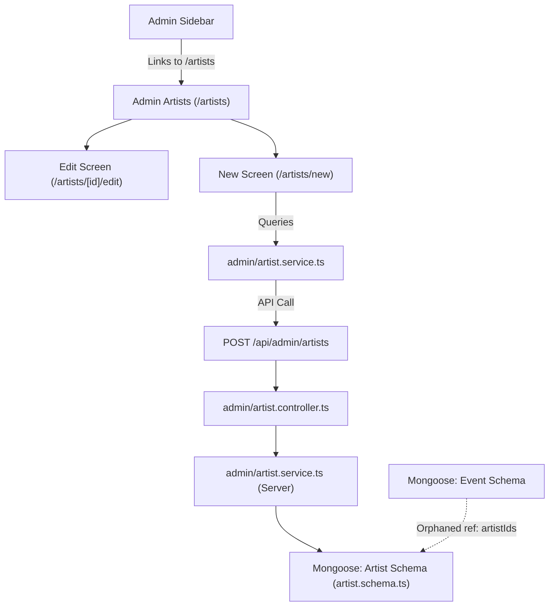
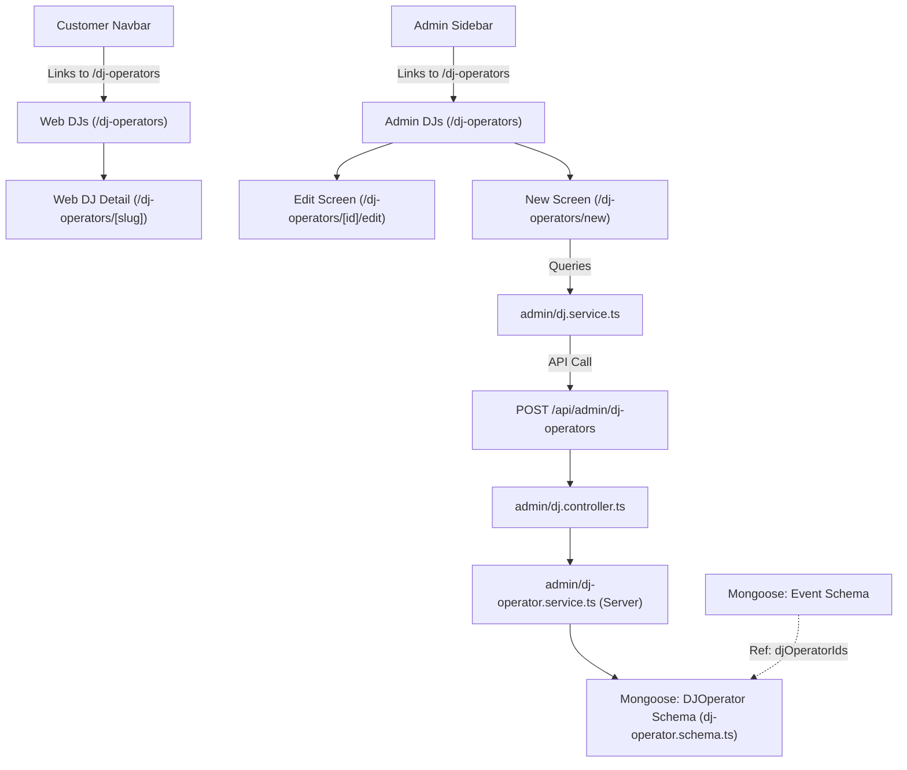

# Artists vs DJ Operators Architecture Audit
**MAD Entertrainment Platform**
*Document Status: Draft / Audit Only*
*Target Branch: `audit/artists-module-removal`*

---

## Executive Summary

This audit evaluates the relationship, code overlap, and business alignment between the **Artists** (`/artists`) and **DJ Operators** (`/dj-operators`) modules across the **MAD Entertrainment** monorepo. Conceptually, both modules model the exact same business entity: **performer talent** hired for events. However, because the platform focuses primarily on live DJ-driven music experiences, the DJ Operators module has emerged as the actively maintained, primary business asset, while the Artists module remains a duplicate, un-linked, and orphaned legacy resource.

By performing a comprehensive dependency analysis, we have confirmed that the Artists module is **entirely invisible to customers**, un-referenced in the event creation and editing UI, and serves no functional purpose in the current administration workflows.

Therefore, we recommend **Option A: Remove Artists completely**. This will clean up massive code bloat (saving 11+ source files and reducing visual and database clutter) without introducing any functional regressions.

---

## Part 1: Current Navigation & Business Architecture

### 1. Artists Module Architecture Map



### 2. DJ Operators Module Architecture Map



---

## Part 2: Structural Verification (Core Questions)

Our deep-dive into the source files of `apps/admin`, `apps/web`, and `apps/server` yields concrete answers to the core audit questions:

### 1. Artists Module Audit

1.  **Is Artists visible to customers?**
    **No.** The customer web client (`apps/web`) contains **no `/artists` route or page**. The public navigation Navbar and Footer do not link to any `/artists` path.
2.  **Is Artists visible to admins?**
    **Yes.** The admin application contains the list screen (`/artists`), a new performer screen (`/artists/new`), and editing screens (`/artists/[id]/edit`).
3.  **Is Artists linked from navigation?**
    *   **Customer Web**: **No** (any broken/dead links were fully purged in Stage 1).
    *   **Admin Dashboard**: **Yes**, in `AdminSidebar.tsx` as a primary sidebar link (`{ label: 'Artists', href: '/artists', ... }`).
4.  **Is Artists referenced by Events?**
    *   **Database Schema**: **Yes**. `event.schema.ts` defines `artistIds: [{ type: Schema.Types.ObjectId, ref: 'Artist' }]`.
    *   **Administration UI**: **No.** The event creation form (`events/new/page.tsx`) and edit forms **contain zero input fields** to assign or select artists for an event.
5.  **Is Artists referenced by Bookings?**
    **No.** Bookings only reference events and customer details; they have no connection to performers.
6.  **Is Artists referenced by Ticket Profiles?**
    **No.**
7.  **Is Artists referenced by DJ Operators?**
    **No.**
8.  **Is Artists only placeholder/demo content?**
    **No.** It has fully implemented schemas, controllers, and services. However, since it is not linked or editable inside event creation, it behaves essentially as an orphaned, dead-end feature in the actual administration workflow.
9.  **Are there active APIs supporting Artists?**
    **Yes.** Active backend CRUD routes under `/api/artists` (public) and `/api/admin/artists` (admin) exist.
10. **Would removing Artists break any workflows?**
    **No operational business workflows** would be broken. Because the UI does not allow admins to assign artists to events, and customers cannot browse them, the module is effectively dormant.

---

### 2. DJ Operators Module Audit

1.  **Is DJ Operators a primary business feature?**
    **Yes.** Booking DJ operators, showcasing DJ talent portfolios, and managing active DJ lineups represent the core business model of MAD Entertainment.
2.  **Is DJ Operators actively exposed on the public website?**
    **Yes.** Fully integrated client routes (`/dj-operators`, `/dj-operators/[slug]`), sitemaps, search query caches, and homepage highlights (`DjOperatorsSection`) exist and are actively loaded.
3.  **Is DJ Operators used in events?**
    *   **Database Schema**: **Yes**, via `djOperatorIds: [{ type: Schema.Types.ObjectId, ref: 'DJOperator' }]`.
    *   **Administration UI**: **No.** Like Artists, the event creation and edit UI does not yet expose a selection widget, meaning the database relationship is currently prepared but unused in the administration form.
4.  **Is DJ Operators replacing Artists conceptually?**
    **Yes.** Performers are booked as DJ Operators, making the "Artists" concept redundant.
5.  **Are both modules solving the same business problem?**
    **Yes.** They both represent performer talent bios, genres, profile images, and slugs.

---

## Part 3: Monorepo Dependency Analysis

```txt
  +-----------------------------------------------------------+
  |                   Event Document Model                    |
  |  - artistIds (Ref: 'Artist')    - djOperatorIds (Ref)     |
  +-----------------------------+-----------------------------+
                                |
        +-----------------------+-----------------------+
        |                                               |
        v                                               v
  +---------------------------+                   +---------------------------+
  |   Artist Schema Model     |                   |  DJOperator Schema Model  |
  +-------------+-------------+                   +-------------+-------------+
                |                                               |
        +-------+-------+                               +-------+-------+
        v               v                               v               v
  [Public API]    [Admin API]                     [Public API]    [Admin API]
  /api/artists    /admin/artists                  /dj-operators   /admin/dj-operators
```

*   **Direct Dependencies**:
    *   `apps/admin/src/app/artists/page.tsx` $\rightarrow$ `admin/artist.service.ts`.
    *   `apps/server/src/routes/index.ts` $\rightarrow$ mounts `admin/artists` and `public/artists` routers.
    *   `apps/server/src/services/admin/event.service.ts` $\rightarrow$ populates `'artistIds'`.
*   **Indirect Dependencies**:
    *   `packages/shared` or types package defining performer types (e.g. `Artist` interface).
*   **Shared Components**:
    *   `CloudinaryUpload.tsx` is shared across events, venues, popups, and performer uploads, allowing folder overrides.

---

## Part 4: Risk Assessment

We classify the risk of **complete removal of the Artists module** as: **LOW / MEDIUM**

### Why?
*   **Zero Operational Risk**: Since the frontend customer web application does not render or route `/artists`, and the admin events creator has no UI widget to select artists, removing it will not impact booking, checkout, payment, or platform operations.
*   **Mongoose Relationship Risk**: The only notable risk is that the Event schema (`event.schema.ts`) and Event services (`event.service.ts`) explicitly define and populate the `artistIds` attribute. If the `Artist` model is deleted without removing these populate methods, the server will crash at runtime (mongoose schema compilation errors).
*   **Mitigation**: The removal must be executed as a complete, coordinated monorepo PR that purges frontend routes, service adapters, server routes, mongoose schemas, and populate queries simultaneously.

---

## Part 5: Recommendation

We recommend **Option A: Remove Artists completely**.

Conceptually merging them is unnecessary because "DJ Operators" already encapsulates the required fields and represents 100% of the active performer business. Retaining "Artists" is visual and database noise, and hiding/deprecating it gradually only prolongs maintenance overhead.

### Option A Action Plan

The following outlines the exact files that must be deleted or modified in a future PR to execute the removal cleanly:

#### 1. Required Files for Deletion (11 Files)
*   `apps/admin/src/app/artists/page.tsx` (List screen)
*   `apps/admin/src/app/artists/new/page.tsx` (Create screen)
*   `apps/admin/src/app/artists/[id]/edit/page.tsx` (Edit screen)
*   `apps/admin/src/lib/api/admin/artist.service.ts` (Admin API client service)
*   `apps/server/src/routes/admin/artist.routes.ts` (Admin Express router)
*   `apps/server/src/routes/public/artist.routes.ts` (Public Express router)
*   `apps/server/src/controllers/admin/artist.controller.ts` (Admin controllers)
*   `apps/server/src/controllers/public/artist.controller.ts` (Public controllers)
*   `apps/server/src/services/admin/artist.service.ts` (Admin DB service)
*   `apps/server/src/services/public/artist.service.ts` (Public DB service)
*   `apps/server/src/models/artist.schema.ts` (Mongoose schema)

#### 2. Required Files for Modification (7 Files)
*   `apps/admin/src/components/AdminSidebar.tsx` (Remove Sidebar menu item)
*   `apps/admin/src/components/CloudinaryUpload.tsx` (Remove folder configuration type)
*   `apps/server/src/routes/index.ts` (Remove route mounting)
*   `apps/server/src/models/event.schema.ts` (Remove `artistIds` from TypeScript interface and schema definition)
*   `apps/server/src/services/admin/event.service.ts` (Remove `.populate('artistIds', 'name')`)
*   `apps/server/src/services/public/event.service.ts` (Remove `.populate('artistIds')`)
*   `apps/server/src/validations/admin-content.validation.ts` (Remove `artistIds` Zod array check)

#### 3. Migration Risks
*   **Stale DB Fields**: Existing events in MongoDB might still contain an `artistIds` array. A database migration script is not strictly necessary as MongoDB ignores unmapped schema fields, but running a simple schema clean query (`db.events.updateMany({}, { $unset: { artistIds: "" } })`) during rollout will ensure absolute DB cleanliness.

#### 4. Testing & Verification Requirements
*   **Vitest Verification**: Run `pnpm test` to ensure Mongoose compiles correctly.
*   **Compile Verification**: Run `pnpm type-check` and `pnpm build` across all packages to confirm no compiler errors exist in shared structures.
*   **E2E Validation**: Create an event in `/events/new` and verify it saves and compiles without Mongoose populate warnings.
