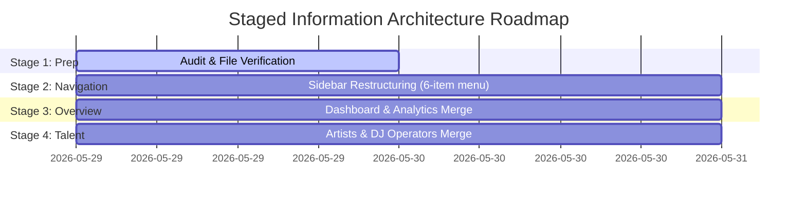

# Dashboard Information Architecture Audit
**MAD Entertrainment Platform**
*Document Status: Draft / Audit Only*
*Target Branch: `feat/dashboard-information-architecture`*

---

## Executive Summary

The **MAD Entertrainment Admin Platform** (`apps/admin`) currently suffers from high cognitive load, layout duplication, and excessive navigation items in the sidebar. Out of the 14 items currently exposed in the primary sidebar, multiple pairs (such as `Dashboard` / `Analytics`, and `Artists` / `DJ Operators`) are virtually identical, repeating backend queries, data visualizers, and UI component boilerplate.

This audit evaluates the information architecture of the admin dashboard and designs a streamlined navigation hierarchy. By consolidating redundant views, grouping related content sub-tasks, and improving workflow transitions, we can reduce the primary sidebar to **6 high-level hubs** and dramatically decrease the clicks required for common administrative operations.

Crucially, this is a **pure UI-only layout simplification audit** that respects all architectural constraints: **no database modifications, no route deletions, no auth changes, and no backend API alterations**.

---

## Part 1: Navigation Analysis

### 1. Sidebar Navigation Duplication

Our investigation of the admin shell structure and the `apps/admin/src/components/AdminSidebar.tsx` links revealed substantial layout and routing redundancies:

*   **`Overview` Redundancy (`Dashboard` vs `Analytics`)**:
    *   Both `/dashboard` and `/analytics` query the same backend service (`adminGetDashboardSummary`).
    *   Both render the exact same KPI metric cards (Total Bookings, Last 30 Days, Total Revenue).
    *   Both render identical top performer event tables.
*   **`Content` Redundancy (`Artists` vs `DJ Operators`)**:
    *   `/artists` and `/dj-operators` point to two separate filesystem routes, but their codebases (`page.tsx` under each folder) are **100% duplicate structural copies**.
    *   They render matching columns (Avatar, Name, Bio, Speciality/Genre, Status toggle) and utilize duplicate confirmation modals, filters, and paging blocks.
*   **`Commerce` Fragmentation**:
    *   `Bookings` (`/bookings`), `Refunds` (`/refunds`), and `Coupons` (`/coupons`) are listed as three separate primary categories, crowding the sidebar.

---

### 2. Route Frequency Assessment

Analyzing typical admin operational patterns identifies high-frequency routes vs. low-value, rarely accessed settings:

| Route / Section | Primary Purpose | Frequency Category | Usability Impact & Recommendation |
| :--- | :--- | :--- | :--- |
| **`/dashboard`** | Platform health, sales metrics, and top events. | 🟢 **High-Frequency** | Crucial operational landing page. Keep prominent. |
| **`/bookings`** | Ticket orders search, CSV exporting, cancellations. | 🟢 **High-Frequency** | Daily commerce lookup. Needs better table focus. |
| **`/events`** | Event creation, schedule planning, capacity. | 🟢 **High-Frequency** | Core content management. Keep prominent. |
| **`/scanner`** | Door validation camera scanner. | 🟢 **High-Frequency** | Critical on-site event night tool. |
| **`/analytics`** | 30-day interactive area chart. | 🟡 **Medium-Frequency** | Redundant. Consolidate into `/dashboard` tab. |
| **`/ticket-profiles`** | Reusable ticket configurations. | 🟡 **Medium-Frequency** | Move directly into the event creation form block. |
| **`/artists` & `/dj-operators`**| Performer directory updates. | 🟡 **Medium-Frequency** | Consolidate under a unified `/talent` tab. |
| **`/coupons` & `/refunds`** | Commercial options & payouts. | 🔴 **Low-Frequency** | Group inside a unified `/commerce` wrapper sub-view. |
| **`/popups` & `/notifications`**| Marketing banner and email updates. | 🔴 **Low-Frequency** | Consolidate under a single `/engagement` tab. |
| **`/team` & `/settings`** | Staff permissions and global parameters. | 🔴 **Low-Frequency** | Consolidate under a single `/system` settings hub. |

---

## Part 2: Workflow & Click Analysis

The table below measures the clicks and page hops currently required to execute standard admin tasks, identifying friction points:

| Action / Workflow | Current Clicks Required | Friction Points Identified | Proposed Simplified Path (Target) |
| :--- | :--- | :--- | :--- |
| **Create Event** | **2 Clicks** | User navigates to `/events`, then clicks `+ Add Event`. | **1 Click**: Promoted to global sidebar Quick Action. |
| **View Bookings** | **1 Click** | Clean, but page filters wrap and waste vertical space. | **1 Click**: Maintain, but with card-responsive design. |
| **Cancel Booking** | **2 Clicks** | Requires going to `/bookings`, finding order, and horizontal swiping on mobile. | **1 Click**: Expandable bookings details overlay drawer. |
| **Manage Ticket Profiles**| **2 Clicks** | Completely disconnected from event creation; forces page hops to copy configurations. | **0 Clicks**: Embedded directly into the Event Creation form. |
| **View Revenue Charts** | **1 Click** | Requires clicking `/analytics` and wait-loading duplicate metrics queries. | **1 Click**: Direct toggle on the unified Dashboard tab. |
| **Scan Tickets** | **1 Click** | Isolated link, camera view restricted by permanent sidebar. | **1 Click**: Retained, but with a full-screen mobile toggle. |

---

## Part 3: Dashboard & Metric Analysis

### 1. Metric Duplication
*   `Total Bookings`, `Last 30 Days Bookings`, and `Total Revenue` are requested and rendered in two separate files (`dashboard/page.tsx` and `analytics/page.tsx`), doubling the query payload on the server.
*   "Top Events by Revenue" is calculated and rendered twice, wasting database execution.

### 2. Low-Value Elements
*   **"Last 30 Days" Card**: A standalone card representing a simple time slice of bookings adds little actionable value without comparison trends (e.g. "+12% vs last month").
*   **Isolated Ticket Profiles**: Managing profiles in `/ticket-profiles` is isolated from active events. Admins rarely configure profiles as a separate standalone step; they do so when building or editing an event.

### 3. Metric Promotion Opportunities
*   **Depletion Warning**: An active event's ticket depletion rate (e.g. "92% Sold - only 8 VIP tickets remaining!") should be promoted to the home dashboard to let admins adjust marketing or add ticket capacity instantly.
*   **Pending Payouts / Refunds**: Direct flags on pending cash refunds or failed payment triggers should be displayed on the home screen rather than hidden inside sub-tabs.

---

## Part 4: Consolidation Opportunities

The approved design focuses on four main consolidation categories:

### 1. Overview Consolidation (`/dashboard` + `/analytics`)
Unify both pages into `/dashboard` using a sleek, stateful Tab controller:
*   **Tab A: Overview**: Displays Quick Actions, high-level metrics cards, and recent booking tables.
*   **Tab B: Revenue Analytics**: Houses the interactive Recharts 30-day area chart and detailed performance tables.
*   **Benefit**: Cuts database query counts in half and removes an entire route link from the primary sidebar.

### 2. Event Ticketing Consolidation (`/events` + `/ticket-profiles`)
*   Remove the standalone `/ticket-profiles` sidebar link.
*   Embed the Ticket Profile creator and templates as a sliding Drawer or modal selector directly within `/events/new` and `/events/[id]/edit`.
*   **Benefit**: Keeps admins in a single focused zone when creating events, eliminating the cognitive friction of page hopping.

### 3. Performer Directory Consolidation (`/artists` + `/dj-operators`)
Unify both lists under a single `/talent` page with a tab toggle:
*   Header switch: `[ Artists ] [ DJs ]`
*   Both views share a single type-safe React Table component, loading from either `artist.service` or `dj.service` dynamically.
*   **Benefit**: Eliminates 250+ lines of redundant client-side duplicate page code and declutters the sidebar.

### 4. Commerce Consolidation (`/bookings` + `/refunds` + `/coupons`)
Group booking logs, coupon management, and refund requests under a single `/commerce` route with a sub-navigation bar:
*   Sub-nav: `[ Bookings ]  [ Refunds ]  [ Coupons ]`
*   **Benefit**: Simplifies sidebar space and consolidates transactional operations.

---

## Part 5: Recommended Information Architecture

The proposed architecture organizes the admin platform into **6 high-level menu groups**, reducing primary sidebar links by 57%.

```txt
Current Sidebar (14 items):
  Overview:    [Dashboard], [Analytics]
  Content:     [Events], [Ticket Profiles], [Artists], [DJ Operators]
  Commerce:    [Bookings], [Scanner], [Refunds], [Coupons]
  Engagement:  [Popups], [Notifications]
  System:      [Team], [Settings]

Proposed Streamlined Sidebar (6 items):
  1. [Overview]    --> Consolidated /dashboard (Overview + Analytics tabs)
  2. [Events]      --> Consolidated /events (Events list + Inline Ticket Profiles)
  3. [Talent]      --> Consolidated /talent (Artists + DJ Operators tab toggles)
  4. [Commerce]    --> Consolidated /commerce (Bookings + Refunds + Coupons sub-nav)
  5. [Scanner]     --> Retained /scanner (Ticket gate scanning camera)
  6. [System]      --> Consolidated /system (Team + Popups + Notifications + Settings tabs)
```

### Proposed Admin Navigation Hierarchy (TypeScript/JSX Representation)

Instead of the sprawling, 14-link structure, the sidebar will map a compact, robust array:

```typescript
const navGroups = [
  {
    title: 'Management',
    items: [
      { label: 'Overview', href: '/dashboard', icon: <GridIcon /> },
      { label: 'Events', href: '/events', icon: <CalendarIcon /> },
      { label: 'Talent', href: '/talent', icon: <UsersIcon /> },
      { label: 'Commerce', href: '/commerce', icon: <TicketIcon /> },
    ],
  },
  {
    title: 'Operations',
    items: [
      { label: 'Scanner', href: '/scanner', icon: <ScanIcon /> },
      { label: 'System', href: '/system', icon: <SettingsIcon /> },
    ],
  },
];
```

---

## Part 6: Staged Implementation Roadmap

We propose a staged, incremental refactoring process. Each step works on pure UI-only layout consolidations with **zero database, route folder deletions, or backend contract changes**.



### Stage 1: Navigation Restructuring (Quick Win)
*   **Objective**: Reorganize the primary sidebar links to map the streamlined 6-item menu.
*   **Implementation**: Update `AdminSidebar.tsx` to mount the consolidated menu array. Point temporary sub-links (like Refunds/Coupons) to their existing folder paths, keeping them active while we prepare layouts.

### Stage 2: Dashboard & Analytics Consolidation
*   **Objective**: Combine `/dashboard` and `/analytics` to remove overview duplication.
*   **Implementation**: Refactor `dashboard/page.tsx` to handle state-based tabs. Port the Recharts area graph component into the second tab, and sunset `/analytics` by client-side redirecting it to `/dashboard?tab=analytics`.

### Stage 3: Performer Directory Consolidation
*   **Objective**: Unify `/artists` and `/dj-operators` layouts.
*   **Implementation**: Create a unified `/talent` route with toggleable list views. Point the sidebar to `/talent`, and gracefully redirect `/artists` and `/dj-operators` to it.

---

## Part 7: Risk Assessment

*   **API / Endpoints Risk**: **Zero Risk.** Database models, Cloudinary uploads, and API endpoints are untouched.
*   **Routing Risk**: **Low Risk.** Since Next.js routes are not deleted, and client-side redirects (`router.replace`) are used for legacy links, old bookmarks will resolve seamlessly.
*   **Type Consistency**: **Zero Risk.** Uses existing shared TypeScript structures from `@mad/types`, preserving absolute monorepo type-checking safety.
*   **Performance Impact**: **Positive.** Consolidating queries reduces concurrent HTTP payloads, improving dashboard loading times.
