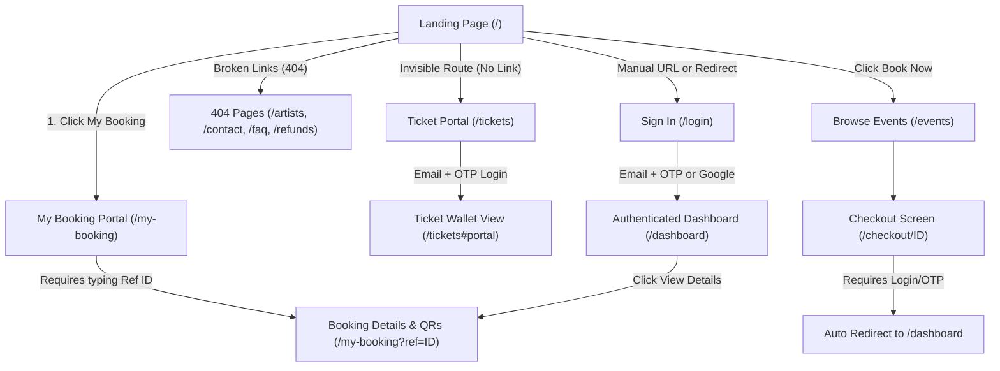
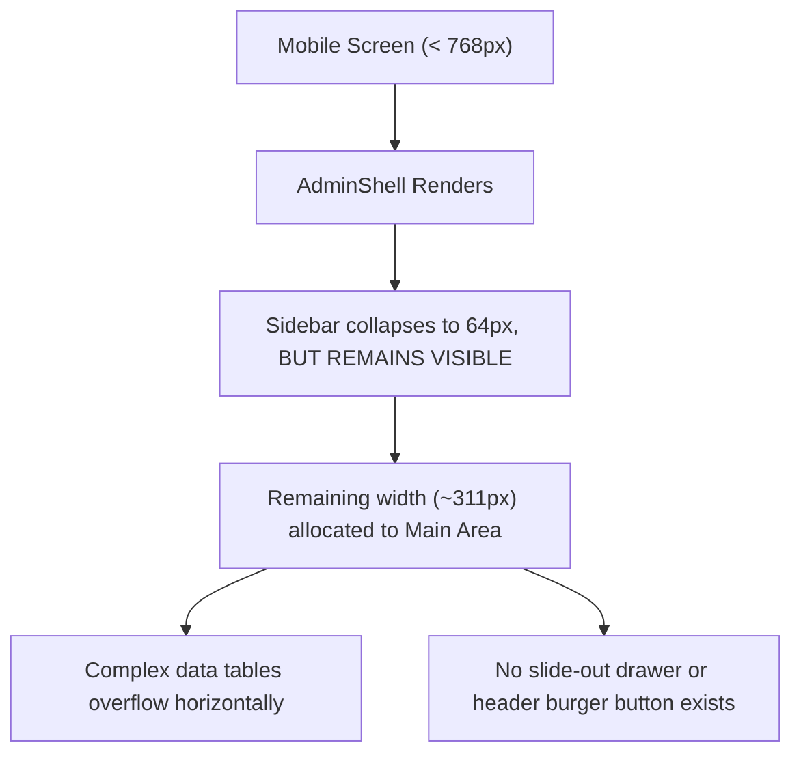

# Dashboard & Navigation UX Simplification Audit
**MAD Entertrainment Platform**
*Document Status: Draft / Audit Only*
*Target Branch: `feat/dashboard-simplification`*

---

## Executive Summary

This audit evaluates opportunities to simplify the customer and admin dashboard UX within the **MAD Entertrainment** codebase without altering business logic, database schemas, or API contracts. By analyzing existing routes, authentication flows, page architectures, and mobile responsiveness, we have identified substantial redundancies, broken paths (dead-ends), and layout conflicts.

Implementing the recommended changes will significantly reduce cognitive load for admins, eliminate redundant page hops for customers, fix critical navigation failures, and ensure the entire platform is responsive, modern, and visually premium on all viewports.

---

## Part 1: Current Navigation Map

The following Mermaid diagrams illustrate the current navigation structures, illustrating how disjointed page flows and duplicate interfaces increase friction.

### 1. Customer Navigation & Authentication Flow



### 2. Admin Navigation Map (14-Sidebar Items)

```mermaid
graph TD
    AdminShell["Admin Shell Layout"] --> Overview["Overview Category"]
    AdminShell --> Content["Content Category"]
    AdminShell --> Commerce["Commerce Category"]
    AdminShell --> Engagement["Engagement Category"]
    AdminShell --> System["System Category"]

    Overview --> Dashboard["Dashboard (/dashboard)"]
    Overview --> Analytics["Analytics (/analytics)"]

    Content --> EventsA["Events (/events)"]
    Content --> TicketProfiles["Ticket Profiles (/ticket-profiles)"]
    Content --> Artists["Artists (/artists)"]
    Content --> DJs["DJ Operators (/dj-operators)"]

    Commerce --> Bookings["Bookings (/bookings)"]
    Commerce --> Scanner["Scanner (/scanner)"]
    Commerce --> Refunds["Refunds (/refunds)"]
    Commerce --> Coupons["Coupons (/coupons)"]

    Engagement --> Popups["Popups (/popups)"]
    Engagement --> Notifications["Notifications (/notifications)"]

    System --> Team["Team (/team)"]
    System --> Settings["Settings (/settings)"]
```



---

## Part 2: Customer UX & Ticket Access Friction

Evaluating the paths required to accomplish standard customer actions reveals high click counts, redundant screens, and hidden portals.

### 1. Clicks Required to Reach Tickets / QR Codes

Depending on the starting context, retrieving a QR entry pass is highly tedious:

*   **Path A: The Authenticated User Route (Via `/login`) — **3 Clicks + High Friction****
    1. User lands on `/` and clicks "Sign In" (hypothetical, as sign-in isn't prominently placed, or they go to `/login` manually).
    2. Input Email $\rightarrow$ Get OTP $\rightarrow$ Input OTP $\rightarrow$ Click "**Verify Code**" (Redirected to `/dashboard`).
    3. On `/dashboard`, user sees their list of bookings. To see their actual tickets/QRs, they must click "**View Details →**" (Redirected to `/my-booking?ref=MAD-XXXX`).
    4. **Result**: 3 clicks, 2 page transitions, and separate API queries for listing and details.
*   **Path B: The Public Reference Route (Via `/my-booking`) — **2 Clicks + Manual Input Friction****
    1. User clicks "My Booking" in the navbar.
    2. User must locate the alphanumeric reference ID from their email/SMS (e.g. `MAD-2026-ABCDE`).
    3. Paste/Type reference ID $\rightarrow$ Click "**Retrieve Tickets**".
    4. **Result**: 2 clicks, but requires heavy manual input, copy-pasting, and is prone to user error.
*   **Path C: The Ticket Retrieval Portal (Via `/tickets`) — **2 Clicks + Passwordless Verification****
    1. User manually navigates to `/tickets` (as it is completely unlinked from the header/footer).
    2. Input Email $\rightarrow$ Get OTP $\rightarrow$ Input OTP $\rightarrow$ Click "**Verify Passcode**".
    3. **Result**: 2 clicks, and bookings and tickets/QRs are rendered *directly* in a unified list without extra page hops or reference typing.

> [!WARNING]
> **The `/tickets` Discovery Gap**: The `/tickets` portal provides the single best customer experience (passwordless authentication $\rightarrow$ instant listing of all bookings AND QRs in a single view), yet **it is not linked anywhere in the navbar or footer navigation**. It is practically invisible to users unless they receive a direct transactional email link.

---

### 2. Core Customer UX Pain Points & Gaps

*   **Redundant Auth & Page Portals**:
    `/login` and `/tickets` are parallel, duplicate flows that handle passwordless OTP authentication exactly the same way under the hood, but lead to different screens. `/login` sends users to `/dashboard` (which doesn't show QRs), while `/tickets` keeps them in a unified "Ticket Wallet" layout.
*   **The `/my-booking` Double-Query Loop**:
    If a logged-in user on `/dashboard` clicks "View Details →", they are sent to the public `/my-booking?ref=ID` page. Rather than passing booking details, `/my-booking` initiates a brand-new API query `publicGetBookingDetails` to fetch the same data, wasting bandwidth.
*   **Obsolete Registration Route**:
    `/register` is obsolete and broken because passwordless credentials cannot be initialized via the legacy form. Although it is now client-side redirected to `/login`, the legacy files remain, and it is still indexed in `sitemap.ts`.
*   **Suboptimal Empty States**:
    When a customer's `/dashboard` is empty, they see a simple "No Bookings Yet" prompt and an "Explore Events" button. There is no utility or card allowing them to search for guest bookings (booked using a different email or before signing in) or link an existing reference ID.

---

## Part 3: Navigation & Dead-End Audit

### 1. Critical Dead-Ends (404 Broken Links)

Our audit of the customer application's main navigation (`apps/web/src/components/layout/Navbar.tsx`) and global footer (`apps/web/src/components/layout/Footer.tsx`) revealed several severe broken links that lead to standard 404 pages:

1.  **Navbar "Artists" Link (`/artists`)**:
    *   **Finding**: The navbar includes an item labeled "Artists" pointing to `/artists`.
    *   **Impact**: There is **no `/artists` directory or page** defined inside `apps/web/src/app`. Clicking this link immediately triggers a 404 page, representing a highly visible dead-end.
2.  **Footer Platform Links (`/artists`)**:
    *   **Finding**: Replicates the broken `/artists` navigation route.
3.  **Footer Support Links (`/contact`, `/faq`, `/refunds`)**:
    *   **Finding**: The footer lists "Contact Us" (`/contact`), "FAQ" (`/faq`), and "Refunds" (`/refunds`).
    *   **Impact**: **None of these routes exist** in the Next.js `apps/web/src/app` filesystem. Every click results in a 404, severely damaging the perceived quality of the user interface.

---

### 2. Customer App Mobile Responsiveness Issues

While the customer interface is generally clean and adaptive, a few responsive gaps exist:
*   **Ticket Stack Fatigue**: Confirmed bookings display all individual entry passes vertically stacked. If a user buys 6 tickets for a show, they must scroll extensively on mobile to show each QR scanner at the venue door.
*   **Monospace Input Scaling**: The OTP code inputs on `/login` and `/tickets` utilize `tracking-[0.6em] pl-[0.6em]` with a large `3xl` font size. On ultra-narrow viewports (e.g. devices under 340px wide like iPhone SE), this can cause alignment issues or input box overflow.

---

## Part 4: Admin Dashboard & Navigation Overcrowding

The admin application (`apps/admin`) features highly redundant data paths and severe mobile usability issues.

### 1. The 80% Overview Duplication (`/dashboard` vs `/analytics`)

The admin sidebar groups `Dashboard` and `Analytics` separately under "Overview". These two pages are **80% redundant**:

| Feature / Data Point | Admin Dashboard (`/dashboard`) | Admin Analytics (`/analytics`) | Overlap Status |
| :--- | :--- | :--- | :--- |
| **API Data Source** | `adminGetDashboardSummary` | `adminGetDashboardSummary` | **100% Identical Query** |
| **Top KPI Card: Total Bookings** | Yes | Yes | **100% Redundant UI** |
| **Top KPI Card: Last 30 Days** | Yes | Yes | **100% Redundant UI** |
| **Top KPI Card: Total Revenue** | Yes | Yes | **100% Redundant UI** |
| **Top Events List Table** | Yes (First 5) | Yes (All) | **90% Redundant UI** |
| **Revenue 30-Day Chart** | No | Yes (Recharts Area) | Unique to Analytics |
| **Quick Action Grid Buttons**| Yes | No | Unique to Dashboard |

Splitting these into two separate pages forces the admin user to jump back and forth to see a unified view of platform health, while multiplying backend queries unnecessarily.

---

### 2. Content Management Overlap (`/artists` vs `/dj-operators`)

The `Artists` and `DJ Operators` sections in the admin sidebar point to two pages that have **100% duplicate layouts and codebases**:

*   **Identical Code**: Both `apps/admin/src/app/artists/page.tsx` and `apps/admin/src/app/dj-operators/page.tsx` are carbon copies of each other, containing 260 lines of virtually identical React/JSX logic.
*   **Identical Table Structures**: Both render tables with columns: Name (with circular profile image), Bio, Genre/Specialties, Status Toggle, and Edit/Delete controls.
*   **Identical Modals**: Both load standard Framer Motion confirmation modals with identical padding and copy templates.

This code bloat increases maintenance overhead and results in redundant menu items in the admin sidebar.

---

### 3. Severe Admin Mobile Usability Failures

The admin dashboard is **practically unusable on mobile viewports** due to critical architectural layout errors in the shell:



*   **No Mobile Drawer**: The `AdminSidebar` does not hide on mobile screens. It forces itself on the left edge, taking up $64\text{px}$ of a $375\text{px}$ screen (nearly 17% of total screen width) even when collapsed.
*   **Broken Typography and Tables**: Since the content width is severely squeezed, the data tables in Bookings, Events, and Ticket Profiles overflow aggressively. Text wraps vertically, edit buttons overlap, and horizontal scrollbars are forced across the main container, breaking the premium aesthetic.

---

## Part 5: Opportunities for Simplification & Consolidation

By removing obsolete paths, merging duplicate views, and standardizing authentication endpoints, we can dramatically improve the platform's visual quality and usability.

### 1. Unified Customer Portal Layout

Instead of maintaining `/dashboard`, `/my-booking`, and `/tickets` as separate pages, they should be consolidated into a single route (e.g. `/dashboard` or `/portal`):

```txt
Current Flow:
Landing ──> /login ──> /dashboard ──> [Click View Details] ──> /my-booking?ref=REF_ID

Proposed Consolidated Flow:
Landing ──> /dashboard (Unified Portal) ──> View Bookings & QRs directly in Expandable Accordions
```

#### Key Improvements:
1.  **Unified Authentication Entry**: Accessing `/dashboard` routes unauthenticated users to a unified sign-in component (combining OTP & Google login).
2.  **In-Place Ticket Retrieval**: On the consolidated dashboard, clicking a booking expands an accordion **in-place** to reveal QR entry passes, download links, and resend buttons. No external redirects, no double API queries.
3.  **Linked Booking Search**: Integrate a small search tab directly into the dashboard's empty state to let users look up and link old guest bookings using a reference ID.

---

### 2. Streamlined Navigation Header & Footer

*   **Remove Broken 404 Links**: Eliminate `/artists` (Navbar & Footer), `/contact` (Footer), `/faq` (Footer), and `/refunds` (Footer).
*   **Add "My Tickets" Navigation Link**: Add a prominent "My Tickets" or "My Bookings" link in the header navbar pointing to `/dashboard`. This replaces `/my-booking` and leads users immediately to their unified secure ticket wallet.

---

### 3. Consolidated Admin Interface

We can reduce the admin sidebar from **14 distinct items to 6 high-level sections**:

```txt
Current Sidebar (14 items):
Dashboard, Analytics, Events, Ticket Profiles, Artists, DJ Operators, Bookings, Scanner, Refunds, Coupons, Popups, Notifications, Team, Settings

Proposed Consolidated Sidebar (6 items):
1. Overview  (Unified Dashboard with 'Summary' & 'Revenue Charts' tabs)
2. Events    (Unified Events + Ticket Profiles editor)
3. Talent    (Unified 'Artists' & 'DJ Operators' with a toggle switch)
4. Commerce  (Unified Bookings, Refunds & Coupons)
5. Scanner   (Camera QR code entry scanner - separate due to device constraints)
6. System    (Consolidated Team, Notifications, Settings, and Popups)
```

*   **Merge Dashboard & Analytics**: Unify `/dashboard` and `/analytics`. Make `/dashboard` the single overview hub, featuring a tabbed controller: `Overview` (quick links, stats, top events) and `Revenue Analytics` (Recharts 30-day interactive graph).
*   **Merge Artists & DJ Operators**: Consolidate these under `/talent` or `/performers` with a toggle header to switch between DJ views and Artist views, sharing a single React layout component.

---

### 4. Fully Responsive Admin Layout

*   **Implement Mobile Burger Drawer**: Set the sidebar to be `hidden` by default on viewports `< md` (768px). Add a responsive menu burger icon to the top-right header that toggles the sidebar as an absolute overlay drawer (sliding from the left on top of the content).
*   **Horizontal Card Adaptation**: Configure complex admin tables to adaptively collapse into card-based layouts on mobile viewports to avoid raw horizontal grid overflows.

---

## Part 6: Recommended Roadmap

We propose a staged, low-risk, reviewable roadmap. Every stage operates purely on UI layout simplification, perfectly adhering to the rule of **zero business logic or database changes**.

### Stage 1: Dead-End Removal & Navigation Cleanliness (Quick Win)
*   **Objective**: Remove broken 404 links to restore navigation confidence.
*   **Scope**:
    *   Modify `apps/web/src/components/layout/Navbar.tsx` to remove the `/artists` route link.
    *   Modify `apps/web/src/components/layout/Footer.tsx` to remove links to `/artists`, `/contact`, `/faq`, and `/refunds`.
    *   Remove `/register` static route entry from `apps/web/src/app/sitemap.ts` to stop crawler index indexing.

### Stage 2: Responsive Admin Shell (High Impact)
*   **Objective**: Make the admin dashboard fully accessible on mobile devices.
*   **Scope**:
    *   Refactor `apps/admin/src/components/AdminShell.tsx` and `AdminSidebar.tsx` to integrate mobile media queries (`hidden md:flex`, `w-0 md:w-64`).
    *   Introduce overlay sidebar logic with a toggle burger button inside the header bar.

### Stage 3: Customer Portal & Ticket View Consolidation
*   **Objective**: Merge `/dashboard`, `/tickets`, and `/my-booking` into a single high-efficiency portal.
*   **Scope**:
    *   Refactor `apps/web/src/app/(auth)/dashboard/page.tsx` to load both bookings and associated entry tickets.
    *   Embed QR renders, ticket details, PDF download links, and "Resend Email" hooks directly into expandable accordion containers.
    *   Set `/tickets` and `/my-booking` to redirect legacy incoming users straight to the consolidated `/dashboard` flow.

### Stage 4: Admin Sidebar & Overview Consolidation
*   **Objective**: Reduce admin cognitive load and clean up code duplicates.
*   **Scope**:
    *   Unify admin `/dashboard` and `/analytics` into a single tabbed route.
    *   Combine `/artists` and `/dj-operators` into a single `/talent` page with a tab selector, sharing the underlying React table component to eliminate 250+ lines of duplicate source code.

---

## Part 7: Risk Assessment

Because this simplification strategy maintains the underlying API endpoints and database architectures, the overall technical risk is **extremely low**.

*   **API Compatibility**: **Zero Risk.** All backend routes (`/bookings/me`, `/bookings/:id`, `/auth/verify`, `adminGetDashboardSummary`) are left completely intact. Only the client-side presentation lay-out changes.
*   **Routing & Bookmarks**: **Low Risk.** Next.js redirects and fallback rewrite configurations will be used to map old paths (such as `/my-booking` or `/tickets`) automatically to `/dashboard`, ensuring legacy customer emails and bookmarks continue to resolve correctly.
*   **Security & Auth Consistency**: **Zero Risk.** The core session models (`AuthProvider`, HttpOnly cookies, JWT verification) are unmodified, preserving absolute state consistency.
*   **Build & Type Integrity**: **Zero Risk.** All consolidations utilize existing types from `@mad/types` and React hooks, ensuring standard type check verification succeeds.
