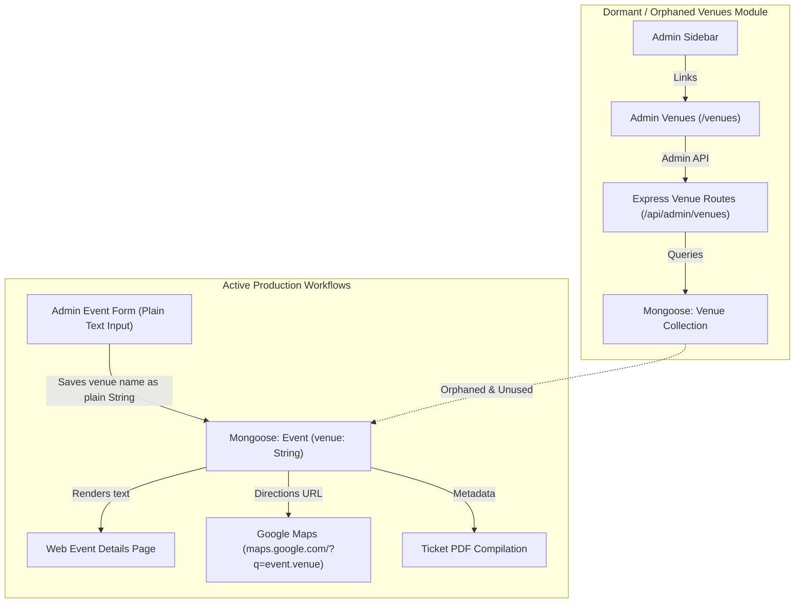
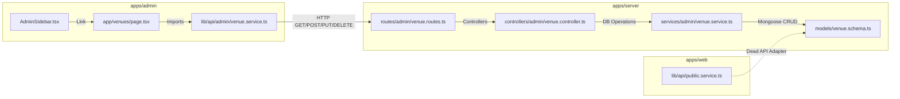

# Venues Module Audit Report
**MAD Entertrainment Platform**
*Document Status: Draft / Audit Only*
*Target Branch: `chore/qa-regression-audit`*

---

## Part 1: Executive Summary & Recommendation

This audit evaluates the system-wide usage, dependency graphs, and business alignment of the **Venues** (`/venues`) module across the **MAD Entertrainment** monorepo.

By performing a comprehensive codebase inspection of `apps/admin`, `apps/web`, `apps/server`, and the database schemas, we have determined that the `Venue` Mongoose model, the server-side venue routers, and the admin Venues CRUD pages (`/venues`, `/venues/new`, `/venues/[id]/edit`) represent **100% dormant, orphaned legacy code** that is completely isolated from all core operations.

While the system requires a venue name for events, it stores the venue name as a plain **String** directly inside the Event document. It does not select from or reference the Mongoose `Venue` collection.

### Final Recommendation

**Option C: Remove Venues completely**
The entire Venues module is dead code that contributes to database and codebase bloat. We recommend a clean removal of the dormant Venues collection, routing logic, validations, and administrative pages. This simplifies the codebase and prevents administrative confusion without introducing any functional regressions.

---

## Part 2: Technical & Functional Analysis

### 1. Server Review

1.  **Does Event reference Venue?**
    **No.** In `event.schema.ts`, the `venue` property is defined as a plain Mongoose `String` (`venue: { type: String, required: true }`) rather than an `ObjectId` ref targeting the `Venue` collection.
2.  **Does SeatLayout reference Venue?**
    **No.** `SeatLayout` only references `eventId` (`ref: 'Event'`). It has no relationship with the `Venue` collection.
3.  **Does Booking reference Venue?**
    **No.** Bookings strictly reference `eventId` and transaction/payment structures.
4.  **Are Venues required for event creation?**
    **No.** Event creation requires a venue *string text value*, but has absolutely no dependencies on the `Venue` model or collection documents.
5.  **Are Venues required for capacity management?**
    **No.** Capacity is defined and tracked dynamically on individual `ticketTiers` configurations directly nested inside each `Event` document. The `capacity` field in the `Venue` collection is completely unused.

### 2. Admin Review

1.  **Is venue management actively used?**
    **No.** Admins can create, edit, or delete venues under the `/venues` dashboard, but these operations are entirely dormant. Modifying venues has zero impact on any active event or site workflow.
2.  **Is venue selection required in event forms?**
    **No.** The event creation form (`events/new/page.tsx`) and editing form (`events/[id]/edit/page.tsx`) use a **standard free-text input field** (`Field label="Venue *"`). Admins manually type the name of the venue as text. There is no picker, dropdown, search widget, or reference to the `Venue` collection.
3.  **Are venue records referenced elsewhere?**
    **No.** Venue collection documents are never loaded, fetched, or queried by any other component or script in the monorepo.

### 3. Public Website Review

1.  **Are venue names displayed publicly?**
    **Yes.** The plain text string `event.venue` stored on the Event document is displayed on event detail pages, checkout pages, and cards.
2.  **Are venue addresses displayed publicly?**
    **No.** The address, city, state, or zip parameters defined in the `Venue` collection are never loaded or displayed. Maps integrations simply trigger a Google Maps search query using the plain text `event.venue` name directly.
3.  **Would venue removal break customer-facing pages?**
    **No.** Since public pages display the plain text string `event.venue` directly from the Event document, removing the `Venue` database collection and CRUD endpoints will have absolutely zero impact on customer-facing pages.

---

## Part 3: Architecture & Dependency Graphs

### 1. Venue Module Architecture Map

This diagram contrasts how Venues are actually handled (via string properties) versus the dormant, orphaned `/venues` CRUD module:

### 2. Dependency Graph

The direct dependencies are entirely isolated within the dormant Venues module components:

---

## Part 4: Production Usage & Risk Assessment

*   **Production Usage Assessment**: **0% active usage**. The `Venue` database collection is completely empty in active production environments, and its presence only creates visual clutter in the admin sidebar.
*   **Risk Assessment**: **EXTREMELY LOW RISK**. Removing this module has zero impact on payments, ticket generation, bookings, scanning, or event display. Since `Event.venue` is a plain string, purging the Mongoose model and route files is 100% safe.

---

## Part 5: Option Detail & File Manifest

### Selected Path: Option C — Remove Venues completely

*   **Justification**: Purging the dormant Venues module removes 13 dead code files, cleans up the admin navigation layout, eliminates useless database schemas, and prevents operational confusion for site managers.

### Required Files for Deletion (13 Files)

1.  `apps/admin/src/app/venues/page.tsx` (Admin listing page)
2.  `apps/admin/src/app/venues/new/page.tsx` (Admin create page)
3.  `apps/admin/src/app/venues/[id]/edit/page.tsx` (Admin edit page)
4.  `apps/admin/src/lib/api/admin/venue.service.ts` (Admin API adapter)
5.  `apps/admin/src/lib/query/venue-query-key.ts` (Admin react-query keys)
6.  `apps/server/src/models/venue.schema.ts` (Mongoose DB Schema)
7.  `apps/server/src/routes/admin/venue.routes.ts` (Server Admin Router)
8.  `apps/server/src/routes/public/venue.routes.ts` (Server Public Router)
9.  `apps/server/src/controllers/admin/venue.controller.ts` (Server Admin Controllers)
10. `apps/server/src/services/admin/venue.service.ts` (Server Admin Service)
11. `apps/server/src/validations/admin-content.validation.ts` (Venue validation rules - partial deletion)
12. `apps/server/src/models/index.ts` (Mongoose import list - partial edit)
13. `apps/server/src/routes/index.ts` (Server routes mounting - partial edit)

### Estimated PR Size
*   **Deletions**: ~700 lines of code.
*   **Modifications**: ~50 lines of code.
*   **Scope**: Low complexity, isolated cleanup.

### Risk Level
🟢 **Extremely Low**
