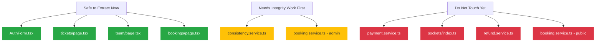

# CLEANUP-006A Large File Audit

## 1. Executive Summary

This repository-wide audit identifies and analyzes oversized TypeScript (`.ts`) and TSX (`.tsx`) files across the workspace. The goal is to establish an evidence-based roadmap for service extraction, complexity reduction, and test coverage alignment, without modifying code.

### Summary Metrics
* **Total TS/TSX Files in Workspace**: 410
* **Review Candidates (> 500 lines)**: 30 files
* **Refactor Candidates (> 800 lines)**: 14 files
* **High Priority (> 1200 lines)**: 4 files
* **Critical (> 2000 lines)**: 1 file

---

## 2. Inventory Table

The following table lists all 30 files in the workspace exceeding the 500-line review candidate threshold, along with their line count, architectural layer, package, and category:

| File Path | Line Count | Layer | Package | Category |
| :--- | :---: | :--- | :--- | :--- |
| [payment.service.ts](../../../apps/server/src/services/public/payment.service.ts) | 2299 | Service | server | Business Logic |
| [payment.service.test.ts](../../../apps/server/src/services/public/payment.service.test.ts) | 1473 | Test | server | Infrastructure |
| [consistency.service.ts](../../../apps/server/src/services/consistency.service.ts) | 1281 | Service | server | Business Logic |
| [consistency.service.test.ts](../../../apps/server/src/services/consistency.service.test.ts) | 1206 | Test | server | Infrastructure |
| [booking.service.ts](../../../apps/server/src/services/admin/booking.service.ts) | 1082 | Service | server | Business Logic |
| [page.tsx](../../../apps/web/src/app/tickets/page.tsx) (tickets) | 1080 | Component | web | UI |
| [booking.service.test.ts](../../../apps/server/src/services/admin/booking.service.test.ts) | 1053 | Test | server | Infrastructure |
| [booking.service.test.ts](../../../apps/server/src/services/public/booking.service.test.ts) | 934 | Test | server | Infrastructure |
| [page.tsx](../../../apps/web/src/app/(auth)/dashboard/page.tsx) (dashboard) | 913 | Component | web | UI |
| [refund.service.test.ts](../../../apps/server/src/services/admin/refund.service.test.ts) | 911 | Test | server | Infrastructure |
| [workers.test.ts](../../../apps/server/src/workers/workers.test.ts) | 898 | Test | server | Infrastructure |
| [AuthForm.tsx](../../../apps/web/src/components/auth/AuthForm.tsx) | 860 | Component | web | UI |
| [EventDetailClient.tsx](../../../apps/web/src/app/events/[slug]/EventDetailClient.tsx) | 805 | Component | web | UI |
| [page.tsx](../../../apps/admin/src/app/bookings/page.tsx) (admin bookings) | 804 | Component | admin | UI |
| [booking.controller.test.ts](../../../apps/server/src/controllers/public/booking.controller.test.ts) | 787 | Test | server | Infrastructure |
| [page.tsx](../../../apps/admin/src/app/team/page.tsx) (admin team) | 747 | Component | admin | UI |
| [page.tsx](../../../apps/admin/src/app/events/[id]/edit/page.tsx) (admin event edit) | 738 | Component | admin | UI |
| [booking.service.ts](../../../apps/server/src/services/public/booking.service.ts) | 708 | Service | server | Business Logic |
| [auth.service.test.ts](../../../apps/server/src/services/public/auth.service.test.ts) | 673 | Test | server | Infrastructure |
| [refund.service.ts](../../../apps/server/src/services/admin/refund.service.ts) | 672 | Service | server | Business Logic |
| [page.tsx](../../../apps/admin/src/app/ticket-profiles/[id]/edit/page.tsx) | 661 | Component | admin | UI |
| [booking.controller.ts](../../../apps/server/src/controllers/public/booking.controller.ts) | 654 | Controller | server | Business Logic |
| [auth.service.ts](../../../apps/server/src/services/public/auth.service.ts) | 632 | Service | server | Business Logic |
| [page.tsx](../../../apps/admin/src/app/ticket-profiles/new/page.tsx) | 614 | Component | admin | UI |
| [index.ts](../../../apps/server/src/sockets/index.ts) (sockets) | 598 | Socket | server | Infrastructure |
| [index.test.ts](../../../apps/server/src/sockets/index.test.ts) (sockets) | 597 | Test | server | Infrastructure |
| [page.tsx](../../../apps/admin/src/app/events/new/page.tsx) | 593 | Component | admin | UI |
| [operational-rbac.routes.test.ts](../../../apps/server/src/routes/admin/operational-rbac.routes.test.ts) | 554 | Test | server | Infrastructure |
| [payment.controller.webhook.test.ts](../../../apps/server/src/controllers/public/payment.controller.webhook.test.ts) | 528 | Test | server | Infrastructure |
| [CheckoutContent.tsx](../../../apps/web/src/components/booking/CheckoutContent.tsx) | 502 | Component | web | UI |

---

## 3. Top 10 Largest Files

| Rank | File | Lines | Recommendation | Rationale |
| :---: | :--- | :---: | :--- | :--- |
| **1** | [payment.service.ts](../../../apps/server/src/services/public/payment.service.ts) | 2299 | **DEFER** | Monolithic class with complex Stripe/Razorpay integrations. High risk, requires integrity work first. |
| **2** | [payment.service.test.ts](../../../apps/server/src/services/public/payment.service.test.ts) | 1473 | **DEFER** | Must be refactored in tandem with `payment.service.ts`. |
| **3** | [consistency.service.ts](../../../apps/server/src/services/consistency.service.ts) | 1281 | **EXTRACT** | Modular checks are easily extractable into task-specific runner components. |
| **4** | [consistency.service.test.ts](../../../apps/server/src/services/consistency.service.test.ts) | 1206 | **EXTRACT** | Extract tests in tandem with `consistency.service.ts` refactoring. |
| **5** | [booking.service.ts](../../../apps/server/src/services/admin/booking.service.ts) (admin) | 1082 | **EXTRACT** | Extract query operations from transactional side-effects (cancel/expire). |
| **6** | [page.tsx](../../../apps/web/src/app/tickets/page.tsx) (tickets) | 1080 | **EXTRACT** | Extract inline components (`PaymentRecoveryBanner`, `TicketStatusMessage`) into `/components/tickets`. |
| **7** | [booking.service.test.ts](../../../apps/server/src/services/admin/booking.service.test.ts) | 1053 | **EXTRACT** | Refactor tests in tandem with admin booking service split. |
| **8** | [booking.service.test.ts](../../../apps/server/src/services/public/booking.service.test.ts) (public) | 934 | **EXTRACT** | Refactor tests in tandem with public booking service split. |
| **9** | [page.tsx](../../../apps/web/src/app/(auth)/dashboard/page.tsx) (dashboard) | 913 | **EXTRACT** | Extract FAQ section and skeleton loaders to separate files. |
| **10** | [refund.service.test.ts](../../../apps/server/src/services/admin/refund.service.test.ts) | 911 | **EXTRACT** | Extract tests alongside the admin refund service. |

---

## 4. Responsibility & Complexity Analysis

### 4.1. Core Server Services & Controller Complexity Summary

As requested, the table below estimates the Cyclomatic Complexity for key transactional files and webhook handlers:

| File / Handler | Cyclomatic Complexity | Key Complexity Drivers |
| :--- | :---: | :--- |
| **[payment.service.ts](../../../apps/server/src/services/public/payment.service.ts)** | **High** | Multiple payment gateways (Stripe/Razorpay), production-mock runtime safeguards, nested database transactions, event emissions, and inventory release paths. |
| **[booking.service.ts](../../../apps/server/src/services/admin/booking.service.ts)** (admin) | **Medium** | Mixes database pagination, filtering, revenue calculations, cancellation side-effects (triggering refunds, emails), and expiration timers. |
| **[booking.service.ts](../../../apps/server/src/services/public/booking.service.ts)** (public) | **High** | Seat locking validation, concurrency-safe ticket selections, session token validation, and transactions. |
| **[refund.service.ts](../../../apps/server/src/services/admin/refund.service.ts)** | **Medium** | Mongoose database mutations combined with Stripe/Razorpay API request handling. |
| **Webhook Handlers** (`stripeWebhook` & `razorpayWebhook` in `payment.controller.ts`) | **High** | Cryptographic signature checking, request idempotency verification via DB lookups, processing different webhook event bodies (charge success, payment intent, failures), and transaction session recovery. |

---

### 4.2. Per-File Detailed Audit Findings

#### 1. [payment.service.ts](../../../apps/server/src/services/public/payment.service.ts)
* **Function Counts**: Exported/Public Methods: **4** | Private Helpers: **11**
* **Cyclomatic Complexity**: **High**
* **Integrity Classification**: Financial Integrity
* **Can Extract Now?**: **NO**
* **Integrity Blockers**: Webhook Integrity Guards, Refund Integrity Guards, High Coupling.
* **Suggested Extractions**:
  - `payment-confirmation.service.ts` (handles webhook validation, safe emit, order status changes)
  - `refund-processing.service.ts` (handles trigger refunds and release inventory)
  - `payment-webhook.service.ts` (handles gateway-specific callbacks)
  - `payment-notification.service.ts` (notifies sockets/emails of confirmation status)
  - `stripe-payment-provider.service.ts` (Stripe specific SDK wrappers)
  - `razorpay-payment-provider.service.ts` (Razorpay specific SDK wrappers)

#### 2. [payment.service.test.ts](../../../apps/server/src/services/public/payment.service.test.ts)
* **Function Counts**: Exported: **0** | Private (Test cases): **42**
* **Cyclomatic Complexity**: **Medium**
* **Integrity Classification**: Financial Integrity
* **Can Extract Now?**: **NO**
* **Integrity Blockers**: High Coupling (dependent on payment.service.ts refactoring).
* **Suggested Extractions**: Split into `stripe-payment-provider.test.ts` and `razorpay-payment-provider.test.ts` in tandem with the service split.

#### 3. [consistency.service.ts](../../../apps/server/src/services/consistency.service.ts)
* **Function Counts**: Exported/Public Methods: **3** | Private Helpers: **14**
* **Cyclomatic Complexity**: **High**
* **Integrity Classification**: Booking Integrity & Financial Integrity (reconciles mismatch counts)
* **Can Extract Now?**: **YES**
* **Integrity Blockers**: None (methods are structurally isolated static checkers).
* **Suggested Extractions**:
  - `booking-consistency.service.ts` (unticketed confirmed and stale booking cleanup)
  - `notification-consistency.service.ts` (stuck/orphaned notification delivery)
  - `refund-consistency.service.ts` (stuck processing refunds and status mismatches)

#### 4. [consistency.service.test.ts](../../../apps/server/src/services/consistency.service.test.ts)
* **Function Counts**: Exported: **0** | Private (Test cases): **31**
* **Cyclomatic Complexity**: **Medium**
* **Integrity Classification**: Booking Integrity & Financial Integrity
* **Can Extract Now?**: **YES**
* **Integrity Blockers**: None.
* **Suggested Extractions**: Extract tests alongside `consistency.service.ts` refactoring.

#### 5. [booking.service.ts](../../../apps/server/src/services/admin/booking.service.ts) (admin)
* **Function Counts**: Exported Functions: **9** | Private Helpers: **0**
* **Cyclomatic Complexity**: **Medium**
* **Integrity Classification**: Booking Integrity & Reporting Integrity
* **Can Extract Now?**: **NO**
* **Integrity Blockers**: Refund Integrity Guards (admin cancellation triggers refunds and emits events).
* **Suggested Extractions**:
  - `booking-query.service.ts` (admin reads: getBookings, getBookingById, getBookingsSummary)
  - `booking-mutation.service.ts` (admin write logic: cancelBooking, expireBooking, resendBookingTickets)
  - `booking-email-correction.service.ts` (handles email change side-effects)

#### 6. [page.tsx](../../../apps/web/src/app/tickets/page.tsx) (tickets)
* **Function Counts**: Exported Functions: **1** | Private Helpers (Inline components): **3**
* **Cyclomatic Complexity**: **Medium**
* **Integrity Classification**: UI Only
* **Can Extract Now?**: **YES**
* **Integrity Blockers**: None.
* **Suggested Extractions**:
  - `PaymentRecoveryBanner.tsx` (handles checkout payment failure recovery alert)
  - `TicketStatusMessage.tsx` (renders state-specific messages)
  - `TicketRetrievalContent.tsx` (handles form filters and ticket display layout)

#### 7. [booking.service.test.ts](../../../apps/server/src/services/admin/booking.service.test.ts)
* **Function Counts**: Exported: **0** | Private (Test cases): **25**
* **Cyclomatic Complexity**: **Medium**
* **Integrity Classification**: Booking Integrity
* **Can Extract Now?**: **NO**
* **Integrity Blockers**: High Coupling (dependent on admin booking service refactoring).
* **Suggested Extractions**: Split test files alongside production query/mutation split.

#### 8. [booking.service.test.ts](../../../apps/server/src/services/public/booking.service.test.ts) (public)
* **Function Counts**: Exported: **0** | Private (Test cases): **24**
* **Cyclomatic Complexity**: **Medium**
* **Integrity Classification**: Booking Integrity
* **Can Extract Now?**: **NO**
* **Integrity Blockers**: High Coupling.
* **Suggested Extractions**: Split test files alongside public booking service refactoring.

#### 9. [page.tsx](../../../apps/web/src/app/(auth)/dashboard/page.tsx) (dashboard)
* **Function Counts**: Exported: **1** | Private Helpers (Inline components): **3**
* **Cyclomatic Complexity**: **Medium**
* **Integrity Classification**: UI Only
* **Can Extract Now?**: **YES**
* **Integrity Blockers**: None.
* **Suggested Extractions**:
  - `BookingCardSkeleton.tsx` (skeleton loader for dashboard panels)
  - `FaqSection.tsx` (holds static FAQ queries, data structures, and display nodes)

#### 10. [refund.service.test.ts](../../../apps/server/src/services/admin/refund.service.test.ts)
* **Function Counts**: Exported: **0** | Private (Test cases): **30**
* **Cyclomatic Complexity**: **Medium**
* **Integrity Classification**: Financial Integrity
* **Can Extract Now?**: **NO**
* **Integrity Blockers**: High Coupling.
* **Suggested Extractions**: Split test suites alongside refund service.

#### 11. [workers.test.ts](../../../apps/server/src/workers/workers.test.ts)
* **Function Counts**: Exported: **0** | Private (Test cases): **21**
* **Cyclomatic Complexity**: **Medium**
* **Integrity Classification**: Booking Integrity & Financial Integrity
* **Can Extract Now?**: **YES**
* **Integrity Blockers**: None.
* **Suggested Extractions**: Split into `email.worker.test.ts`, `pdf.worker.test.ts`, and `booking.worker.test.ts`.

#### 12. [AuthForm.tsx](../../../apps/web/src/components/auth/AuthForm.tsx)
* **Function Counts**: Exported: **1** | Private Helpers: **7**
* **Cyclomatic Complexity**: **High**
* **Integrity Classification**: UI Only (handles logic for timers and OTP cooldown states)
* **Can Extract Now?**: **YES**
* **Integrity Blockers**: None.
* **Suggested Extractions**:
  - `useOtpCooldowns.ts` (custom hook for OTP request and verification timers)
  - `LoginForm.tsx` (login email layout form)
  - `OtpVerifyForm.tsx` (verification field layout form)
  - `RegisterForm.tsx` (registration input form)

#### 13. [EventDetailClient.tsx](../../../apps/web/src/app/events/[slug]/EventDetailClient.tsx)
* **Function Counts**: Exported: **1** | Private Helpers: **1**
* **Cyclomatic Complexity**: **Medium**
* **Integrity Classification**: UI Only
* **Can Extract Now?**: **YES**
* **Integrity Blockers**: None.
* **Suggested Extractions**:
  - `BookingModal.tsx` (ticket selection and reservation modal)
  - `CheckoutModal.tsx` (contact info collection modal)

#### 14. [page.tsx](../../../apps/admin/src/app/bookings/page.tsx) (admin bookings)
* **Function Counts**: Exported: **1** | Private Helpers: **2**
* **Cyclomatic Complexity**: **Medium**
* **Integrity Classification**: UI Only
* **Can Extract Now?**: **YES**
* **Integrity Blockers**: None.
* **Suggested Extractions**:
  - `CancelBookingModal.tsx` (admin booking cancellation modal wrapper)
  - `EditEmailModal.tsx` (admin email correction modal wrapper)

#### 15. [booking.controller.test.ts](../../../apps/server/src/controllers/public/booking.controller.test.ts)
* **Function Counts**: Exported: **0** | Private (Test cases): **21**
* **Cyclomatic Complexity**: **Medium**
* **Integrity Classification**: Booking Integrity
* **Can Extract Now?**: **NO**
* **Integrity Blockers**: High Coupling.
* **Suggested Extractions**: Split alongside booking controller refactoring.

#### 16. [page.tsx](../../../apps/admin/src/app/team/page.tsx) (admin team)
* **Function Counts**: Exported: **1** | Private Helpers: **1**
* **Cyclomatic Complexity**: **Medium**
* **Integrity Classification**: UI Only
* **Can Extract Now?**: **YES**
* **Integrity Blockers**: None.
* **Suggested Extractions**:
  - `InviteAdminModal.tsx`
  - `EditAdminModal.tsx`
  - `RoleChangeModal.tsx`
  - `ResetPasswordModal.tsx`

#### 17. [page.tsx](../../../apps/admin/src/app/events/[id]/edit/page.tsx) (admin event edit)
* **Function Counts**: Exported: **1** | Private Helpers: **2**
* **Cyclomatic Complexity**: **Medium**
* **Integrity Classification**: UI Only
* **Can Extract Now?**: **YES**
* **Integrity Blockers**: None.
* **Suggested Extractions**:
  - `EventForm.tsx` (Shared form layout)
  - `TicketTierEditor.tsx` (Ticket tier arrays manager)

#### 18. [booking.service.ts](../../../apps/server/src/services/public/booking.service.ts) (public)
* **Function Counts**: Exported/Public Methods: **6** | Private Helpers: **0**
* **Cyclomatic Complexity**: **High**
* **Integrity Classification**: Booking Integrity
* **Can Extract Now?**: **NO**
* **Integrity Blockers**: Missing Tests (requires tests around concurrent seat layouts), High Coupling.
* **Suggested Extractions**:
  - `seat-reservation.service.ts` (handles fingerprints, Redis reservation locks, and database check layouts)
  - `booking-creation.service.ts` (handles entity validation, transaction commits, and creation)

#### 19. [auth.service.test.ts](../../../apps/server/src/services/public/auth.service.test.ts)
* **Function Counts**: Exported: **0** | Private (Test cases): **21**
* **Cyclomatic Complexity**: **Medium**
* **Integrity Classification**: Authentication Integrity
* **Can Extract Now?**: **NO**
* **Integrity Blockers**: High Coupling.
* **Suggested Extractions**: Split alongside auth service split.

#### 20. [refund.service.ts](../../../apps/server/src/services/admin/refund.service.ts)
* **Function Counts**: Exported Functions: **3** | Private Helpers: **0**
* **Cyclomatic Complexity**: **High**
* **Integrity Classification**: Financial Integrity
* **Can Extract Now?**: **NO**
* **Integrity Blockers**: Refund Integrity Guards, High Coupling.
* **Suggested Extractions**:
  - `stripe-refund-provider.ts` (Stripe refund endpoints integrations)
  - `razorpay-refund-provider.ts` (Razorpay refund endpoints integrations)
  - `refund-admin.service.ts` (handles listing, CRUD updates, summaries)

#### 21. [page.tsx](../../../apps/admin/src/app/ticket-profiles/[id]/edit/page.tsx)
* **Function Counts**: Exported: **1** | Private Helpers: **1**
* **Cyclomatic Complexity**: **Medium**
* **Integrity Classification**: UI Only
* **Can Extract Now?**: **YES**
* **Integrity Blockers**: None.
* **Suggested Extractions**: Shared `TicketProfileForm.tsx` component.

#### 22. [booking.controller.ts](../../../apps/server/src/controllers/public/booking.controller.ts)
* **Function Counts**: Exported Functions: **10** | Private Helpers: **0**
* **Cyclomatic Complexity**: **Medium**
* **Integrity Classification**: Booking Integrity
* **Can Extract Now?**: **NO**
* **Integrity Blockers**: High Coupling.
* **Suggested Extractions**:
  - `booking-pdf.controller.ts` (handles pdf downloads, tokens)
  - `booking-recovery.controller.ts` (handles bookings OTP/recovery workflows)
  - `booking-crud.controller.ts` (handles sessions and saveCheckout)

#### 23. [auth.service.ts](../../../apps/server/src/services/public/auth.service.ts)
* **Function Counts**: Exported/Public Methods: **7** | Private Helpers: **2**
* **Cyclomatic Complexity**: **High**
* **Integrity Classification**: Authentication Integrity
* **Can Extract Now?**: **NO**
* **Integrity Blockers**: High Coupling, Missing Tests (low branch coverage in Vitest).
* **Suggested Extractions**:
  - `magic-link.service.ts` (handles magic link token creation, email dispatch, rate limits)
  - `oauth-google.service.ts` (handles verification of Google auth client tokens)
  - `session-token.service.ts` (handles signing JWT access tokens and refresh tokens)

#### 24. [page.tsx](../../../apps/admin/src/app/ticket-profiles/new/page.tsx)
* **Function Counts**: Exported: **1** | Private Helpers: **1**
* **Cyclomatic Complexity**: **Medium**
* **Integrity Classification**: UI Only
* **Can Extract Now?**: **YES**
* **Integrity Blockers**: None.
* **Suggested Extractions**: Shared `TicketProfileForm.tsx` component.

#### 25. [index.ts](../../../apps/server/src/sockets/index.ts) (sockets)
* **Function Counts**: Exported Functions: **2** | Private Helpers: **8**
* **Cyclomatic Complexity**: **High**
* **Integrity Classification**: Booking Integrity
* **Can Extract Now?**: **NO**
* **Integrity Blockers**: High Coupling, Missing Tests (sockets are integration heavy).
* **Suggested Extractions**:
  - `redis-seat-lock.service.ts` (handles seat locks check-in/checkout in Redis)
  - `socket-middleware.ts` (correlation IDs and rate limit verification)

#### 26. [index.test.ts](../../../apps/server/src/sockets/index.test.ts) (sockets)
* **Function Counts**: Exported: **0** | Private (Test cases): **29**
* **Cyclomatic Complexity**: **Medium**
* **Integrity Classification**: Booking Integrity
* **Can Extract Now?**: **NO**
* **Integrity Blockers**: High Coupling.
* **Suggested Extractions**: Split test files alongside socket index refactoring.

#### 27. [page.tsx](../../../apps/admin/src/app/events/new/page.tsx)
* **Function Counts**: Exported: **1** | Private Helpers: **2**
* **Cyclomatic Complexity**: **Medium**
* **Integrity Classification**: UI Only
* **Can Extract Now?**: **YES**
* **Integrity Blockers**: None.
* **Suggested Extractions**: Shared `EventForm.tsx` component.

#### 28. [operational-rbac.routes.test.ts](../../../apps/server/src/routes/admin/operational-rbac.routes.test.ts)
* **Function Counts**: Exported: **0** | Private (Test cases): **2** (with 39 helper routines)
* **Cyclomatic Complexity**: **Medium**
* **Integrity Classification**: Authentication Integrity
* **Can Extract Now?**: **YES**
* **Integrity Blockers**: None.
* **Suggested Extractions**: Split into modular route tests.

#### 29. [payment.controller.webhook.test.ts](../../../apps/server/src/controllers/public/payment.controller.webhook.test.ts)
* **Function Counts**: Exported: **0** | Private (Test cases): **19**
* **Cyclomatic Complexity**: **Medium**
* **Integrity Classification**: Financial Integrity
* **Can Extract Now?**: **NO**
* **Integrity Blockers**: High Coupling.
* **Suggested Extractions**: Split alongside controller refactoring.

#### 30. [CheckoutContent.tsx](../../../apps/web/src/components/booking/CheckoutContent.tsx)
* **Function Counts**: Exported: **1** | Private Helpers: **2**
* **Cyclomatic Complexity**: **High**
* **Integrity Classification**: UI Only
* **Can Extract Now?**: **NO**
* **Integrity Blockers**: High Coupling.
* **Suggested Extractions**:
  - `useStripeCheckout.ts` (custom hook for Stripe payment script loading and session creation)
  - `useRazorpayCheckout.ts` (custom hook for Razorpay script load and callbacks verification)

---

## 5. Test Coverage Mapping

For each large file, this section maps unit test status, current Vitest statement/function coverage, and associated test files:

| File Name | Dedicated Test Exists? | Coverage Status | Vitest Coverage (Statement / Function) | Test File References |
| :--- | :---: | :---: | :---: | :--- |
| **payment.service.ts** | **YES** | Medium | 54.48% / 65.85% | [payment.service.test.ts](../../../apps/server/src/services/public/payment.service.test.ts) |
| **consistency.service.ts** | **YES** | High | 83.12% / 93.10% | [consistency.service.test.ts](../../../apps/server/src/services/consistency.service.test.ts) |
| **booking.service.ts** (admin) | **YES** | Medium | 66.42% / 62.16% | [booking.service.test.ts](../../../apps/server/src/services/admin/booking.service.test.ts) |
| **booking.service.ts** (public)| **YES** | Medium | 61.60% / 76.67% | [booking.service.test.ts](../../../apps/server/src/services/public/booking.service.test.ts) |
| **refund.service.ts** (admin) | **YES** | High | 79.75% / 76.92% | [refund.service.test.ts](../../../apps/server/src/services/admin/refund.service.test.ts) |
| **auth.service.ts** (public) | **YES** | Medium | 61.92% / 100.00% | [auth.service.test.ts](../../../apps/server/src/services/public/auth.service.test.ts) |
| **index.ts** (sockets) | **YES** | Medium | 60.40% / 58.06% | [index.test.ts](../../../apps/server/src/sockets/index.test.ts) |
| **booking.controller.ts** (pub) | **YES** | Medium | 64.36% / 66.67% | [booking.controller.test.ts](../../../apps/server/src/controllers/public/booking.controller.test.ts) |
| **CheckoutContent.tsx** (web) | **NO** | Unknown | N/A | Tested via Playwright E2E suites |
| **AuthForm.tsx** (web) | **NO** | High | 63.35% / 68.97% | [AuthForm.test.tsx](../../../apps/web/src/components/auth/AuthForm.test.tsx) |
| **tickets/page.tsx** | **NO** | Unknown | N/A | Tested via Playwright E2E suites |
| **dashboard/page.tsx** (web) | **NO** | Unknown | N/A | Tested via Playwright E2E suites |
| **EventDetailClient.tsx** | **NO** | Unknown | N/A | Tested via Playwright E2E suites |
| **bookings/page.tsx** (admin) | **NO** | Unknown | N/A | Tested via Playwright E2E suites |
| **team/page.tsx** (admin) | **NO** | Unknown | N/A | Tested via Playwright E2E suites |
| **events/[id]/edit/page.tsx** | **NO** | Unknown | N/A | Tested via Playwright E2E suites |
| **ticket-profiles/[id]/edit/page.tsx**| **NO** | Unknown | N/A | Tested via Playwright E2E suites |
| **ticket-profiles/new/page.tsx** | **NO** | Unknown | N/A | Tested via Playwright E2E suites |
| **events/new/page.tsx** (admin) | **NO** | Unknown | N/A | Tested via Playwright E2E suites |

> [!NOTE]
> Client-side UI Pages and Form layouts do not have direct Vitest unit test coverage because they are verified dynamically via Playwright integration test specs under the `e2e/` folder.

---

## 6. Extraction Readiness Matrix

This matrix groups each large file by extraction priority based on the **Priority Scoring** schema:
* **P1**: Extract immediately (Safe to extract now, UI Only or highly modular utility/tasks)
* **P2**: Extract after integrity work (Requires payment, webhook, or refund integrity validation work first)
* **P3**: Leave alone (Authentication security-critical, high-coupling, or risk-prohibitive)

| Score | Files | Action / Strategy |
| :---: | :--- | :--- |
| **P1** | 1. [tickets/page.tsx](../../../apps/web/src/app/tickets/page.tsx) 2. [dashboard/page.tsx](../../../apps/web/src/app/(auth)/dashboard/page.tsx) 3. [AuthForm.tsx](../../../apps/web/src/components/auth/AuthForm.tsx) 4. [EventDetailClient.tsx](../../../apps/web/src/app/events/[slug]/EventDetailClient.tsx) 5. [bookings/page.tsx](../../../apps/admin/src/app/bookings/page.tsx) 6. [team/page.tsx](../../../apps/admin/src/app/team/page.tsx) 7. [events/id/edit/page.tsx](../../../apps/admin/src/app/events/%5Bid%5D/edit/page.tsx) / [events/new/page.tsx](../../../apps/admin/src/app/events/new/page.tsx) 8. [ticket-profiles/id/edit/page.tsx](../../../apps/admin/src/app/ticket-profiles/%5Bid%5D/edit/page.tsx) / [ticket-profiles/new/page.tsx](../../../apps/admin/src/app/ticket-profiles/new/page.tsx) 9. [workers.test.ts](../../../apps/server/src/workers/workers.test.ts) 10. [operational-rbac.routes.test.ts](../../../apps/server/src/routes/admin/operational-rbac.routes.test.ts) | **Extract Immediately.** Safe to refactor immediately since they carry no backend transactions risk or are cleanly decoupled helper suites. |
| **P2** | 1. [payment.service.ts](../../../apps/server/src/services/public/payment.service.ts) 2. [payment.service.test.ts](../../../apps/server/src/services/public/payment.service.test.ts) 3. [consistency.service.ts](../../../apps/server/src/services/consistency.service.ts) 4. [consistency.service.test.ts](../../../apps/server/src/services/consistency.service.test.ts) 5. [booking.service.ts](../../../apps/server/src/services/admin/booking.service.ts) 6. [booking.service.test.ts](../../../apps/server/src/services/admin/booking.service.test.ts) 7. [booking.service.ts](../../../apps/server/src/services/public/booking.service.ts) (public) 8. [booking.service.test.ts](../../../apps/server/src/services/public/booking.service.test.ts) (public) 9. [refund.service.ts](../../../apps/server/src/services/admin/refund.service.ts) 10. [refund.service.test.ts](../../../apps/server/src/services/admin/refund.service.test.ts) 11. [booking.controller.ts](../../../apps/server/src/controllers/public/booking.controller.ts) 12. [booking.controller.test.ts](../../../apps/server/src/controllers/public/booking.controller.test.ts) 13. [index.ts](../../../apps/server/src/sockets/index.ts) (sockets) 14. [index.test.ts](../../../apps/server/src/sockets/index.test.ts) (sockets) 15. [payment.controller.webhook.test.ts](../../../apps/server/src/controllers/public/payment.controller.webhook.test.ts) 16. [CheckoutContent.tsx](../../../apps/web/src/components/booking/CheckoutContent.tsx) | **Extract After Integrity Work.** Lock refactoring until Webhook, Refund, and Payment integrity validation suites are fully implemented. |
| **P3** | 1. [auth.service.ts](../../../apps/server/src/services/public/auth.service.ts) 2. [auth.service.test.ts](../../../apps/server/src/services/public/auth.service.test.ts) | **Leave Alone.** Authentication, login tokens, and Google session hydration should remain unified and untouched to prevent security regressions or refresh-token leaks. |

---

## 7. Extraction Roadmap

### P1 — UI Sub-component Extraction & Cooldown Hook (Immediate Cleanup)
*Focuses on front-end components and pages that are bloated with sub-components but carry zero backend/database risks.*
1. **[AuthForm.tsx](../../../apps/web/src/components/auth/AuthForm.tsx)**: Extract the request/verify OTP cooldown hook `useOtpCooldowns.ts` and separate sub-forms (`LoginForm`, `OtpVerifyForm`).
2. **[tickets/page.tsx](../../../apps/web/src/app/tickets/page.tsx)**: Extract `PaymentRecoveryBanner`, `TicketStatusMessage`, and `TicketRetrievalContent` inline sub-components into separate files.
3. **[team/page.tsx](../../../apps/admin/src/app/team/page.tsx)**: Extract modals (InviteAdmin, EditAdmin, RoleChange, ResetPassword) to resolve complexity in admin team management.
4. **[bookings/page.tsx](../../../apps/admin/src/app/bookings/page.tsx)** (admin bookings): Extract edit email dialog and cancel booking dialog modal wrappers.

### P2 — Event Forms Consolidation & Consistency Service Task Split (Medium Risk)
*Focuses on modular database services and page components that require basic schema/API alignment.*
1. **[consistency.service.ts](../../../apps/server/src/services/consistency.service.ts)**: Separate self-healing tasks into modular task files (expirations, repairs, reconciliations) run by a core runner.
2. **[events/id/edit/page.tsx](../../../apps/admin/src/app/events/%5Bid%5D/edit/page.tsx)** & **[events/new/page.tsx](../../../apps/admin/src/app/events/new/page.tsx)**: Extract and consolidate shared event forms and tier grids.
3. **[ticket-profiles/new/page.tsx](../../../apps/admin/src/app/ticket-profiles/new/page.tsx)** & **[ticket-profiles/id/edit/page.tsx](../../../apps/admin/src/app/ticket-profiles/%5Bid%5D/edit/page.tsx)**: Consolidate configuration forms.
4. **[dashboard/page.tsx](../../../apps/web/src/app/(auth)/dashboard/page.tsx)**: Extract static FAQ lists and skeletons.

### P3 — Core Transactional Services & Sockets (Requires Integrity Work)
*Focuses on the most complex files that handle payments, seat locks, webhooks, and booking transactions. Highly coupled, high-priority risk.*
1. **[booking.service.ts](../../../apps/server/src/services/admin/booking.service.ts)** (admin): Split query operations from write/mutation side-effects.
2. **[booking.service.ts](../../../apps/server/src/services/public/booking.service.ts)** (public) & **[booking.controller.ts](../../../apps/server/src/controllers/public/booking.controller.ts)**: Extract checkout details saving, seat locking, and PDF generation controllers.
3. **[refund.service.ts](../../../apps/server/src/services/admin/refund.service.ts)**: Extract gateway provider integrations.
4. **[index.ts](../../../apps/server/src/sockets/index.ts)** (sockets): Extract Redis-based seat locking into `SeatLockManager`.
5. **[payment.service.ts](../../../apps/server/src/services/public/payment.service.ts)**: Split Stripe and Razorpay processors into individual providers.

---

## 8. Risk Assessment & Safety Categorization

This categorization defines which files are safe to extract immediately vs which files are locked until further system integrity work is completed.

### 8.1. Safe to Extract Now (Low Risk / P1)
The following files are isolated UI components and pages. Their refactoring carries **zero backend risk** and is highly recommended as a starting point.
- [AuthForm.tsx](../../../apps/web/src/components/auth/AuthForm.tsx)
- [tickets/page.tsx](../../../apps/web/src/app/tickets/page.tsx)
- [team/page.tsx](../../../apps/admin/src/app/team/page.tsx) (admin team)
- [bookings/page.tsx](../../../apps/admin/src/app/bookings/page.tsx) (admin bookings)
- [EventDetailClient.tsx](../../../apps/web/src/app/events/[slug]/EventDetailClient.tsx)
- [dashboard/page.tsx](../../../apps/web/src/app/(auth)/dashboard/page.tsx)
- [events/id/edit/page.tsx](../../../apps/admin/src/app/events/%5Bid%5D/edit/page.tsx) / [events/new/page.tsx](../../../apps/admin/src/app/events/new/page.tsx)
- [ticket-profiles/id/edit/page.tsx](../../../apps/admin/src/app/ticket-profiles/%5Bid%5D/edit/page.tsx) / [ticket-profiles/new/page.tsx](../../../apps/admin/src/app/ticket-profiles/new/page.tsx)

### 8.2. Needs Integrity Work First (Medium Risk / P2)
These files involve critical database operations (expiration timers, diagnostic fixes, admin audits). Although they are structured cleanly, their refactoring requires **Payment or Refund Integrity Work** to ensure data transitions remain consistent.
- [consistency.service.ts](../../../apps/server/src/services/consistency.service.ts) (requires Payment and Refund integrity safety nets)
- [booking.service.ts](../../../apps/server/src/services/admin/booking.service.ts) (admin) (requires Refund integrity safety nets due to cancellation side-effects)

### 8.3. Do Not Touch Yet (High Risk / Critical / P2 & P3)
These files are the transactional core of the platform. They control payment intents, client SDK callbacks, webhooks, database locking, and real-time socket connections. **Do not attempt extraction on these files until Webhook, Refund, and Payment integrity validation suites are fully implemented.**
- [payment.service.ts](../../../apps/server/src/services/public/payment.service.ts) (Critical payment/webhook core)
- [sockets/index.ts](../../../apps/server/src/sockets/index.ts) (Real-time Redis locks)
- [refund.service.ts](../../../apps/server/src/services/admin/refund.service.ts) (Gateway refund handlers)
- [booking.service.ts](../../../apps/server/src/services/public/booking.service.ts) (public) (Core booking/locks coordinator)
- [booking.controller.ts](../../../apps/server/src/controllers/public/booking.controller.ts) (Exposes public booking endpoints)
- [CheckoutContent.tsx](../../../apps/web/src/components/booking/CheckoutContent.tsx) (Stripe/Razorpay SDK loader and verification triggers)
