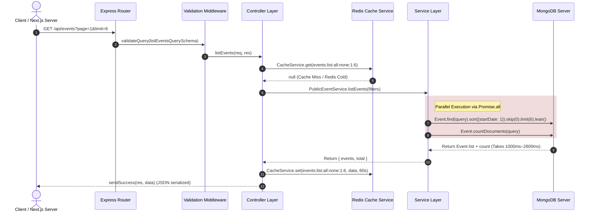

# Homepage API Performance Audit Report

This report documents the performance bottlenecks in the primary homepage API endpoints:
1. `GET /api/events?page=1&limit=6` (Featured Events)
2. `GET /api/dj-operators?limit=6` (DJ Operators)

Recent measurements indicate these endpoints occasionally take **800ms–2800ms** on cache misses or cold boots, severely degrading the initial page load speed on Safari and mobile viewports.

---

## 1. Complete Execution Flow Trace

Below is the chronological path of an incoming HTTP request on cache misses:



---

## 2. Root Cause Analysis & Gaps Detected

### A. Missing Compound Indexes & Blocking Sorts (Slowest Code Paths)

The main driver behind the **800ms–2800ms** latency is **in-memory sorting and unindexed database queries**.

#### 1. The DJ Operator Sorting Bottleneck
* **File**: `apps/server/src/services/public/dj-operator.service.ts` ([dj-operator.service.ts:L20-L28](../../../apps/server/src/services/public/dj-operator.service.ts#L20-L28))
* **Code**:
  ```typescript
  DJOperator.find(query)
    .sort({ name: 1 })
    .skip(skip)
    .limit(limit)
    .select('-__v')
    .lean()
  ```
* **Index Review** (`apps/server/src/models/dj-operator.schema.ts`):
  * The schema only indexes `isActive` ([dj-operator.schema.ts:L36](../../../apps/server/src/models/dj-operator.schema.ts#L36)) and `isDeleted` ([dj-operator.schema.ts:L37](../../../apps/server/src/models/dj-operator.schema.ts#L37)).
  * **There is no index on `name`.**
  * **Impact**: When sorting by `name`, MongoDB is forced to fetch *all* active DJ documents and perform an **in-memory blocking sort**. If the database grows under load, this blocks the DB engine, spiking latency up to 2.8 seconds.

#### 2. The Event Query isDeleted Index Flaw
* **File**: `apps/server/src/services/public/event.service.ts` ([event.service.ts:L31-L38](../../../apps/server/src/services/public/event.service.ts#L31-L38))
* **Code**:
  ```typescript
  Event.find(query)
    .sort({ startDate: 1 })
    .skip(skip)
    .limit(limit)
    .lean()
  ```
* **Query object**:
  ```json
  { "status": "published", "isDeleted": { "$ne": true } }
  ```
* **Index Review** (`apps/server/src/models/event.schema.ts`):
  * The indexes are:
    * `eventSchema.index({ startDate: 1, status: 1 });`
    * `eventSchema.index({ isDeleted: 1 });` (automatically created by `index: true` on the field)
  * **Impact**: MongoDB executes `$ne` (not equal to `true`) queries using an index scan on all entries that are not true, followed by random document fetches to confirm `status === "published"`. 
  * If MongoDB uses the `startDate` index for sorting, it scans index entries sequentially and fetches each document from disk to filter by `isDeleted` and `status` in memory. This generates a massive disk I/O bottleneck.

---

### B. Duplicate Work Detected

1. **Redundant countDocuments Queries**:
   * **Location**: `event.service.ts` (Line 37) and `dj-operator.service.ts` (Line 27).
   * **Problem**: A parallel call is issued to count the total number of documents.
   * **Impact**: The homepage card carousel only displays the top 6 items. The pagination total is completely ignored by the client (homepage layout ignores it). Executing a complete count scan on every cache miss is duplicate and wasteful database overhead.

2. **Fetching Massive Unused Payload Fields**:
   * **Location**: `event.service.ts` (Line 32).
   * **Problem**: The event query uses no projection (`.select()`), retrieving the complete document structure.
   * **Impact**: Next.js fetches full multi-kilobyte subdocument arrays including full `ticketTiers` configurations (including capacity, taxPercent, discount, descriptions, and offerRules!), highlights, and additional text fields. This bloats memory usage, increases network latency between DB and Server, and triggers expensive CPU serialization times inside Express.

---

### C. N+1 Queries review
* **List Events**: No N+1 queries occur on list query, as there is no loop-population in controller.
* **Get Event Details**: `getEventBySlug` executes `.populate('djOperatorIds')`. Since this is only for detail views (not list view), it does not impact list performance.

---

## 3. Recommended Optimizations Ranked by Impact

The following ranked optimizations will resolve this latency bottleneck without modifying business logic or UI states:

### Rank 1: Create Compound Indexes (Zero Code Modifications)
Adding compound indexes will completely eliminate in-memory sorting and result in optimal `IXSCAN` plans.
* **For Events**:
  ```typescript
  // event.schema.ts
  eventSchema.index({ isDeleted: 1, status: 1, startDate: 1 });
  ```
* **For DJ Operators**:
  ```typescript
  // dj-operator.schema.ts
  djOperatorSchema.index({ isActive: 1, name: 1 });
  ```

### Rank 2: Select Projection Fields (Minimal Code Refactor)
Limit the query payload size to the minimal fields rendered on the homepage event/DJ cards.
* **For Events list**:
  ```typescript
  Event.find(query)
    .select('title slug description category status startDate bannerImage isSoldOut ticketTiers.price')
    .sort({ startDate: 1 })
    ...
  ```
* **For DJ Operators list**:
  ```typescript
  DJOperator.find(query)
    .select('name slug bio specialties profileImage isActive')
    .sort({ name: 1 })
    ...
  ```

### Rank 3: Bypass Total Counts for Card Lists
Introduce a flag (e.g. `skipCount: true`) to bypass the `countDocuments` query when rendering card feeds (page 1 lists where pagination is omitted).
