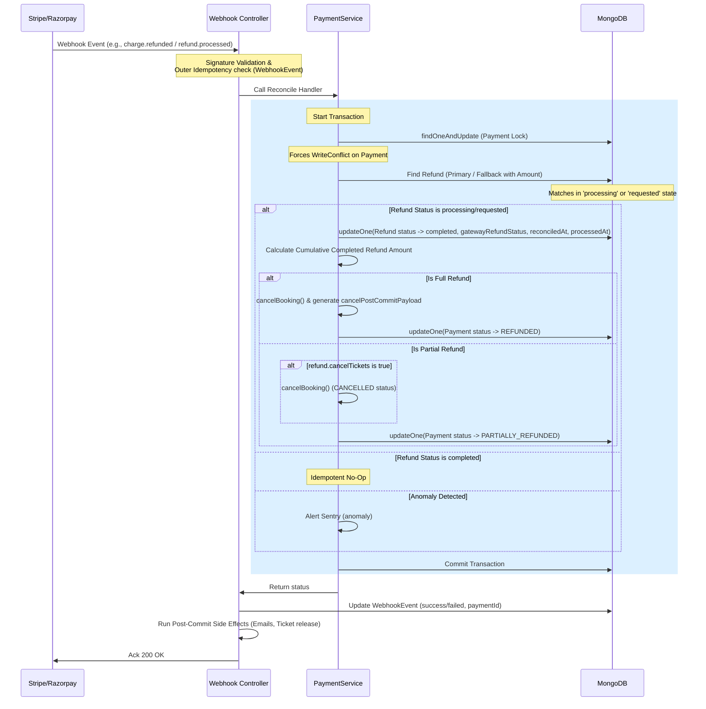

# REFUND-004A — Refund Webhook Reconciliation Architecture

**Task:** REFUND-004A  
**Date:** 2026-06-20  
**Status:** Revised Architecture Review  
**Target Branch:** `refactor/refund-webhook-reconciliation` (from develop)  

---

## 1. Updated Architecture Overview

This revised architecture addresses all findings (RFND-C01 through RFND-L02) from the independent architecture audit. The design provides end-to-end data integrity for refunds across Stripe and Razorpay, ensuring crash-window safety, concurrent protection, correct payload handling, and proper state-machine transitions.



---

## 2. Webhook Routing & Payload Matrix (RFND-C01, RFND-H01)

Stripe webhooks deliver different data object structures based on the event type. The controller and service layer must parse these payloads separately to avoid runtime type errors.

| Provider | Webhook Event | Payload Data Object Type | Key Extraction Logic |
|---|---|---|---|
| **Stripe** | `charge.refunded` | `Charge` | `gatewayPaymentId = event.data.object.id`<br/>`gatewayRefundId = event.data.object.refunds.data[0]?.id`<br/>`status = 'succeeded'` (implicitly succeeded on this event) |
| **Stripe** | `refund.updated` | `Refund` | `gatewayPaymentId = event.data.object.charge`<br/>`gatewayRefundId = event.data.object.id`<br/>`status = event.data.object.status` (check for `'succeeded'` or `'failed'`) |
| **Stripe** | `refund.failed` | `Refund` | `gatewayPaymentId = event.data.object.charge`<br/>`gatewayRefundId = event.data.object.id`<br/>`status = 'failed'` |
| **Razorpay**| `refund.processed`| `refund.entity` | `gatewayPaymentId = payload.refund.entity.payment_id`<br/>`gatewayRefundId = payload.refund.entity.id`<br/>`status = 'processed'` (implicitly succeeded) |
| **Razorpay**| `refund.failed` | `refund.entity` | `gatewayPaymentId = payload.refund.entity.payment_id`<br/>`gatewayRefundId = payload.refund.entity.id`<br/>`status = 'failed'` |

### Stripe Status Mapping (RFND-H01):
- `refund.status === 'succeeded'`: Process transition to `completed`.
- `refund.status === 'failed'`: Process transition to `failed`.
- `refund.status === 'pending'` or `requires_action`: Skip processing (no-op, return 200, keep database status as `processing`).

---

## 3. Updated State Machine (RFND-M01, RFND-C02)

To protect against the watchdog resetting a refund to `requested` before the webhook arrives, the webhook handler is permitted to transition refunds from either `processing` OR `requested` status into the terminal status.

```
                  ┌────────────────────────┐
                  │       requested        │
                  └───────────┬────────────┘
                              │
                  ┌───────────▼────────────┐
                  │       processing       │
                  └─────┬────────────┬─────┘
                        │            │
      (Watchdog Timeout)│            │(Webhook Success /
      [reverts status]  │            │ Admin Success)
                        │            │
                        ▼            ▼
                  ┌───────────┐┌───────────┐
                  │ requested ││ completed │
                  └─────┬─────┘└───────────┘
                        │
                        │(Late Webhook Success)
                        ▼
                  ┌───────────┐
                  │ completed │
                  └───────────┘
```

### Valid State Transitions in Reconciliation:

- `processing` ➜ `completed` (Gateway success: `charge.refunded` / Stripe `refund.succeeded` / Razorpay `refund.processed`)
- `requested` ➜ `completed` (Gateway success after watchdog timeout reset)
- `processing` ➜ `failed` (Gateway failure: Stripe `refund.failed` / Razorpay `refund.failed`)
- `requested` ➜ `failed` (Gateway failure after watchdog timeout reset)
- `completed` ➜ `completed` (Idempotent success no-op)
- `failed` ➜ `failed` (Idempotent failure no-op)
- `completed` ➜ `failed` (CRITICAL Anomaly: Sentry alert raised; money is gone but DB says completed)
- `failed` ➜ `completed` (CRITICAL Anomaly: Sentry alert raised; gateway completed but DB marked failed)

---

## 4. Crash Recovery Model (RFND-H02)

To minimize the database-gateway crash window and resolve lookup ambiguity:

1. **Immediate Write-Through (Minimize Crash Window):**
   In `refund.service.ts` -> `processRefund` (Phase 2), immediately after the gateway API call returns a successful refund ID, persist the `gatewayRefundId` to the database using an un-sessioned write. This reduces the crash window from minutes (waiting for transaction commit) to microseconds (the duration of a fast update write).
   ```ts
   if (finalGatewayRefundId) {
     await Refund.updateOne(
       { _id: refund._id },
       { $set: { gatewayRefundId: finalGatewayRefundId } }
     );
     refund.gatewayRefundId = finalGatewayRefundId;
   }
   ```

2. **Amount-Matched Fallback Lookup:**
   If the server crashes between the gateway call and the immediate write, `gatewayRefundId` will be missing. The fallback lookup matches by:
   - `paymentId` (resolved from gateway payment/charge ID)
   - `status: { $in: ['processing', 'requested'] }`
   - `amount: webhookRefundAmount` (Stripe cents / Razorpay paise converted to decimal).

---

## 5. Webhook Concurrency & Serialization Locks (RFND-H03)

The webhook reconciliation transaction must align with the REFUND-002 concurrency model. Before executing any refund status updates or calculating booking states, the transaction session must acquire an exclusive lock on the `Payment` document:

```ts
const payment = await Payment.findOneAndUpdate(
  { _id: refund.paymentId },
  { $set: { updatedAt: new Date() } },
  { session, new: true }
);
```

This enforces serialization at the database layer, causing concurrent approval/webhook execution threads to throw a Mongo WriteConflict and safely retry the transaction.

---

## 6. Audit Traceability & Alerting (RFND-M02, RFND-L02, RFND-L01)

### Webhook Traceability:
- Populate `webhookEvent.paymentId = payment._id` inside the controller before committing.
- Inject `_reconciledRefundId: refund._id` into the `webhookEvent.rawPayload` JSON object before saving.
- This links the WebhookEvent audit trail directly to the DB Refund without modifying the schema.

### Sentry Alerting:
- Standard logs are insufficient for financial mismatches. Invoke `Sentry.captureMessage` or `Sentry.captureException` for all state-machine anomalies (e.g., `completed -> failed` or `failed -> completed`).

### Semantics of processedAt and reconciledAt:
- `processedAt`: The definitive financial timestamp when the refund was marked as `'completed'` in our DB (set by admin approve or crash-window webhook recovery).
- `reconciledAt`: The specific timestamp when the webhook confirmed the refund.
  - Normal flow: Admin sets `processedAt`. When the webhook arrives later, it only sets `reconciledAt` and `gatewayRefundStatus` (leaving `processedAt` untouched).
  - Crash-window flow: Webhook reconciliation completes the refund and sets both `processedAt` and `reconciledAt` to the current timestamp.

---

## 7. Updated Test Matrix

In addition to base unit tests, the following scenarios must be covered in `payment.service.refund-webhook.test.ts`:

1. **Stripe Payload Type Distinctions:**
   - Verify `charge.refunded` payload parses correctly (extracts from `refunds.data[0].id`).
   - Verify `refund.updated` and `refund.failed` payloads parse correctly (extracts from `.charge` and `.id`).
2. **Stripe Status Filtering on `refund.updated`:**
   - Verify `status: 'pending'` returns `skipped` (retains `processing` status in DB).
   - Verify `status: 'succeeded'` triggers database completion.
   - Verify `status: 'failed'` triggers database failure.
3. **Late-Arrival Watchdog Reset (`requested` -> `completed`):**
   - Verify that a refund in `requested` state is successfully reconciled to `completed` upon receiving a successful webhook event.
4. **Ambiguous Partial Refund Matching (Amount matching):**
   - Setup: Payment has two processing refunds: Refund A (₹500) and Refund B (₹1000).
   - Action: Receive webhook for ₹1000.
   - Assertion: Refund B is matched and completed; Refund A remains `processing`.
5. **Reconciliation Booking Cancellation:**
   - Verify that when the webhook completes a full refund, it calls `cancelBooking` and transitions the Booking to `REFUNDED`.
   - Verify that when `cancelTickets` is true on a partial refund, it transitions the Booking to `CANCELLED`.
6. **Concurrent Write Lock Serialization:**
   - Verify that the Payment document is updated with `updatedAt = new Date()` inside the transaction session.
