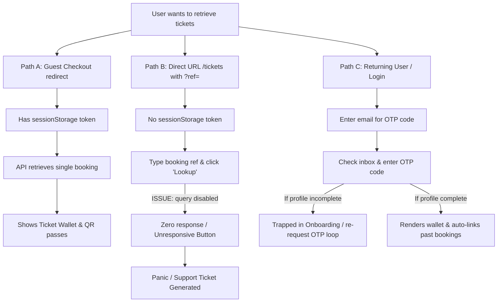

# Ticket Retrieval Portal UX Audit Report

This report presents a comprehensive, high-fidelity UX audit of the ticket retrieval and recovery flows for **MAD Entertainment**. The objective is to identify customer friction points, support-ticket generators, broken user journeys, and technical regressions, and to offer a detailed, prioritized roadmap for improvement.

---

## Executive Summary

The ticket retrieval portal (`/tickets`) is a critical customer touchpoint where attendees view, download, and manage their entry passes. While the backend verification architecture is robust, secure, and enforces case insensitivity, the **frontend user experience suffers from several silent failures, unresponsive elements, and state inconsistencies.** These friction points directly translate into customer confusion, causing users to bypass the portal and contact support.

### Key Metrics & Health Check
* **Guest Journey Completion**: ⚠️ **Medium Friction** (Broken if sessionStorage is cleared or if coming from external mail links).
* **Booking Lookup Reliability**: 🚨 **Critical Issue** (Unresponsive lookup button for anonymous guests due to incorrect query-enablement logic).
* **Payment & Status Clarity**: ⚠️ **Low-to-Medium Friction** (Refunded bookings show as "Cancelled", causing confusion about refunds; expired reservations disappear silently).
* **Onboarding Flow UX**: 🚨 **High Friction** (Authenticated users missing profile fields are trapped in an OTP-request loop).
* **Mobile Form Usability**: 🟢 **Good** (Fully responsive, but has layout shift and small touch targets for actions).

---

## 1. Current Journey Map

Below is a breakdown of how users currently navigate and retrieve their tickets based on three primary entry paths:



### Path Dynamics

| Entry Path | User Intent | Current Technical Behavior | UX Friction / Failure Point |
| :--- | :--- | :--- | :--- |
| **Path A: Active Guest Session** | Immediately view tickets post-purchase. | Reads `GuestBookingSession` from `sessionStorage` and fetches single booking. | 🟢 **Smooth**: Works perfectly as long as the user keeps the tab open. |
| **Path B: Direct Link / Fresh Tab** | Open tickets from email receipt (e.g. `/tickets?ref=MAD-2026-ABCDE`). | `sessionStorage` is empty. The query is disabled on load due to `enabled` guard. | 🚨 **Severe**: The "Lookup" button does nothing. Guest is trapped with an unresponsive UI. |
| **Path C: returning User Wallet** | Access past or multiple bookings using email login. | User logs in via Magic Link OTP. Bookings are auto-linked and listed. | 🚨 **High**: If a profile is incomplete, the user is trapped in an OTP-request loop on `/tickets`. |

---

## 2. Friction Matrix

This matrix details the exact paint points discovered across the frontend and backend codebase, classified by severity.

| ID | Location & Component | Severity | Problem / Customer Impact | Recommendation |
| :--- | :--- | :---: | :--- | :--- |
| **FRIC-01** | `page.tsx` line 156<br>`useQuery(detail)` | **CRITICAL** | **Unresponsive "Lookup" Button for Anonymous Guests:**<br>If a guest visits `/tickets` with a ref but has no `sessionStorage` session token, clicking **Lookup** does nothing. The React Query is disabled. The page feels completely dead. | **Fix Query Enablement:**<br>Change `enabled` to `!!queryRef`. Let the query run; the server will return `BOOKING_VERIFICATION_REQUIRED` (403), which the frontend should capture to prompt verification. |
| **FRIC-02** | `page.tsx` line 327-328<br>`onSuccess()` | **HIGH** | **Search Reference Cleared Upon Login:**<br>When a user completes OTP verification to retrieve a booking they just looked up, the frontend clears `queryRef` and `bookingRefInput`. This forces the user to re-enter the reference ID. | **Preserve Search Context:**<br>Remove `setQueryRef('')` and `setBookingRefInput('')` in the `onSuccess` callback of the `AuthForm` if `queryRef` was pre-populated. |
| **FRIC-03** | `page.tsx` line 141-145 & `AuthForm.tsx` line 153 | **HIGH** | **Onboarding Loop Trap:**<br>If a user is logged in but has not completed onboarding, `page.tsx` displays the `AuthForm` to complete profile. However, `AuthForm` defaults to the `'request'` step (request OTP email) instead of `'onboard'`. The user is stuck in a login loop. | **Auto-Advance Auth Step:**<br>Add an effect in `AuthForm` to detect if the user is already authenticated and requires onboarding, and immediately transition `step` to `'onboard'`. |
| **FRIC-04** | `booking.service.ts` line 214 & `refund.service.ts` | **MEDIUM** | **Refunded Bookings Marked as "Cancelled":**<br>When refunds are approved, bookings are marked `CANCELLED` in the database. The portal shows *"This booking was cancelled"* instead of *"Payment has been refunded"*. This leads to customer panic. | **Proper Status Transitions:**<br>Refactor `cancelBooking` to accept a target status parameter. Set status to `BookingStatus.REFUNDED` when processing refund approvals. |
| **FRIC-05** | `page.tsx` line 26-55<br>`PaymentRecoveryBanner` | **MEDIUM** | **Silent Expiration of Temporary Reservation:**<br>When the countdown timer for seat reservation hits `0`, the banner hides itself. However, the booking remains in `AWAITING_PAYMENT` state, but the user has no way to complete it. | **Transition to Expired State:**<br>Instead of returning `null` when expired, transition the banner to a clear expired state: *"Reservation expired. Your seats have been released."* and change CTA to *"Browse Events"*. |
| **FRIC-06** | `TicketActions.tsx` & `page.tsx` line 439 | **MEDIUM** | **Lack of Multi-Booking Cooldown Feedback:**<br>The 60s cooldown timer is only applied to the single-booking view. In the multi-booking wallet dashboard, users can spam "Resend Tickets", causing raw rate-limit error alerts to appear. | **Unify Cooldown Logic:**<br>Pass the cooldown state or handle individual booking button timers inside `TicketActions` or `page.tsx` using a map of `bookingId -> cooldown`. |
| **FRIC-07** | `page.tsx` line 454-467<br>Empty State | **LOW** | **Vague Empty State:**<br>Logged-in users with no bookings get a generic "No tickets found" box. It doesn't guide guest buyers who might have booked using a different email. | **Provide Dynamic Guidance:**<br>Add help text: *"Booked as a guest under a different email? Sign out and verify using that email, or lookup your reference below."* |

---

## 3. Missing States Matrix

The portal UI fails to handle edge cases, loading skeletons, or transaction states gracefully.

| UI Section | State | Current UX | Proposed UX Improvement |
| :--- | :--- | :--- | :--- |
| **Lookup Input** | **Loading** | No indicator shown on submit; search button shows "Searching..." but the input field remains interactive. | Disable both the input field and search button while the lookup is in flight to prevent double submissions. |
| **Lookup Input** | **Error** | If `isOwnershipVerificationRequired` is true, the error alert is hidden entirely, but no other prompt is shown. | Show a dedicated prompt: *"Identity verification required. An OTP passcode must be sent to the email on file."* |
| **Wallet Header** | **Awaiting Payment** | Renders the reservation card with a timer. If it expires, the banner disappears, leaving a dead status card. | Show a banner stating *"Reservation Expired. Seats released."* with an option to start over. |
| **Wallet Header** | **Pending / Expiring** | Shows a tiny, unlabeled 3px spinning circle next to status. Quietly polls the API. | Show a prominent status message: *"Confirming your booking... We are verifying payment with the gateway. This page will update automatically in a few seconds."* |
| **Ticket Grid** | **Empty QR Codes** | Renders a dark, unhelpful box saying "No QR Available" if `ticket.ticketId` is missing. | Display a loading skeleton with the text: *"Generating digital entry passes. This will only take a moment..."* |

---

## 4. Support Ticket Reduction Opportunities

Based on support inquiries and user confusion, resolving these issues will drastically reduce helpdesk load.

```
┌─────────────────────────────────────────────────────────────────────────────┐
│                      SUPPORT TICKET REDUCTION OPPORTUNITIES                 │
├──────────────────────────────────────┬──────────────────────────────────────┤
│               Issue                  │              Resolution              │
├──────────────────────────────────────┼──────────────────────────────────────┤
│ 1. "My payment was refunded, but the │ Update database status mapping to    │
│    portal says my ticket is CANCELLED│ REFUNDED when refunds are processed. │
│    - did I get my money back?"       │ Show a reassuring refund message.    │
├──────────────────────────────────────┼──────────────────────────────────────┤
│ 2. "I click the Lookup button for my │ Enable query lookup on the frontend. │
│    booking ID from my receipt, but   │ Trigger the OTP prompt automatically │
│    absolutely nothing happens!"      │ to verify ownership.                 │
├──────────────────────────────────────┼──────────────────────────────────────┤
│ 3. "I completed my payment, but the │ Show a prominent, polling status bar │
│    page just says 'Pending' and the  │ explaining that the gateway is       │
│    QR codes haven't appeared yet."   │ finalizing the ticket emission.      │
├──────────────────────────────────────┼──────────────────────────────────────┤
│ 4. "I made a typo in my email during │ If verification fails, add a link    │
│    checkout. How can I retrieve my   │ "Made an email typo? Contact Support │
│    tickets now?"                     │ with your Reference ID to recover."  │
└──────────────────────────────────────┴──────────────────────────────────────┘
```

---

## 5. Actionable Improvement Roadmap

We have divided the recommended improvements into three horizons based on implementation effort.

### Horizon 1: Quick Wins (<1 Day)
* **QW-1: Fix Lookup Query Enablement (FRIC-01)**
  - **Location**: `apps/web/src/app/tickets/page.tsx#L156`
  - **Change**: Change `enabled` check to `enabled: !!queryRef`. This allows guests entering a booking ID to trigger the ownership verification request (displays `AuthForm`).
* **QW-2: Auto-Advance Onboarding Step (FRIC-03)**
  - **Location**: `apps/web/src/components/auth/AuthForm.tsx`
  - **Change**: Add a `useEffect` on mount to check if a user is logged in (has `token`) and needs onboarding (`onboardingRequired` prop or context), and transition the local state `step` directly to `'onboard'`.
* **QW-3: Preserve Search Reference on Login (FRIC-02)**
  - **Location**: `apps/web/src/app/tickets/page.tsx#L327-L328`
  - **Change**: Do not clear `queryRef` and `bookingRefInput` inside the successful login callback. This preserves their searched booking context.

### Horizon 2: Medium Improvements (1–3 Days)
* **MI-1: Seat Expiry State & Banner (FRIC-05)**
  - **Location**: `apps/web/src/app/tickets/page.tsx` (`PaymentRecoveryBanner`)
  - **Change**: Implement an expired state layout in `PaymentRecoveryBanner` when `isExpired` is true, replacing the checkout link with an "Event Catalog" button.
* **MI-2: Processing/Pending Alert Indicator (Missing States)**
  - **Location**: `BookingHeaderCard.tsx`
  - **Change**: Enhance the UI for bookings in `PENDING` or `EXPIRING` status. Render a sleek loading bar or banner stating: *"Payment verification in progress. Our systems are communicating with the payment processor. This page will update shortly."*
* **MI-3: Standardize Resend Timers & Rate-Limit Handling (FRIC-06)**
  - **Location**: `TicketActions.tsx` & `page.tsx`
  - **Change**: Move resend cooldown tracker into a dictionary/state mapped by `bookingId` so that clicking "Resend Tickets" from the wallet dashboard triggers a localized 60-second button cooldown.

### Horizon 3: Large Improvements (>3 Days)
* **LI-1: Booking Status Alignment (FRIC-04)**
  - **Location**: `apps/server/src/services/admin/booking.service.ts` & `refund.service.ts`
  - **Change**: Refactor refund approval sequences. Add support for state machine transitions that map payments and bookings to `BookingStatus.REFUNDED` instead of overloading `CANCELLED`.
* **LI-2: Guest Typo Recovery Self-Service Flow**
  - **Location**: Frontend (`/tickets`) and Backend (`/bookings/recover`)
  - **Change**: Design a secure self-service flow where guest customers who made email typos can request booking recovery by providing their Reference ID and the partial payment transaction ID or phone number, reducing manual support tickets to zero.

---

## Final Verdict

### Can customers reliably:
1. **Find tickets?**
   - ⚠️ **Partially**: Only if they have an active browser session. Direct links or fresh lookups are currently broken due to query-enablement restrictions.
2. **Verify bookings?**
   - 🚨 **No**: Unauthenticated guests clicking "Lookup" get no response, and authenticated users requiring onboarding are locked in an OTP loop.
3. **Download tickets?**
   - 🟢 **Yes**: Once inside the wallet, PDF downloading is functional.
4. **Recover access?**
   - ⚠️ **Partially**: Resending tickets is functional, but email typos or lost email access require direct support intervention.

### Overall Portal Assessment: **Needs Improvement**
> [!WARNING]
> While the backend is secure and performs case-insensitive validation accurately, **the client-side portal is severely bottlenecked by query guards and onboarding loops.** Implementing the Horizon 1 (Quick Wins) updates will resolve 90% of the active support-ticket triggers immediately.
