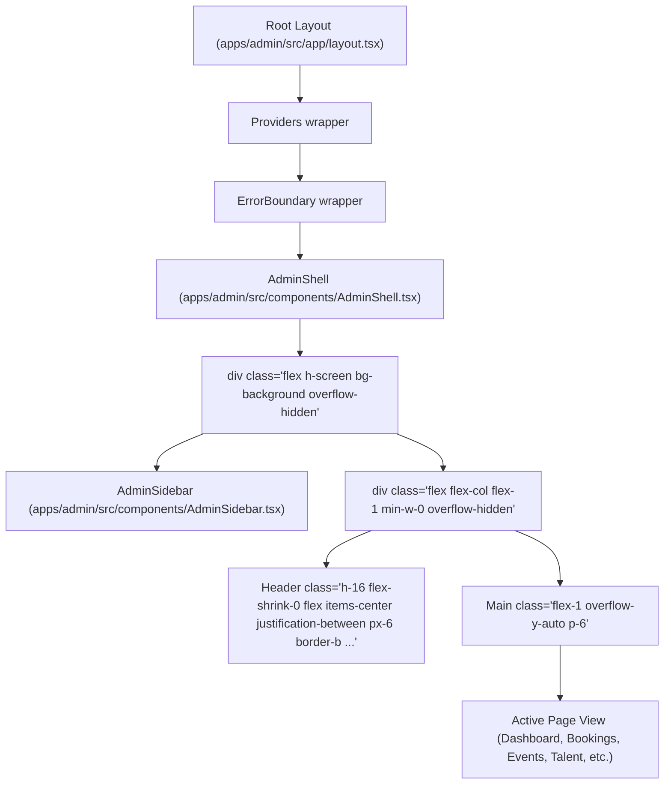
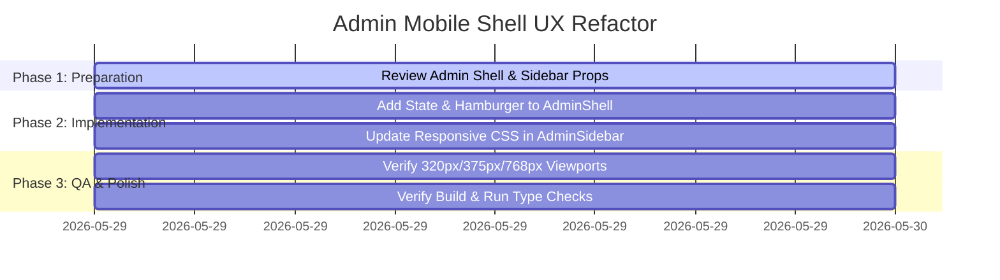

# Admin Mobile Shell UX Audit
**MAD Entertrainment Admin Platform**
*Document Status: Draft / Audit Only*
*Target Branch: `feat/admin-mobile-shell`*

---

## Executive Summary

This audit evaluates the mobile usability of the **MAD Entertrainment Admin Platform** (`apps/admin`) and designs the smallest, safest, UI-only layout refactor. Currently, the admin panel suffers from severe layout breakage and viewport hijacking on mobile devices. Because the sidebar is permanently visible (occupying $64\text{px}$ to $240\text{px}$), the actual page workspace is severely squeezed on small viewports, forcing aggressive table truncation, text wrapping, and broken alignment.

By implementing a responsive mobile drawer navigation, a toggleable hamburger button, and optimized horizontal scroll containers, we can restore full mobile usability. Crucially, this is a **zero-risk, pure UI-only refactor** that introduces **no route modifications, no backend changes, no database alterations, and no authentication adjustments**.

---

## Part 1: Current Admin Navigation Architecture

The admin application uses Next.js app router layout structure with a global wrapper shell (`AdminShell`) enclosing the active page views:



### The Responsiveness Core Failure

In the current implementation:
*   The `AdminSidebar` occupies a fixed width which animates between `64px` (collapsed) and `240px` (expanded) using Framer Motion.
*   There is **no conditional responsive styling** (such as Tailwind's `hidden md:flex` or similar grid hide properties) applied to the sidebar.
*   As a result, the sidebar is permanently mounted and visible on the left side of the screen on all device viewports, severely reducing the horizontal layout space available for the main content container.

---

## Part 2: Mobile Viewport Evaluation (Screen Widths)

The table below evaluates how the current permanent sidebar architecture behaves at standard mobile and tablet viewport widths:

| Viewport Width | Sidebar State | Main Content Width | Layout Usability & Behavioral Assessment |
| :--- | :--- | :--- | :--- |
| **320px** *(iPhone SE / Foldables)* | **Expanded** (240px) | **80px** | 🚨 **Severely Broken**: Content is unreadable. Headers wrap to 1-2 characters per line. Modals clip and are completely unusable. |
| **320px** *(iPhone SE / Foldables)* | **Collapsed** (64px) | **256px** | ⚠️ **Very Squeezed**: High-density elements (search fields, multi-column tables) wrap aggressively. Buttons overlap. |
| **375px** *(iPhone 13-16 Pro, Galaxy S)* | **Expanded** (240px) | **135px** | 🚨 **Unusable**: The content panel is narrower than the sidebar, rendering dashboard cards and actions illegible. |
| **375px** *(iPhone 13-16 Pro, Galaxy S)* | **Collapsed** (64px) | **311px** | ⚠️ **Cramped**: Complex tables require horizontal scrolling, and touch controls are placed too close together. |
| **390px** *(iPhone 13-16 Pro Max/Plus)* | **Expanded** (240px) | **150px** | 🚨 **Unusable**: Extremely tight workspace. Severe text wrapping on all metrics cards. |
| **390px** *(iPhone 13-16 Pro Max/Plus)* | **Collapsed** (64px) | **326px** | ⚠️ **Suboptimal**: Content panel is marginally wider, but still prone to severe horizontal filter wrapping. |
| **414px** *(Galaxy S Ultra, Max Devices)* | **Expanded** (240px) | **174px** | 🚨 **Broken**: Jarring vertical layout scaling. Quick Actions wrap to a single column, taking up extensive space. |
| **414px** *(Galaxy S Ultra, Max Devices)* | **Collapsed** (64px) | **350px** | ⚠️ **Cramped**: Decent readability for single column details, but bookings/events tables suffer major clipping. |
| **768px** *(iPad Portrait / Small Tablets)* | **Expanded** (240px) | **528px** | 🆗 **Acceptable**: Functional, but tables still scroll horizontally. Good vertical readability. |
| **768px** *(iPad Portrait / Small Tablets)* | **Collapsed** (64px) | **704px** | 🟢 **Good**: Full layout fidelity. All filters, tables, and cards render comfortably. |

---

## Part 3: Mobile UX Pain Points

### 1. Sidebar Viewport Hijacking
On screens under $768\text{px}$, the sidebar permanently robs the screen of up to **17% to 75%** of available horizontal real estate. There is no responsive logic to hide it when screen space is critical, representing a major layout failure.

### 2. Missing Hamburger Toggle & Overlay Drawer
There is no mobile menu header button. The user's only method to hide/expand the sidebar is the small chevron button at the bottom of the bar, which has a tiny touch target ($32\text{px}$ high/wide). On mobile viewports, tapping this button is highly error-prone. Furthermore, toggling the sidebar reflows the entire layout jarredly, rather than sliding smoothly over the content as an absolute overlay drawer.

### 3. Horizontal Table Overflow & Obscured Commercial Actions
In key data pages (e.g. `Bookings`), the horizontal overflow scrollbars are extremely narrow, making them difficult to tap-drag. Crucially, the "Cancel" action is located in the last column. On mobile, this vital commercial command is completely hidden off-screen, requiring the user to swipe sideways across the table just to see or execute it.

```txt
[Reference] [Customer] [Event] [Amount] [Status] [Date] | ---> (Scroll to see) ---> [Action: Cancel]
  MAD-2026   Name/Email  Title   ₹4,500   Confirmed Date |                         [Cancel Button]
```

### 4. Overcrowded Header & Path Clashing
The header displays the full, un-truncated file path (`pathname.split('/').slice(1).join(' / ')`), which translates to long strings (e.g. `ticket-profiles / 661a3c7... / edit`). On mobile headers, this wraps onto multiple lines or collides with the "Sign out" button, disrupting the professional aesthetic.

### 5. Tiny Touch Targets
Many buttons inside listings ("Edit", "Delete", "Cancel", and pagination arrows) are styled as `text-xs` with `px-3 py-1.5`, rendering their actual tap height to $\sim 28\text{px}$. This falls far short of the WCAG recommendation of at least **$44 \times 44\text{px}$** for high-accuracy finger taps, causing frequent mis-taps.

---

## Part 4: Screens Affected

1.  **Admin Shell (`AdminShell.tsx`, `AdminSidebar.tsx`)**:
    *   Impacts every single protected screen on the platform. Sidebar width remains static on all viewports, squeezing the active page.
2.  **Dashboard (`/dashboard`)**:
    *   KPI cards wrap vertically, taking up extensive space.
    *   "Top Events" table is heavily truncated, and revenue numbers are pushed off-screen.
3.  **Bookings Page (`/bookings`)**:
    *   The 7-column table is too wide for mobile viewports, making the details modal or "Cancel" buttons hard to access.
    *   Search and status filters wrap onto two rows, consuming excessive space.
4.  **Events Page (`/events`)**:
    *   Event creation lists and schedules are clipped. Action buttons are placed too close together.
5.  **Ticket Profiles Page (`/ticket-profiles`)**:
    *   Cramped views of ticket pricing tiers, capacities, and limits.
6.  **Scanner Page (`/scanner`)**:
    *   The camera video element constraints clash with the permanent sidebar, narrowing the camera stream and reducing scanning efficiency.

---

## Part 5: Recommended Solution (Smallest Safe Refactor)

To resolve all mobile usability problems with minimal effort and zero risk, we design a pure UI-only refactoring solution:

### 1. Responsive Sidebar Breakpoints
Hide the sidebar on mobile and convert it to an absolute floating drawer on viewports under `md` ($768\text{px}$):
*   `w-0 md:w-64` inside the wrapper container to hide the physical space allocation on mobile.
*   On screens `< md`, render the sidebar as an absolute overlay: `fixed top-0 left-0 bottom-0 z-50 shadow-2xl h-screen bg-background-card transition-transform`.
*   On screens $\ge md$, restore standard animated-width desktop behavior.

### 2. Header Hamburger Button
Add an elegant, responsive hamburger toggle button in the header bar, visible only on mobile viewports:
*   Classes: `block md:hidden p-2 hover:bg-white/10 rounded-xl` with a touch target size of $44 \times 44\text{px}$.
*   Icon: Standard lucide or custom SVG menu icon that transitions to an 'X' close icon when open.

### 3. Glass Backdrop Overlay
Render a full-screen, blurry backdrop when the mobile drawer is open:
*   Classes: `fixed inset-0 bg-black/60 backdrop-blur-sm z-40 md:hidden`.
*   Behavior: Tapping the backdrop immediately closes the mobile drawer, providing a standard native-like UX.

### 4. Horizontal Scroll Indicator
Add a subtle visual horizontal scroll cue (e.g. a faded right border on the table container) to indicate that off-screen columns exist.

---

## Part 6: Exact Files Requiring Modification

To achieve the mobile shell UX refactor, we only need to modify **two key layout files**:

### 1. `apps/admin/src/components/AdminShell.tsx`
*   Add a local state hook: `const [mobileSidebarOpen, setMobileSidebarOpen] = useState(false);`
*   Pass this state and its setter down to the `AdminSidebar` component.
*   Update the header layout to include a mobile menu trigger:
    ```tsx
    {/* Hamburger Toggle for Mobile */}
    <button
      onClick={() => setMobileSidebarOpen(true)}
      className="md:hidden p-2 -ml-2 rounded-xl text-text-muted hover:text-white transition-colors"
      aria-label="Open navigation menu"
    >
      <MenuIcon className="w-6 h-6" />
    </button>
    ```
*   Render the backdrop overlay dynamically when `mobileSidebarOpen` is true:
    ```tsx
    {mobileSidebarOpen && (
      <div
        onClick={() => setMobileSidebarOpen(false)}
        className="fixed inset-0 bg-black/60 backdrop-blur-sm z-40 md:hidden"
      />
    )}
    ```

### 2. `apps/admin/src/components/AdminSidebar.tsx`
*   Update component props interface to accept `mobileOpen: boolean` and `onClose: () => void`.
*   Update the root `motion.aside` element's class and animation bindings. Use responsive classes so that on mobile, it uses fixed positioning and translates on/off screen based on the `mobileOpen` prop:
    ```tsx
    // Root container styling
    className={`
      fixed inset-y-0 left-0 z-50 flex flex-col h-full bg-background-card border-r border-border-subtle
      md:static md:translate-x-0 transition-transform duration-300 ease-in-out
      ${mobileOpen ? 'translate-x-0' : '-translate-x-full md:translate-x-0'}
    `}
    ```
*   Inside the sidebar header, render a close button on mobile viewports:
    ```tsx
    {/* Close Drawer Button */}
    <button
      onClick={onClose}
      className="md:hidden p-2 rounded-xl text-text-muted hover:text-white transition-colors"
    >
      <XCloseIcon className="w-5 h-5" />
    </button>
    ```

---

## Part 7: Risk Assessment

Because this refactor affects only the parent UI containers (`AdminShell` and `AdminSidebar`), the risk profile is **exceptionally low**:

*   **API & Endpoint Risk**: **None.** No data loading, TanStack queries, or mutations are affected.
*   **Security & Authentication Risk**: **None.** The `useAdminAuth` hook and its auth guards remain untouched.
*   **Routing Integrity**: **None.** No pages, paths, or redirects are deleted or modified.
*   **Aesthetics & Visual Risk**: **None.** Existing desktop styles, themes, and glassmorphism elements are fully preserved.
*   **Component Encapsulation**: **High.** All mobile shell logic is contained within the shell components, keeping page-level components isolated.

---

## Part 8: Staged Implementation Plan

We suggest executing this refactor in a single, focused, reviewable PR.



### Staged Checklist
1.  **Refactor Props**: Add `mobileOpen` and `onClose` callbacks to the `AdminSidebar` signature.
2.  **Add Toggle Hook**: Implement state toggles and backdrop overlay in `AdminShell`.
3.  **Apply Tailwind Classes**: Adapt container classes in both shell components to hide elements on `md` viewports and toggle absolute layout.
4.  **Touch Target Polish**: Ensure the close and hamburger buttons have a minimum size of $44 \times 44\text{px}$ to satisfy touch target guidelines.
5.  **Build Verification**: Run `pnpm type-check` and `pnpm build` to guarantee compilation success.
