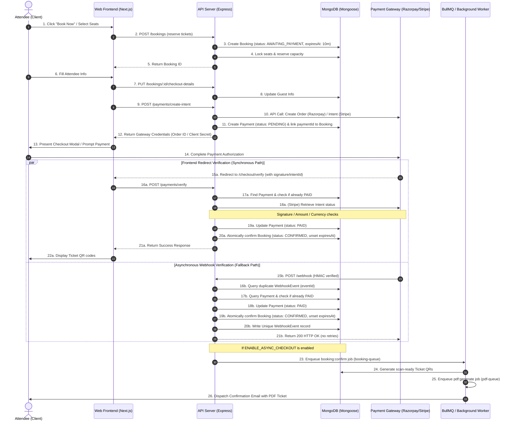

# Booking Status Verification Audit

This audit reviews the order creation, payment verification, webhook handling, and status transition workflows in the **MAD Entertainment** monorepo. It specifically analyzes how the state machine behaves when processing payment events from Razorpay and Stripe to identify edge cases, race conditions, and critical data integrity issues.

---

## 1. Booking Status & Payment Workflow

The following Mermaid diagram traces the end-to-end lifecycle from initial ticket reservation to final ticket QR compilation and email delivery.



---

## 2. Status Lifecycle Matrix

The platform orchestrates transitions across three main entities: **Bookings**, **Payments**, and **Reservations**.

| Trigger / Action | Booking Status | Payment Status | Reservation Status |
| :--- | :--- | :--- | :--- |
| **Initial Reservation** | `AWAITING_PAYMENT` | *(None)* | `RESERVED` |
| **Gateway Intent Created** | `AWAITING_PAYMENT` | `PENDING` | `PENDING_PAYMENT` |
| **Payment Captured (Frontend or Webhook)** | `CONFIRMED` | `PAID` | `CONFIRMED` |
| **Payment Fails / Sig Invalid** | `FAILED` | `FAILED` | `FAILED` (Inventory released) |
| **MongoDB TTL Expiry (10m reached)** | *(Deleted from DB)* | `PENDING` (Orphaned) | `FAILED` (Inventory released) |

---

## 3. Core Investigation Audit Q&A

### 1. Can a successful payment remain pending internally?
**Yes.**
- **Frontend Interruption**: If the user closes their browser or gets disconnected immediately after a successful charge but before the redirect to `/checkout/verify` completes, the frontend API call `verifyPayment` is never triggered.
- **Webhook Failure/Delay**: If the asynchronous payment gateway webhook (`payment.captured` or `payment_intent.succeeded`) is delayed, blocked by a firewall, or fails to deliver, the internal database records will remain stuck:
  - `Payment` status stays `PENDING`.
  - `Booking` status stays `AWAITING_PAYMENT`.
  - Eventually, the MongoDB TTL index will trigger and permanently delete the booking (see Risks below).

### 2. Can a booking become confirmed without payment verification?
**No.**
- The only function that transitions a booking to `CONFIRMED` is the private `confirmBooking` in [payment.service.ts](../../apps/server/src/services/public/payment.service.ts#L828-L850).
- `confirmBooking` is strictly called *only* inside:
  1. `confirmFromWebhook` (which validates that the payload has a verified HMAC webhook signature and matches actionable event types).
  2. `verifyPayment` (which runs HMAC SHA-256 checks on Razorpay redirect signatures, or fetches the original Stripe intent via the Stripe API to verify the `succeeded` status, currency, amount, and metadata bindings).

### 3. Can tickets generate before payment confirmation?
**No.**
- In synchronous mode, tickets are compiled in Mongoose directly inside `confirmBooking` *after* the status changes to `CONFIRMED`.
- In asynchronous mode (`ENABLE_ASYNC_CHECKOUT = true`), `confirmBooking` enqueues a `booking:confirm` job to the `booking-queue` in [booking.worker.ts](../../apps/server/src/workers/booking.worker.ts#L16). The worker checks `Ticket.countDocuments` and compiles QRs.
- Because the queue job is only enqueued *inside* the successful `confirmBooking` wrapper, ticket generation is blocked until payment is marked `PAID`.

### 4. Can emails fail while the booking remains confirmed?
**Yes.**
- **Synchronous Mode**: Email dispatch is executed in a loose try-catch block inside `confirmBooking` (lines 1021–1068). If the SMTP provider is offline or rate-limits the server, `sendEmail` throws an error. The catch block logs it and returns the booking. The booking status remains `CONFIRMED` in the database, but the customer never receives their email.
- **Asynchronous Mode**: If the `pdf-queue` worker fails all BullMQ retries, the job is moved to the `DeadLetterJob` table. The booking remains `CONFIRMED` and active in the database, but no email is successfully delivered.

### 5. Can the admin dashboard and public ticket portal show different booking states?
**No.**
- Both the Admin Dashboard (`/admin/bookings`) and the Public Ticket Portal (`/tickets`) query the same Mongoose `Booking` collection directly.
- The cache invalidation logic (`CacheService.delPattern('events:*')`) is used only for public event details lists, not for individual booking or profile summaries.
- There is no read-replica lag or caching layer for bookings, ensuring **immediate consistency** between admin and guest screens.

### 6. Can webhook timing create inconsistent or double-confirmed records?
**No.**
- The booking transition strictly uses Mongoose `Booking.findOneAndUpdate` with a status check:
  ```typescript
  const confirmedBooking = await Booking.findOneAndUpdate(
    { _id: booking._id, status: BookingStatus.AWAITING_PAYMENT },
    { $set: { status: BookingStatus.CONFIRMED }, $unset: { expiresAt: 1 }, ... }
  );
  ```
- If the frontend call confirms the booking first, the status becomes `CONFIRMED`. When the concurrent webhook arrives and calls `confirmBooking`, the `findOneAndUpdate` fails to match `status: BookingStatus.AWAITING_PAYMENT` and returns `null`.
- The webhook handler catches this, logs `'payment_confirmation_skipped'`, and exits gracefully without double-deducting inventory or duplicating tickets.

---

## 4. Risks & Vulnerabilities Identified

### 🚨 CRITICAL RISK: MongoDB TTL Deletion Race Condition (Paid but Missing Booking)
- **Vulnerability**: Pending bookings are assigned a 10-minute TTL index on `expiresAt` inside [booking.schema.ts](../../apps/server/src/models/booking.schema.ts#L109).
- **Trigger**: MongoDB's background TTL thread periodically deletes documents where `expiresAt` has passed.
- **Race Condition**:
  1. A guest completes their checkout payment at 9 minutes and 50 seconds.
  2. The webhook delivery takes 15 seconds.
  3. Meanwhile, at 10 minutes, the MongoDB TTL thread deletes the `Booking` document.
  4. The webhook arrives at 10 minutes and 5 seconds. In `confirmFromWebhook` (lines 318–326):
     ```typescript
     const booking = await Booking.findById(payment.bookingId);
     if (!booking) {
       logger.error({ razorpayOrderId }, 'PR-03: Payment record exists but Booking is missing...');
       return { status: 'skipped' };
     }
     ```
  5. The booking is gone. The webhook logs an error, returns 200, and skips.
- **Outcome**: The customer has paid successfully, but their booking record is permanently deleted. They will **never receive their tickets or show QRs**, resulting in a high-severity customer billing conflict.

### ⚠️ MEDIUM RISK: Synchronous Email Failure Silent Drop
- **Vulnerability**: If `ENABLE_ASYNC_CHECKOUT` is disabled, the SMTP send and PDF generation are done synchronously.
- **Outcome**: If the mail server times out, the user is left confirmed but will never get their tickets emailed, and no automated retry queue is available.

---

## 5. Existing Guards & Protections

1. **Unique HMAC Webhook Verification**: Ensures that only authenticated payloads originating from Stripe or Razorpay can trigger confirmation logic.
2. **Idempotency Deduplication**: The `WebhookEvent` model enforces a unique index on `eventId`. Duplicate deliveries are caught at the HTTP controller layer, logged, and skipped.
3. **Atomic Status Updates**: Mongoose `findOneAndUpdate` with a status check ensures that concurrent execution paths do not double-confirm or double-allocate seats.
4. **Automatic Expiry Cleanup**: Expired/failed reservations release their locked seats and capacity automatically.

---

## 6. Recommended Fixes

### 1. Resolve the TTL Expiration Deletion Vulnerability
- **Fix**: Remove the automatic MongoDB TTL index on the `Booking` collection's `expiresAt` field.
- **Alternative Cleanup**: Instead of physical deletion via TTL index, let bookings remain in the database. A background cleaner process (e.g. cron or BullMQ scheduler) should look for expired bookings (`status: AWAITING_PAYMENT` and `expiresAt < now`), mark them as `EXPIRED` or `FAILED`, and release their seats.
- **Recovery Path**: If a payment webhook arrives for an `EXPIRED` booking, the system can automatically recover it, transition it to `CONFIRMED`, generate tickets, and notify the admins.

### 2. Standardize Asynchronous Checkout
- **Fix**: Make `ENABLE_ASYNC_CHECKOUT` standard. Remove the synchronous email/ticket execution branch inside `confirmBooking` completely. This ensures that ticket generation and SMTP dispatch always run inside isolated, robust queue workers with exponential retry profiles.

---

## 7. Audit Conclusion & Risk Rating

**Risk Rating: HIGH**

While the concurrency locks, idempotency guards, and payment verification HMAC checks are exceptionally robust, the physical deletion of pending bookings via the Mongoose TTL index presents a **critical data loss risk** for late-paying or slow-redirecting guests. Resolving this TTL race condition is highly recommended before production traffic.
