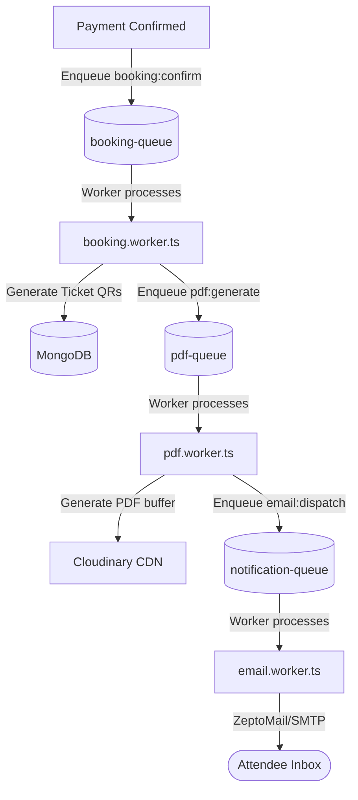
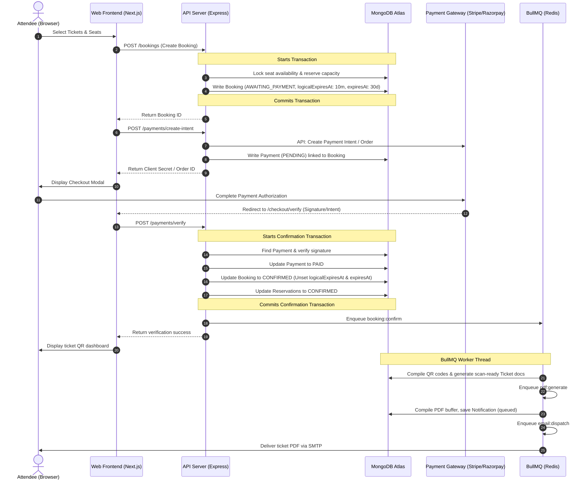
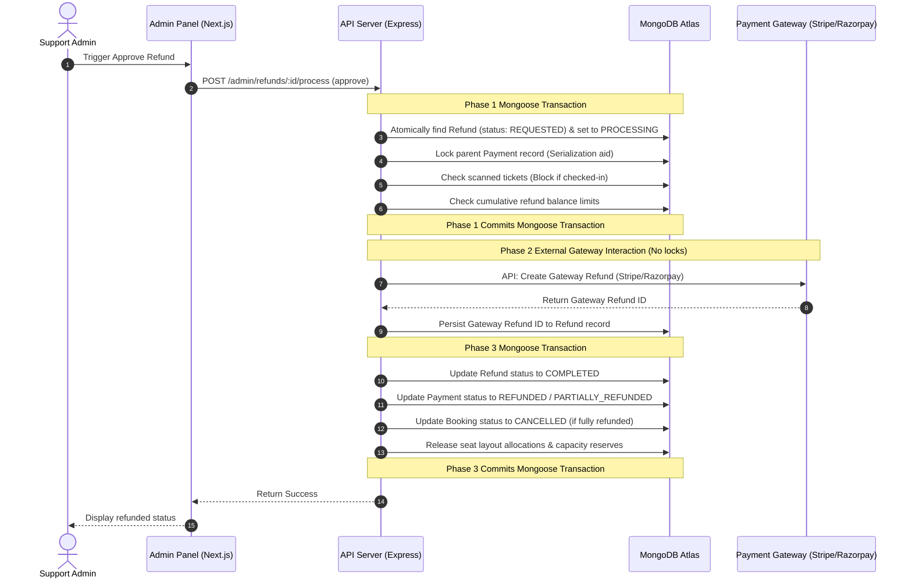

# MAD-500: End-to-End Production Runtime & Business Flow Audit

- **Epic Code**: MAD-500
- **Status**: Completed (Audit & Discovery Phase)
- **Target Systems**: `@mad/web`, `@mad/admin`, `@mad/server`, `@mad/shared`, `@mad/types`, `@mad/validations`
- **Owner**: Technical Architect & AI Agent OS
- **Date**: 2026-07-05
- **Related Documents**:
  - [ARCHITECTURE.md](../../ARCHITECTURE.md)
  - [API_CONTRACTS.md](../../API_CONTRACTS.md)
  - [TODO-AUDIT-FIXES.md](../TODO-AUDIT-FIXES.md)

---

## 1. Executive Summary

This audit establishes a comprehensive risk profile and diagnostic evaluation of the **MAD Entertrainment** platform's runtime behaviors. Moving beyond static repository hygiene, we trace critical transactional pathways, assess system boundaries, evaluate asynchronous queue workers, map failure states, and formulate a prioritized remediation backlog.

### Quantitative Production Readiness Scorecard
We evaluate the platform across five core dimensions using a 1–10 scale:

| Dimension | Score | Key Findings |
| :--- | :---: | :--- |
| **Reliability (State Machines)** | **9/10** | Webhook races and physical TTL deletions are fully mitigated using a dual-time expiration model (10m logical, 30d physical TTL) and Mongoose transactions. |
| **Security & Auth Control** | **8.5/10** | Strict RBAC database verification, password version checking, and webhook replay protection via deterministically generated payload signatures. Potential diagnostic API exposure needs tightening. |
| **Observability (Logging & DLQ)** | **8/10** | BullMQ retry policies are integrated with a custom MongoDB `DeadLetterJob` logging adapter and Sentry spans. However, real-time alert routing to notification channels (e.g. Slack) is currently missing. |
| **Performance & Queue Throughput** | **7.5/10** | Clear concurrency caps on workers (concurrency: 20 for bookings, 5 for heavy PDF tasks). However, the central `payment.service.ts` is 1,429 lines, violating file size standards and creating maintenance friction. |
| **Recoverability (Rollbacks & Retries)** | **8/10** | Multi-phase refund transactions ensure API failures don't hang locks. Late-payment capacity recovery automatically triggers gateway refunds if seats are taken. |

**Overall Production Readiness Score: 8.2 / 10**

---

## 2. End-to-End Journey Tracing

### 2.1. User Journey: Ticket Purchase to Entry

```text
[Home Page] ──(Select Event)──> [Event Details] ──(Select Tickets & Lock Seats)──> [Booking Created]
                                                                                        │
[Ticket QR / Gateway Webhook] <──(HMAC Signature Check)── [Payment verify] <──(Stripe/Razorpay)
         │
[Venue Entry scanner] ──(API Validate)──> [scannedAt marked] ──(Completed Event)──> [Memory Gallery]
```

1. **Home Page (`apps/web/src/app/page.tsx`)**:
   - Renders upcoming active event listings. Queries events via HTTP API wrappers.
2. **Event Detail Page (`apps/web/src/app/events/[slug]/page.tsx` & `EventDetailClient.tsx`)**:
   - Displays event descriptions, ticket tiers, and capacity layouts.
   - For seat-based events, dynamically initializes seat canvas maps.
3. **Booking Creation (`PublicBookingService.createBooking` in `booking.service.ts`)**:
   - Validates that the event is published, active, and not sold out.
   - Computes unique `selectionFingerprint` based on selected tickets/coupon.
   - Atomically locks seats and enqueues capacity allocations via `ReservationService.reserveForBooking` with a logical checkout window of **10 minutes**.
   - Persists a new `Booking` document with status `AWAITING_PAYMENT`, `logicalExpiresAt` (10m), and physical `expiresAt` (30d) to prevent physical TTL deletion races during slow payment delivery.
4. **Checkout & Intent (`PaymentService.createPaymentIntent` in `payment.service.ts`)**:
   - Frontend captures attendee details (`PUT /bookings/:id/checkout-details`).
   - Backend calls the corresponding gateway adapter (`StripeAdapter` or `RazorpayAdapter`) to create a payment transaction, returning client secrets/order IDs to the client browser.
5. **Verification & Confirmation (`verifyPayment` in `payment.service.ts` / Webhooks in `payment.controller.ts`)**:
   - **Frontend Redirect (Sync Path)**: Hits `POST /payments/verify`, which asserts the gateway signature, updates `Payment` to `PAID`, and calls `PaymentBookingService.confirmBooking` in Mongoose transaction.
   - **Gateway Webhook (Async Fallback Path)**: Receives webhook (HMAC checked), checks `WebhookEvent` for deduplication, calls `confirmFromWebhook`/`confirmFromWebhookStripe` to claim payment, and unsets `expiresAt` & `logicalExpiresAt` on the booking document.
6. **Ticket Compilation & Delivery**:
   - If `ENABLE_ASYNC_CHECKOUT` is active, backend enqueues a `booking:confirm` job to BullMQ. `booking.worker.ts` compiles scan-ready `Ticket` documents and enqueues `pdf:generate` to `pdf.worker.ts`.
   - The PDF worker compiles the ticket layout, uploads it to Cloudinary, and enqueues SMTP mailing tasks to send tickets to guests.
7. **Gate Entry (`ScannerController` / `TicketController`)**:
   - Staff uses the scanner API to check guest ticket QRs. Backend matches ticket ID, verifies that `assignmentStatus` is unassigned/valid, and records the `scannedAt` timestamp to prevent double-entries.
8. **Memory Gallery (`EventMemoriesRecap.tsx`)**:
   - Once the event status transitions to `COMPLETED`, the event details page replaces the booking selector card with a post-event memories gallery, displaying Cloudinary highlights, thank-you messages, and recap photo sliders.

---

### 2.2. Admin Journey: Event Configuration & Management

```text
[Create Event Draft] ──> [Upload Media] ──> [Publish Transition] ──> [Booking / Refund Management]
                                                                                │
[Analytics Dashboard] <──(In-Memory Sort/Aggregation) <──(Mongoose Pipelines) ───┘
```

1. **Event Draft & Creation (`createEvent` in `event.service.ts`)**:
   - Admins define ticket tiers, group sizes, pricing structures, and seating maps.
   - Validates that initial status is strictly `draft` or `published` with sanitization.
2. **Media Uploads (`UploadService` / `cloudinary.ts`)**:
   - Admins upload cover images and memory items. Streams buffers directly to Cloudinary and saves secure URLs and asset public IDs to Mongoose documents.
3. **Publishing (`updateEvent` in `event.service.ts`)**:
   - Transition asserts strict status transitions (`EVENT_STATUS_TRANSITIONS`).
   - If publishing memories, the backend validates that images do not exceed `MAX_MEMORIES_GALLERY_LIMIT` (30 items) and unsets old images from Cloudinary if deleted.
4. **Booking & Refund Management (`refund.service.ts`)**:
   - Support staff can search bookings and trigger refunds for cancelled events.
   - Approving a refund executes a **multi-phase transaction**:
     - *Phase 1*: Atomically claims the refund request and locks the parent payment within a Mongoose transaction to prevent double refunds.
     - *Phase 2*: Calls the Stripe/Razorpay API outside the database transaction to prevent locking Mongoose connections during external network requests.
     - *Phase 3*: Commits the refunded state and releases reservations in a second database transaction.
5. **Analytics (`analytics.controller.ts`)**:
   - Aggregates real-time ticket sales, active seat loads, gross revenues, and coupon performance. Renders graphs on admin dashboards.

---

## 3. Worker and Asynchronous Queue Topology

MAD Entertrainment relies on **BullMQ** running on Redis to perform non-blocking side-effects.



### Worker Setup & Configuration

- **Booking Confirm Worker (`booking.worker.ts`)**:
  - **Queue Name**: `booking-queue`
  - **Concurrency**: 20
  - **Responsibilities**: Generates QR code credentials, links seat allocations to tickets, and updates event sold counts.
- **PDF Generation Worker (`pdf.worker.ts`)**:
  - **Queue Name**: `pdf-queue`
  - **Concurrency**: 5 (Restricted to protect container CPU limits from PDF compiling overhead).
  - **Responsibilities**: Generates print-ready ticket PDF documents in memory, updates local `Notification` records, and attaches files.
- **Email Delivery Worker (`email.worker.ts`)**:
  - **Queue Name**: `notification-queue` (or `email-queue`)
  - **Concurrency**: 10
  - **Responsibilities**: Connects to the SMTP gateway (ZeptoMail) to dispatch confirmed tickets.
- **Event Lifecycle Worker (`event-lifecycle.worker.ts`)**:
  - **Queue Name**: `event-lifecycle-queue`
  - **Concurrency**: 2
  - **Responsibilities**: Automatically transitions active events to `completed` after their scheduled end dates, triggering memory recap displays.
- **Consistency Worker (`consistency.worker.ts`)**:
  - **Queue Name**: `consistency-queue`
  - **Concurrency**: 1 (Single runner to avoid concurrency lock contentions).
  - **Responsibilities**: Scans for orphaned seat locks, expired logical reservations, or mismatching ledger sums and executes repairs.

### Queue Error Tolerability & DLQ Recovery
- **Retry Strategy**: Failed jobs trigger exponential backoff retries (default: 3 attempts).
- **Dead Letter Queue (DLQ)**: If all retries are exhausted, the worker catch block logs details and writes a document to the Mongoose `DeadLetterJob` collection, recording the raw queue payloads, stack traces, and fail reasons.
- **Sentry Integration**: Job failures route details to Sentry with explicit tags denoting the queue name, failed job ID, and attempts made.

---

## 4. Runtime Transactional Sequence Diagrams

### 4.1. End-to-End User Booking & Payment Lifecycle



---

### 4.2. Admin Refund & Gateway Reconciliation Flow



---

## 5. Failure Mode and Effects Analysis (FMEA)

| Failure Mode | Root Cause | System Effect | Risk Level | Mitigation & Recovery Path |
| :--- | :--- | :--- | :---: | :--- |
| **MongoDB TTL Deletion Webhook Race** | MongoDB background TTL thread deletes a booking document after 10m, but a payment webhook arrives at 10m 5s. | Webhook fails to confirm booking because the record is gone. User is charged, but no tickets are issued. | **Critical** (Mitigated) | **Completed Mitigation**: Set database index TTL (`expiresAt`) to **30 days**. Introduced a logical timeout window (`logicalExpiresAt` = 10m) for seat holds. If payment confirms after 10m, late recovery capacity validations run, auto-refunding the charge if seats were re-allocated. |
| **Unsecured System & DLQ Endpoints** | `/api/admin/diagnostics/*` routes are active under standard Admin middleware without SuperAdmin restrictions. | Lower-level operators or compromised admin accounts can view detailed internal system variables and DLQ payloads. | **High** | **Remediation**: Secure diagnostic routes `/queues`, `/system`, and `/dlq` under SuperAdmin filters in `diagnostics.routes.ts`. |
| **Duplicate Webhook Delivery** | Payment gateways dispatch webhook events multiple times due to slow client responses. | Potential double bookings, multiple ticket generations, or redundant coupon usage increments. | **High** (Mitigated) | **Completed Mitigation**: Webhooks are captured inside `payment.controller.ts` where a sha-256 hash fingerprint of the raw body is stored in `WebhookEvent` with a unique constraint. Second deliveries trigger a 200 return code instantly, skipping execution. |
| **ZeptoMail SMTP Outage** | External mail server goes offline or rejects connection requests. | Attendees do not receive ticket confirmation emails or attached ticket PDFs. | **Medium** | **Mitigation**: BullMQ `pdf-queue` and `notification-queue` run retries with exponential backoffs. If all fail, jobs transition to `DeadLetterJob` table where admins can query and trigger manual retries via `POST /api/admin/diagnostics/dlq/:id/retry`. |
| **Mongoose Long-Running Locks** | Call to gateway payment API (e.g. Stripe refund) is run inside Mongoose transaction blocks. | Database connection pool exhaustion and transaction lock aborts for concurrent bookings. | **Medium** (Mitigated) | **Completed Mitigation**: Refund and Payment flows execute external API requests outside database transactions (multi-phase execution pattern). Mongoose locks are held only during rapid updates in Phase 1 and Phase 3. |
| **No MongoDB High Availability** | Platform relies on a single MongoDB Atlas instance without backup failover replica config. | Complete platform outage if database node experiences hardware failure. | **High** | **Remediation**: Reconfigure MongoDB Atlas connection strings to target a Replica Set cluster topology (Primary, Secondary, Arbiter) with auto-failover. |

---

## 6. Risk Register & Backlog Recommendations

This section catalogues technical backlog items derived from this audit, categorized by risk severity and priority.

### 🔴 Critical Priority (Address in Next Sprint)
1. **Secure Diagnostic API Routes**:
   - *Description*: Tighten authorization in `diagnostics.routes.ts` so that `/system`, `/dlq`, and `/queues` metrics routes are restricted to `SUPER_ADMIN` or supervised under strict auditing.
   - *Risk*: Exposure of stack traces and internal queue metrics to standard administrator accounts.
2. **MongoDB Replica Set Failover Configuration**:
   - *Description*: Verify connection strings and configure Atlas clusters for High Availability.
   - *Risk*: Single point of failure for all state stores.

### 🟠 High Priority (Address Before Launch)
1. **Axios Client Token Refresh Queue**:
   - *Description*: If multiple parallel client-side requests fail with 401 Unauthorized, they trigger concurrent token refresh requests, causing token reuse rotation errors.
   - *Risk*: Users get logged out when opening multiple tabs or firing parallel dashboard queries.
   - *Remediation*: Implement request locking or queueing in frontend Axios interceptors during token rotations.
2. **Offline Scanner Caching**:
   - *Description*: Venues with poor cell coverage fail online ticket validations.
   - *Risk*: Ticket entry delays and check-in failures.
   - *Remediation*: Build local storage database caching on the scanner mobile client app to run offline validation checks.

### 🟡 Medium Priority (Technical Debt & Maintenance)
1. **Modularize Payment Service (`payment.service.ts`)**:
   - *Description*: `payment.service.ts` is 1,429 lines, violating the 500-line service governance rule.
   - *Risk*: High maintenance friction and risk of regression.
   - *Remediation*: Extract Razorpay, Stripe gateway adapters, and ledger validation hooks into smaller helper packages under `packages/utils` or discrete services.
2. **Admin Refund Dashboard Buttons**:
   - *Description*: Support team requires a visual layout to trigger the `/admin/refunds/:id/process` endpoints.
   - *Risk*: Operational latency when dealing with refund requests.
   - *Remediation*: Embed refund actions inside the Booking Detail cards in `apps/admin/src`.
