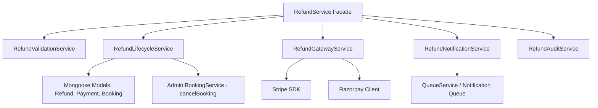

# ADR-010: Admin Refund Service Decomposition

## Metadata
- **Status**: Implemented
- **Date**: 2026-07-06
- **Authors**: Antigravity AI Pair
- **Reviewers**: Repository Governance Owner
- **Decision Category**: Architecture | Admin Services
- **Related Documents**: [ARCHITECTURE.md](../../ARCHITECTURE.md), [ADR-009-payment-refund-decomposition.md](ADR-009-payment-refund-decomposition.md)
- **Related GitHub Issues**: None
- **Related Pull Requests**: None

---

## Context
The Admin Refund Service monolith (`apps/server/src/services/admin/refund.service.ts`) currently sits at 719 lines. It encapsulates three primary entrypoints for managing refunds:
1. `createRefund`: Validates, ensures cumulative limits, and creates a manual/auto requested refund.
2. `getRefunds`: Queries refunds with pagination and MongoDB populated references.
3. `processRefund`: Orchestrates approvals/rejections, executes gateway API calls, locks payments, cancels bookings, and triggers notification emails.

## Problem Statement
The service is a hybrid of **domain orchestration** (cancellations, database updates, transactions) and **infrastructure adapters** (Stripe SDK interactions, Razorpay paise conversions, email template generators). This violates the Single Responsibility Principle, makes testing difficult (requiring heavy mocks of Stripe/Razorpay clients), and increases the risk of regressions in transaction rollbacks and write ordering.

---

## Decision
We will decompose `apps/server/src/services/admin/refund.service.ts` into specialized candidate sub-services. The existing file will remain as a lightweight **Facade** delegating to:
1. **`RefundValidationService`**: Validates eligibility, checks individual/cumulative amount caps, and verifies booking check-in status.
2. **`RefundGatewayService`**: Encapsulates raw Stripe/Razorpay client dispatches.
3. **`RefundLifecycleService`**: Manages state transitions, database updates, and database transaction scopes.
4. **`RefundNotificationService`**: Handles email template generation and notification queue enqueuing.
5. **`RefundAuditService`**: Controls structured audit logging and Sentry error captures.

---

## 1. Responsibility Matrix

| Responsibility | Domain/Core | Gateway (Infra) | Validation | Audit / Notify | Decoupled Module |
| :--- | :---: | :---: | :---: | :---: | :--- |
| `assertProductionRefundIntegrity` | ❌ | ❌ | ✅ | ❌ | `RefundValidationService` |
| Ticket check-in validation | ❌ | ❌ | ✅ | ❌ | `RefundValidationService` |
| Cumulative amount cap checks | ❌ | ❌ | ✅ | ❌ | `RefundValidationService` |
| Payment status validation | ❌ | ❌ | ✅ | ❌ | `RefundValidationService` |
| DB transaction scopes (`runInTransaction`) | ✅ | ❌ | ❌ | ❌ | `RefundLifecycleService` |
| Stripe `stripe.refunds.create` dispatch | ❌ | ✅ | ❌ | ❌ | `RefundGatewayService` |
| Razorpay `createRazorpayRefund` dispatch | ❌ | ✅ | ❌ | ❌ | `RefundGatewayService` |
| Booking cancellations (`cancelBooking`) | ✅ | ❌ | ❌ | ❌ | `RefundLifecycleService` |
| Update Payment status (`REFUNDED`) | ✅ | ❌ | ❌ | ❌ | `RefundLifecycleService` |
| Manual override audits | ❌ | ❌ | ❌ | ✅ | `RefundAuditService` |
| Sentry exception logging | ❌ | ❌ | ❌ | ✅ | `RefundAuditService` |
| Email HTML preparation & Queue enqueue | ❌ | ❌ | ❌ | ✅ | `RefundNotificationService` |

---

## 2. Dependency Map

The following Mermaid diagram demonstrates how the decomposed modules will interact, separating domain logic from infrastructure details:

### Domain vs. Infrastructure Boundaries
* **Domain Modules**: `RefundValidationService`, `RefundLifecycleService`, `BookingService`, and Mongoose Schemas.
* **Infrastructure Modules**: `RefundGatewayService` (external API adapters), `RefundNotificationService` (queues), and `RefundAuditService` (Sentry/logs).

---

## 3. Transaction Boundary Analysis

Admin refunds require two separate database transactions (due to the blocking nature of external API dispatches):

### Phase 1: Claim & Reserve Transaction
1. **Atomic Lock**: `Refund.findOneAndUpdate` updates status from `REQUESTED` to `PROCESSING`.
2. **Serialization Lock**: `Payment.findOneAndUpdate` locks the parent payment record using an `updatedAt` update, preventing concurrent refunds.
3. **Validation**: Cumulative amount checks and scanned ticket checks are done inside this transaction session.
4. **Commit Phase 1**: The session commits to ensure the refund is locked in `PROCESSING` before reaching out to third-party APIs.

### API Dispatch Phase (No Transaction)
* Calls Stripe/Razorpay APIs. No DB transaction runs here to prevent long-held database locks.

### Phase 3: Finalization Transaction
1. **Update State**: Updates `Refund.status` to `COMPLETED` and sets `gatewayRefundId`.
2. **Update Payment**: Changes payment status to `REFUNDED` (full) or `PARTIALLY_REFUNDED` (partial).
3. **Cancel Booking**: Calls `cancelBooking` if a full refund is processed.
4. **Commit Phase 3**: Commits state updates to DB.
5. **Post-Commit Side Effects**: Dispatches emails and runs `executeCancelBookingSideEffects`.

---

## 4. External Integration Inventory

| Integration | Context of Use | Type | Isolation Mechanism |
| :--- | :--- | :--- | :--- |
| **Stripe SDK** | Calls `stripe.refunds.create` with refund amount and payment intent. | External API | Mocked via `vitest` mocks in test suite; encapsulated in `RefundGatewayService`. |
| **Razorpay Client** | Calls local `createRazorpayRefund` wrapper with payment ID and paise amount. | External API | Encapsulated in `RefundGatewayService`. |
| **Sentry** | Logs production exceptions (`captureException`) when safety checks trip. | Infrastructure | Wrapped inside `RefundAuditService`. |
| **QueueService** | Enqueues `'email-dispatch'` notifications into the `'notification-queue'`. | Infrastructure | Wrapped inside `RefundNotificationService`. |

---

## 5. Candidate Service Boundaries

### `RefundValidationService`
* **Justification**: Eligibility rules (like blocking refunds on scanned tickets unless super_admin overrides) are complex and business-critical. Separating them ensures validation can be unit-tested without DB or Gateway overhead.

### `RefundGatewayService`
* **Justification**: Separates external gateway SDKs (Stripe/Razorpay) from our core business schemas. Enables easy addition of future gateways.

### `RefundLifecycleService`
* **Justification**: Owns the state machine transitions and transaction boundaries, guaranteeing database write safety.

### `RefundNotificationService`
* **Justification**: Email HTML compilation and job enqueuing are infrastructure concerns that should not block core database logic.

### `RefundAuditService`
* **Justification**: Standardizes audit structures (actor, metadata, descriptions) for compliance tracking.

---

## 6. Incremental Refactoring Roadmap

To ensure zero downtime and reviewable change sizes, we will execute this refactoring in six incremental stages:

1. **Stage 1 (This Stage)**: Discovery & Planning (ADR committed, no code changes).
2. **Stage 2**: Extract validation logic into `RefundValidationService`.
3. **Stage 3**: Extract gateway adapters into `RefundGatewayService`.
4. **Stage 4**: Extract email notification generation into `RefundNotificationService`.
5. **Stage 5**: Extract audit logging/Sentry mappings into `RefundAuditService`.
6. **Stage 6**: Refactor `refund.service.ts` into a lightweight facade coordination layer.

---

## Verification Strategy
- Run full typecheck and linting suites.
- Target all admin refund tests: `vitest run apps/server/src/services/admin/booking.service.test.ts`.
