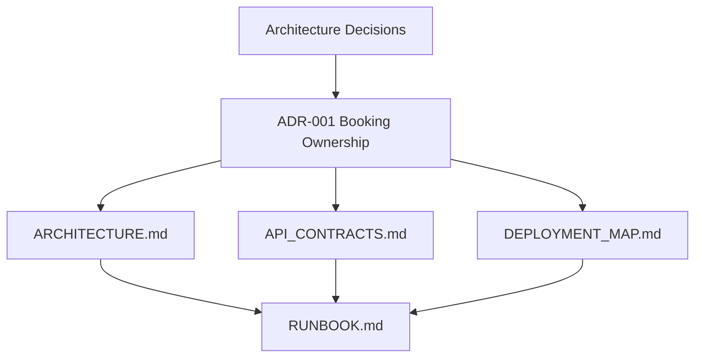
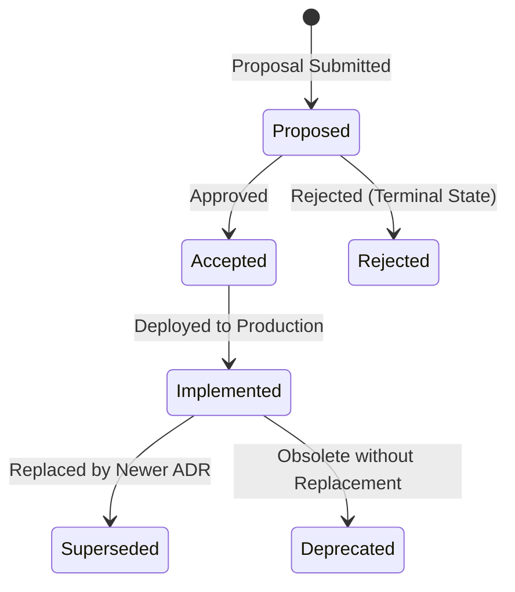

# Architecture Decision Records (ADRs)

Status: Active
Version: 1.0
Owner: Repository Architecture
Review Cycle: Ongoing
Last Updated: 2026-06-25

Related Documents:
- [README.md](../../README.md)
- [REPOSITORY_GOVERNANCE.md](../../REPOSITORY_GOVERNANCE.md)
- [ARCHITECTURE.md](../../ARCHITECTURE.md)
- [DEPLOYMENT_MAP.md](../../DEPLOYMENT_MAP.md)
- [API_CONTRACTS.md](../../API_CONTRACTS.md)

---

## Executive Overview

### What is an ADR?
An **Architecture Decision Record (ADR)** is a short text document that captures a significant technical decision, its context, and the rationale behind it.

### Why do they exist?
While our core SSOT documents (`ARCHITECTURE.md`, `DEPLOYMENT_MAP.md`, `API_CONTRACTS.md`) explain **what** the system's design is, ADRs document **why** those decisions were made. They prevent knowledge loss, simplify onboarding, provide historical context, and ensure long-term architectural traceability.

---

## ADR Numbering Policy

To maintain long-term traceability and historical integrity as the repository grows, the following numbering rules apply:

| Rule | Description | Example |
| :--- | :--- | :--- |
| **Never reuse numbers** | Each ADR number is permanently assigned. If an ADR is rejected or superseded, its number is never reassigned to a new decision. | `ADR-001` always remains the record for Booking Ownership. |
| **Never renumber** | The index must preserve its original chronological order. Do not renumber existing decisions to fill in gaps. | Even if `ADR-002` is rejected, `ADR-003` remains `ADR-003`. |
| **Superseded ADRs remain in the index** | Superseded decisions are never deleted from the index log; their status is updated to reference the replacing ADR. | `ADR-001` ➔ Superseded by `ADR-008`. |
| **Deleted ADRs are prohibited** | Once an ADR is merged, it must never be deleted from the filesystem. Obsolete ADRs are marked as Deprecated or Superseded. | Preserve historical traceability of all decisions. |

---

## Decision Relationship Graph

The following graph illustrates how architectural decisions feed into our Single Source of Truth (SSOT) documents and operational procedures:

---

## ADR Creation Policy

An ADR **must** be created and approved before merging any changes that:
- Change package boundaries or monorepo topology
- Modify deployment topology or hosting providers
- Introduce new infrastructure components or databases
- Change authentication/authorization architecture
- Change payment processing architecture
- Change booking ownership or seating integrity rules
- Introduce breaking API contract schemas
- Modify repository governance rules
- Introduce significant security architecture changes

---

## ADR Lifecycle Status Model

Each decision record transitions through a structured status model:

### Transition & Status Rules:
1. **Proposed**: The decision is drafted and under active review.
2. **Accepted**: The decision has been approved by the architecture team but has not yet been fully implemented in the codebase.
3. **Implemented**: The code changes matching the decision are deployed to production.
4. **Rejected**: The proposal was reviewed and rejected. This is a terminal state.
5. **Superseded**: A newer decision (`ADR-XXX`) has been approved that replaces or modifies this decision.
6. **Deprecated**: The decision is obsolete and has been retired without a direct replacement (e.g. when a feature, service, or dependency is completely removed).

---

## ADR Governance & Review Process

### 1. Proposal Phase
- Copy the [ADR_TEMPLATE.md](ADR_TEMPLATE.md) to create a new file named `docs/decisions/ADR-XXX-title.md`.
- Set the status to `Proposed` and fill in the Context, Problem Statement, and Alternatives Considered.

### 2. Review Phase
- Open a Pull Request referencing the proposed ADR.
- Assign appropriate reviewers from the **Decision Ownership Matrix** below.

### 3. Execution Phase
- Once merged, the status shifts to `Accepted`.
- After code implementation is complete, verified, and merged, the status is updated to `Implemented`.

### Decision Ownership Matrix
Architectural review and approvals are divided into operational areas:

| Decision Category | Primary Reviewer / Owner | Relevant SSOT Document |
| :--- | :--- | :--- |
| **Architecture** | Principal Architect | [ARCHITECTURE.md](../../ARCHITECTURE.md) |
| **Infrastructure & Hosting**| Platform Team | [DEPLOYMENT_MAP.md](../../DEPLOYMENT_MAP.md) |
| **Payments & Payouts** | Financial Domain Tech Lead | [API_CONTRACTS.md](../../API_CONTRACTS.md) |
| **Authentication & AuthZ** | Security Architect | [API_CONTRACTS.md](../../API_CONTRACTS.md) |
| **Governance & Quality** | Repository Governance Owner | [REPOSITORY_GOVERNANCE.md](../../REPOSITORY_GOVERNANCE.md) / [AGENTS.MD](../../AGENTS.MD) |
