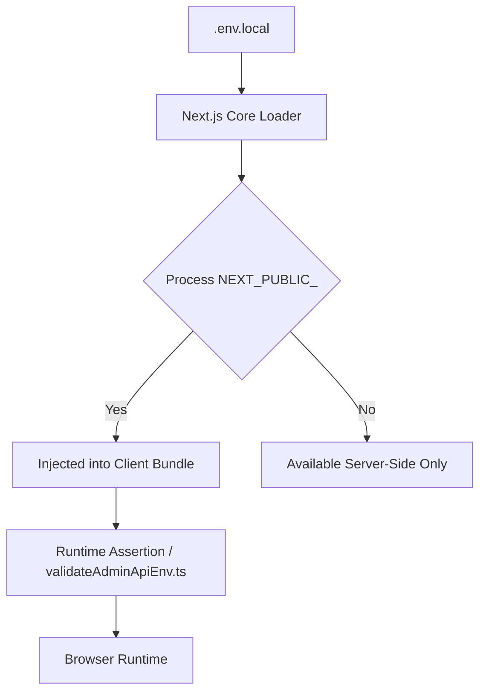
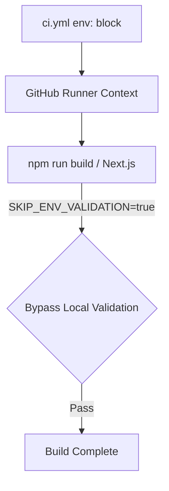
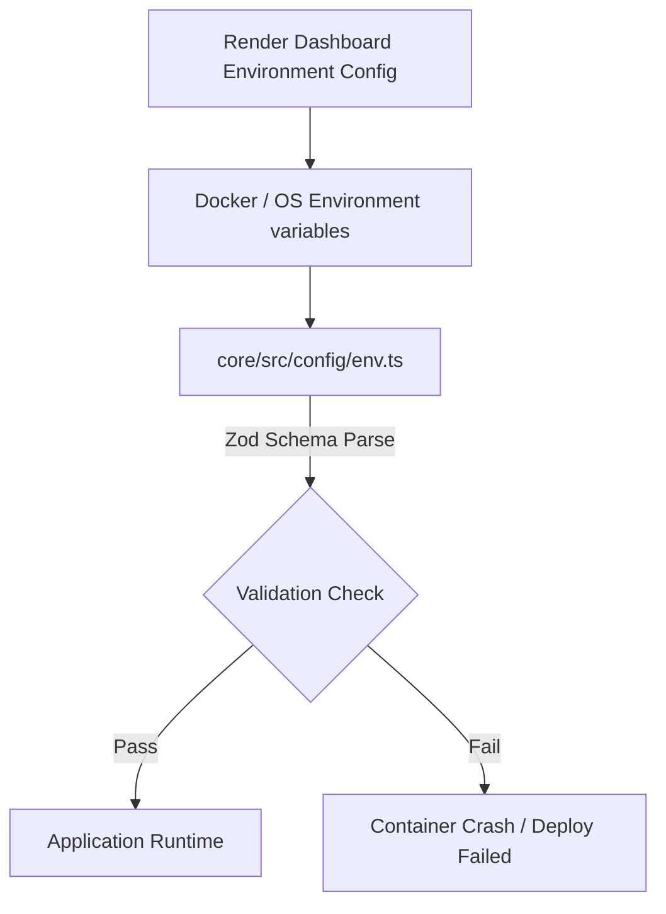
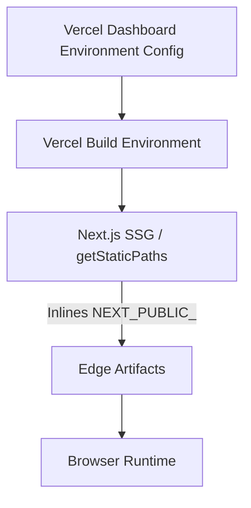

# Environment Loading Flow

This document visualizes the exact sequence of environment variable loading across different execution contexts.

## 1. Local Backend Development (Core/User)
When running `npm run dev` in `backend/api`:

```mermaid
graph TD
    A[.env (core) / .env (backend/api)] --> B[dotenv configuration]
    B --> C[core/src/config/loadEnvFiles.ts]
    C --> D[core/src/config/env.ts]
    D -->|Zod Schema Parse| E{Validation Check}
    E -->|Pass| F[Application Runtime]
    E -->|Fail| G[Throw Synchronous Boot Error]
```

## 2. Local Frontend Development (Next.js)
When running `npm run dev` in `apps/web` or `apps/admin`:



## 3. GitHub Actions CI Pipeline
When a PR is pushed, avoiding missing secret crashes during builds:



## 4. Render Backend Deployment
When Render spins up the Node service:



## 5. Vercel Frontend Deployment
When Vercel builds the Next.js applications:


