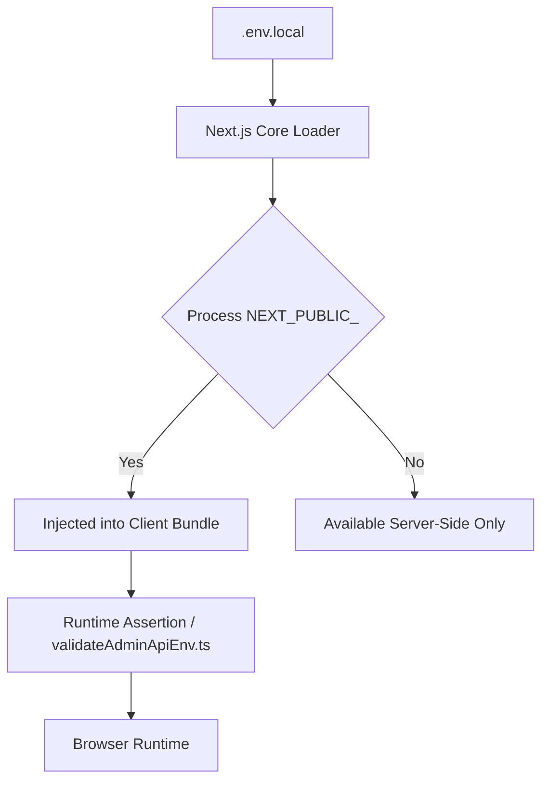
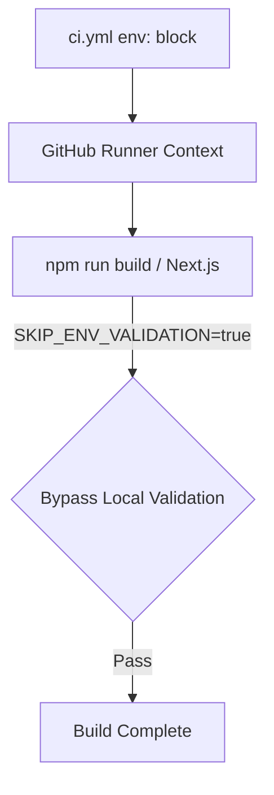
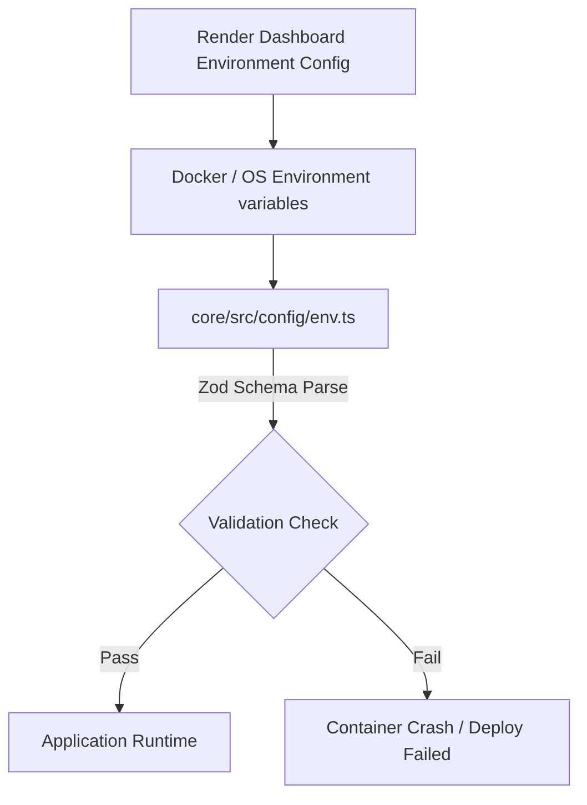
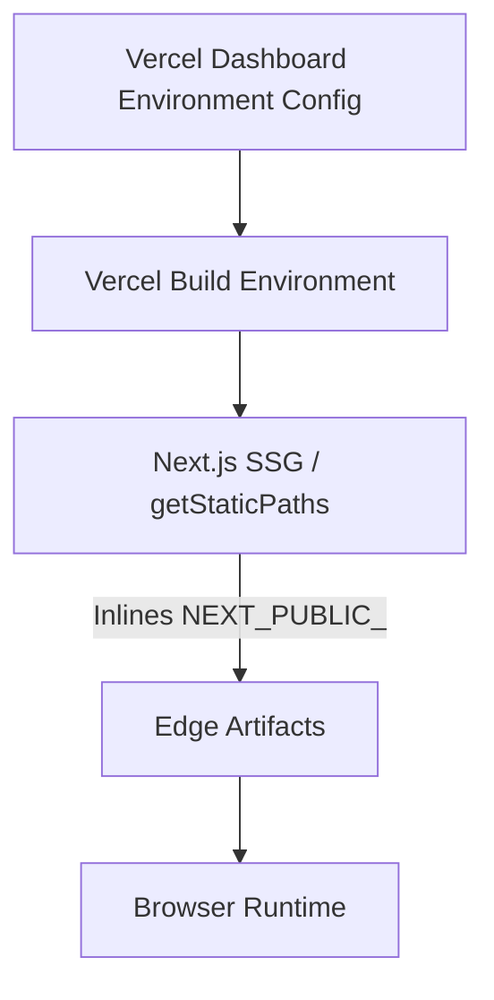

# Esparex Environment & Deployment Master SSOT

```text
Document Version: 1.0.0
Status: Approved
Owner: Platform Engineering
Review Cycle: Quarterly
Last Reviewed: 2026-07-09
Supersedes: None
```

## Executive Summary
This document is the authoritative **Single Source of Truth (SSOT)** for environment configuration across the Esparex platform. It governs the strict loading, validation, and bootstrapping of environment variables for `apps/web` (Vercel), `apps/admin` (Vercel), and `backend/user` (Render).

### Deployment Architecture
- **User Web** → Vercel
- **Admin Web** → Vercel
- **Backend API** → Render

*Core and Shared packages are consumed by the host applications and do not own distinct deployment environments.*

---

## 1. Environment Architectural Authority (SSOT)

No package or module may arbitrarily invent new environment variables. All variables must be strictly validated by the consuming host application.
- `apps/web` owns all `NEXT_PUBLIC_` variables used in the User UI.
- `apps/admin` owns all `NEXT_PUBLIC_` variables used in the Admin UI.
- `backend/user` runs the Node.js API and delegates validation to `core`.
- `core/src/config/env.ts` is the single source of truth for all backend validation.

### File Hygiene & Templates
Every application that loads variables MUST expose a `.example` template.

| Host Application | Template | Usage |
|---|---|---|
| `apps/web` | `.env.local.example` | Local UI Development |
| `apps/web` | `.env.production.example` | Vercel Deployment Reference |
| `apps/admin` | `.env.local.example` | Local Admin UI Development |
| `apps/admin` | `.env.production.example` | Vercel Deployment Reference |
| `backend/user` | `.env.example` | Local API Development |
| `backend/user` | `.env.production.example` | Render Deployment Reference |

---

## 2. Environment Variable Matrix

This matrix establishes the definitive traceability chain, lifecycle tracking, and build/runtime classification for all required variables.

### Traceability & Ownership
| Variable | Defined In | Loaded By | Validated By | Consumed By | Owner |
|---|---|---|---|---|---|
| `NEXT_PUBLIC_API_URL` | `apps/web/.env.local.example` | Next.js | `validateAdminApiEnv.ts` / Next.js | API Client | `apps/web` |
| `NEXT_PUBLIC_APP_URL` | `apps/web/.env.local.example` | Next.js | Next.js | UI Components | `apps/web` |
| `NEXT_PUBLIC_APP_ENV` | `apps/web/.env.local.example` | Next.js | `validateAdminApiEnv.ts` | Analytics / Logging | `apps/web` |
| `NEXT_PUBLIC_FIREBASE_*` | `apps/web/.env.local.example` | Next.js | Next.js | Firebase Client SDK | `apps/web` |
| `NEXT_PUBLIC_ADMIN_API_URL`| `apps/admin/.env.local.example`| Next.js | `validateAdminApiEnv.ts` | Admin API Client | `apps/admin` |
| `NODE_ENV` | `core/.env` / System | Node.js | `core/src/config/env.ts` | Backend System | `core` |
| `PORT` | `backend/user/.env.example` | `dotenv` | `core/src/config/env.ts` | Express Server | `core` |
| `MONGODB_URI` | `backend/user/.env.example` | `dotenv` | `core/src/config/env.ts` | Mongoose Connection | `core` |
| `JWT_SECRET` | `backend/user/.env.example` | `dotenv` | `core/src/config/env.ts` | Auth Middleware | `core` |
| `HMAC_SECRET` | `backend/user/.env.example` | `dotenv` | `core/src/config/env.ts` | OTP System | `core` |
| `S3_BUCKET_NAME` | `backend/user/.env.production.example`| `dotenv` | `core/src/config/env.ts` | Upload Handlers | `core` |

### Build vs Runtime Classification
| Variable | Build Time | Runtime | Justification |
|---|---|---|---|
| `NEXT_PUBLIC_*` | ✔ | ✔ | Next.js edge variables are statically embedded during build time (`getStaticPaths`), requiring them in both contexts. |
| Server Secrets (e.g., `JWT_SECRET`) | ✘ | ✔ | Backend variables are securely injected dynamically at runtime by Render/Node and are never bundled. |

### Variable Lifecycles

#### Frontend Next.js Lifecycle (`NEXT_PUBLIC_API_URL`)
```text
Defined (.env.local / Vercel Settings)
↓
Loaded (next.config.mjs / Next.js Boot)
↓
Validated (validateAdminApiEnv.ts / Edge)
↓
Build (Inlined into Edge bundle)
↓
Runtime (Browser execution)
```

#### Backend API Lifecycle (`JWT_SECRET`)
```text
Defined (.env / Render Settings)
↓
Loaded (dotenv / loadEnvFiles.ts)
↓
Validated (core/src/config/env.ts - Zod)
↓
Runtime (Express / Authentication Middleware)
```

---

## 3. Environment Loading Flow

### A. Local Backend Development (Core/User)
When running `npm run dev` in `backend/user`:
```mermaid
graph TD
    A[.env (core) / .env (backend/user)] --> B[dotenv configuration]
    B --> C[core/src/config/loadEnvFiles.ts]
    C --> D[core/src/config/env.ts]
    D -->|Zod Schema Parse| E{Validation Check}
    E -->|Pass| F[Application Runtime]
    E -->|Fail| G[Throw Synchronous Boot Error]
```

### B. Local Frontend Development (Next.js)
When running `npm run dev` in `apps/web` or `apps/admin`:


### C. GitHub Actions CI Pipeline


### D. Render Backend Deployment


### E. Vercel Frontend Deployment


---

## 4. Environment Bootstrap Guide

### A. Core / Backend Setup
1. Navigate to the user backend: `cd backend/user`
2. Copy the template: `cp .env.example .env`
3. Generate a secure `JWT_SECRET` (if running locally, the default in `.env.example` is acceptable for development).
4. Start a local MongoDB and Redis instance (or use Docker).
5. The backend will validate via Zod upon starting (`npm run dev`).

### B. User Frontend Setup (Vercel Client)
1. Navigate to the web frontend: `cd apps/web`
2. Copy the template: `cp .env.local.example .env.local`
3. Run `npm run dev`.

### C. Admin Frontend Setup (Vercel Client)
1. Navigate to the admin frontend: `cd apps/admin`
2. Copy the template: `cp .env.local.example .env.local`
3. Run `npm run dev`.

---

## 5. Deployment & Release Checklists

### A. Local Verification Checklist
- `[ ]` Ensure `.env`, `apps/web/.env.local`, and `apps/admin/.env.local` exist.
- `[ ]` Verify `npm run build` succeeds monorepo-wide.
- `[ ]` Verify `npm test` succeeds with local Redis/Mongo mocks.

### B. GitHub Actions CI Checklist
- `[ ]` Ensure GitHub Secrets do not contain local development keys.
- `[ ]` Verify `SKIP_ENV_VALIDATION=true` is injected to bypass build errors.
- `[ ]` Ensure the `governance:all` step completes successfully.

### C. User Web (Vercel) Checklist
1. **Required Variables:** Open `apps/web/.env.production.example`.
2. **Dashboard Configuration:** Paste all keys into the Vercel **Settings > Environment Variables** tab.
3. **Verify:** Check that `NEXT_PUBLIC_API_URL` points to the *production* Render backend.
4. **Deploy:** Trigger a Vercel Preview Build.
5. **Verify Firebase:** Ensure `NEXT_PUBLIC_FIREBASE_*` keys are accurately mapped to the production Firebase instance.

### D. Admin Web (Vercel) Checklist
1. **Required Variables:** Open `apps/admin/.env.production.example`.
2. **Dashboard Configuration:** Paste all keys into the Vercel **Settings > Environment Variables** tab.
3. **Deploy:** Trigger a Vercel Preview Build.

### E. Backend API (Render) Checklist
1. **Required Variables:** Open `backend/user/.env.production.example`.
2. **Dashboard Configuration:** Map every key into the Render Environment tab.
3. **CRITICAL:** Generate a highly secure (64+ character) `JWT_SECRET`.
4. **Verify Systems:** Ensure `MONGODB_URI` and `REDIS_URL` point to managed production instances.

---

## 6. Environment Security Standards

### Naming Standards
- **Public (Browser-Safe):** `NEXT_PUBLIC_*` (Must NEVER contain passwords, API keys, or JWT secrets).
- **Server-Only (Secrets):** No prefix (e.g., `JWT_SECRET`, `MONGODB_URI`).

### Git Hygiene
- `.env`, `.env.local`, and `.env.development` MUST be strictly listed in the root `.gitignore`.
- `.env.example`, `.env.local.example`, and `.env.production.example` MUST be committed, and they MUST contain only placeholders or safe local-development defaults.

---

## 7. Environment Validation Rules

| Package | Validation File | Validation Type |
|---|---|---|
| `core` | `core/src/config/env.ts` | Zod Schema |
| `apps/web` | `apps/web/next.config.mjs` | Manual Next.js Assertion |
| `apps/admin` | `apps/admin/src/lib/api/validateAdminApiEnv.ts` | Manual Next.js Assertion |

*There is no duplicated validation. Frontend code validates `NEXT_PUBLIC_` edge variables, while Backend code strictly validates server secrets.*

### Engineering Exception: `SKIP_ENV_VALIDATION`
```text
Status: Temporary

Reason: Required for current CI pipeline. Next.js statically builds pages using real endpoint URLs, causing CI to fail without production secrets.

Target State: CI should validate against the same contract as production using safe placeholder values instead of bypassing validation entirely.

Owner: Platform Engineering

Review Frequency: Every release cycle.
```

---

## 8. Environment Platform Deployment Matrix

| Variable | Local | GitHub Actions | User Vercel | Admin Vercel | Render | Required | Secret | Public |
|---|---|---|---|---|---|---|---|---|
| `NEXT_PUBLIC_API_URL` | ✔ | ✔ (Dummy) | ✔ | ✘ | ✘ | Yes | No | Yes |
| `NEXT_PUBLIC_APP_URL` | ✔ | ✘ | ✔ | ✘ | ✘ | Yes | No | Yes |
| `NEXT_PUBLIC_APP_ENV` | ✔ | ✔ (`local`) | ✔ | ✔ | ✘ | Yes | No | Yes |
| `NEXT_PUBLIC_FIREBASE_*` | ✔ | ✔ (Dummy) | ✔ | ✘ | ✘ | Yes | No | Yes |
| `NEXT_PUBLIC_ADMIN_API_URL` | ✔ | ✘ | ✘ | ✔ | ✘ | Yes | No | Yes |
| `SKIP_ENV_VALIDATION` | ✘ | ✔ (`true`) | ✘ | ✘ | ✘ | CI Only | No | No |
| `NODE_ENV` | ✔ | ✔ | ✘ | ✘ | ✔ | Yes | No | No |
| `PORT` | ✔ | ✘ | ✘ | ✘ | ✔ | Yes | No | No |
| `MONGODB_URI` | ✔ | ✔ (Mock) | ✘ | ✘ | ✔ | Yes | Yes | No |
| `JWT_SECRET` | ✔ | ✔ (Mock) | ✘ | ✘ | ✔ | Yes | Yes | No |
| `HMAC_SECRET` | ✔ | ✘ | ✘ | ✘ | ✔ | Yes | Yes | No |
| `S3_BUCKET_NAME` | ✘ | ✘ | ✘ | ✘ | ✔ (Prod) | Prod Only| No | No |

---

## 9. Environment Risk Register

### CRITICAL
| Risk | Description | Mitigation |
|---|---|---|
| **Vercel Build Dependencies** | Frontend components aggressively invoke `.env` validation during static rendering (`getStaticPaths`). If Vercel environment variables are missing during a deployment trigger, the build completely crashes, potentially taking down production pipelines. | Ensure all keys listed in `.env.production.example` are manually verified in the Vercel Dashboard prior to triggering a production deployment. |

### HIGH
| Risk | Description | Mitigation |
|---|---|---|
| **CI Local Drift** | GitHub Actions actively injects `SKIP_ENV_VALIDATION="true"` to bypass Next.js build-time errors. | Ensure thorough Vercel Preview Branch testing before merging to `main`. |
| **Monorepo File Sprawl** | `core`, `apps/web`, `apps/admin`, and `backend/user` all require distinct `.env` files. | Enforce the execution of the Bootstrap Guide procedures. |

### MEDIUM
| Risk | Description | Mitigation |
|---|---|---|
| **JWT_SECRET Lifecycle** | Backend `env.ts` enforces `JWT_SECRET` length in production, but does not enforce rotation. | Implement a Redis-backed session blocklist or explicit `ADMIN_SESSION_TTL_MS` rules. |
| **Firebase Exposed Keys** | `NEXT_PUBLIC_FIREBASE_*` keys are fundamentally exposed to the browser. | Requires strict Firebase Security Rules (Firestore/Storage) to prevent malicious direct-access data manipulation. |

---

## 10. Environment Governance Policy

To prevent configuration drift, silent failures, and documentation rot, the following governance policy applies universally across the Esparex monorepo.

### Approval Matrix

Any Pull Request that introduces, modifies, or deprecates an environment variable MUST pass this checklist before it can be merged:

1. **One Owner:** The variable must be claimed by exactly one package (`apps/web`, `apps/admin`, or `core`).
2. **Template Inclusion:** The variable MUST be added to the respective `.example` template (`.env.local.example`, `.env.production.example`).
3. **SSOT Registration:** The variable MUST be documented in the Environment Variable Matrix.
4. **Validation Guard:** The variable MUST be added to the appropriate validation layer (`core/src/config/env.ts` or Next.js assertions).
5. **Platform Mapping:** The variable MUST be mapped to its target environments in the Platform Matrix.
6. **Platform UI Sync:** If required, the DevOps/Release Engineer must configure the variable in the GitHub Actions, Vercel, or Render dashboards *prior* to merge.

**Any Pull Request containing undocumented or unvalidated environment variables will be automatically rejected.**

### Environment Variable Change Process

When modifying the environment contract, the following mandatory change workflow must be executed:

1. Add variable to the correct `.env.example`
2. Add validation (`env.ts` or Next.js assertions)
3. Update `ENVIRONMENT_VARIABLE_MATRIX.md`
4. Update `ENVIRONMENT_PLATFORM_MATRIX.md`
5. Configure GitHub Actions (if applicable)
6. Configure Vercel/Render (if applicable)
7. Verify local bootstrap
8. Verify CI
9. Verify deployment
10. Merge PR
