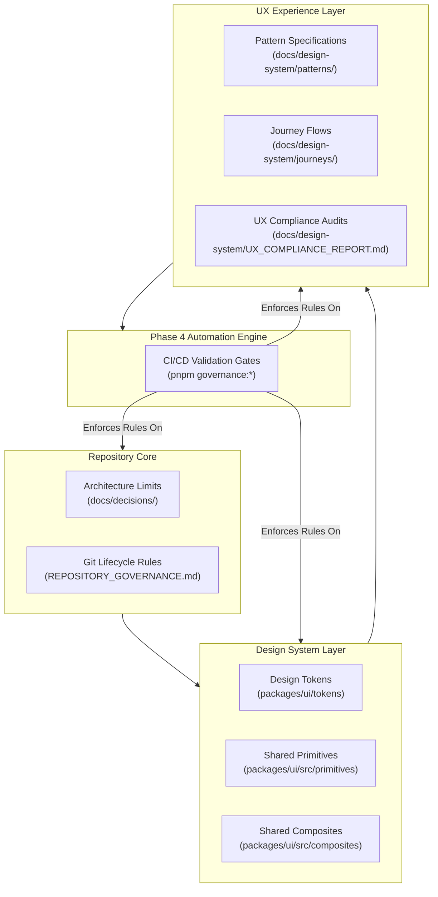

# Governance Architecture & Enforcement Platform

**Version:** 1.0.0  
**Status:** Approved  
**Last Updated:** 2026-07-06  
**Owner:** Platform Governance Team  
**Review Cycle:** Semi-Annually  

---

## 1. Purpose

This document defines the structural relationship between code quality, architectural constraints, Git branch lifecycles, and design tokens/UX patterns in the MAD Entertrainment repository. 

As a repository scales into a multi-product platform, manual peer reviews become insufficient. This architecture acts as the blueprint for **automated enforcement (Phase 4)**, mapping human-readable specifications to static analysis rules.

---

## 2. Core Governance Layers

The governance engine evaluates repository health across five distinct layers:



### Layer Details

1. **Architecture & Structure Governance:**
   - Enforces file size limits (e.g. Components < 300 lines).
   - Prevents dependency cycle loops between internal packages and apps.
   - Restricts package boundaries (e.g. apps can only import from `@mad/ui`, never from internal package structures).

2. **Git Lifecycle Governance:**
   - Enforces `RULE-GIT-001` (automated squash/rebase branch cleanup validation).
   - Validates branch naming formats (`feat/*`, `fix/*`, `refactor/*`, `docs/*`).
   - Ensures PR compliance before merge.

3. **Design System Governance (Tokens & Primitives):**
   - Validates that semantic design tokens (typography, layout heights, spacing, theme constants) map to CSS variables.
   - Prevents hardcoded color values (hex/rgb) or ad-hoc custom styles in layout views.
   - Verifies compliance with the Theme Contract across products.

4. **UX & Pattern Governance (Composites & Journeys):**
   - Compares implemented pages against the 19 canonical pattern documents (e.g., verifying `UX-AUTH-001` forms use `FormField`).
   - Enforces keyboard focus trapping and ARIA standards (WCAG AA accessibility target).

5. **Compliance & Backlog Tracking:**
   - Indexes and validates all backlog references (`BL-XXX`) in `BACKLOG.md`.
   - Logs and measures layout compliance via the manual and automated compliance matrix.

---

## 3. Phase 4 Automation Strategy

Phase 4 moves the governance engine from descriptive documentation to automated gates that fail the CI pipeline upon violations.

```
                               ┌────────────────────────┐
                               │  Code Commit / Pull Request │
                               └───────────┬────────────┘
                                           │
                                           ▼
                            ┌──────────────────────────────┐
                            │   pnpm governance:validate   │
                            └──────────────┬───────────────┘
                                           │
                    ┌──────────────────────┼──────────────────────┐
                    │                      │                      │
                    ▼                      ▼                      ▼
         [Documentation Lint]      [Public API Lint]      [Static Token Audit]
         Checks YAML schema,       Verifies imports from  Detects raw hex/rgb,
         Pattern IDs & links.      stable barrel only.    non-token values.
                    │                      │                      │
                    └──────────────────────┼──────────────────────┘
                                           │
                                           ▼
                                ┌─────────────────────┐
                                │ All Checks Passed?  │
                                └──────────┬──────────┘
                                           │
                             ┌─────────────┴─────────────┐
                             ▼                           ▼
                        [YES: Merge]               [NO: Fail CI]
```

### Automation Workstreams

* **Phase 4A — Documentation Enforcement:**
  - Lints pattern markdown files for valid YAML frontmatter templates.
  - Verifies that all components listed in `related-components` exist in the `@mad/ui` barrel export.
  - Validates pattern and journey link references.

* **Phase 4B — Component Import Validation:**
  - Employs AST parser rules (ESLint plugin) to ensure that apps import components exclusively from the stable public boundary (`@mad/ui`).
  - Restricts imports of internal directories (e.g. `@mad/ui/src/primitives/...` is prohibited).

* **Phase 4C — Design Token Scanner:**
  - Audits CSS/Tailwind source files for raw color values (e.g. `#8b5cf6`).
  - Restricts style overrides unless explicitly annotated with `governance-ignore` comments for external SDK requirements (like Razorpay).

* **Phase 4D — Accessibility Auditor:**
  - Validates that modal overlays incorporate Escape close behaviors.
  - Ensures inputs contain associated `<Label>` references.

---

## 4. Contributor Workflow

Every developer making changes in the repository must adhere to the following sequence:

1. **Consult Patterns:** Refer to `docs/design-system/patterns/` to align new features with approved UX layouts.
2. **Reuse Components:** Utilize stable composites from `@mad/ui` (such as `FormField` or `ErrorState`). If a primitive is missing, log a gap in `BACKLOG.md` rather than building an ad-hoc local component.
3. **Execute Local Audits:** Prior to staging commits, run lint commands:
   ```bash
   pnpm governance:docs
   pnpm build
   ```
4. **Follow Branch Cleanup:** When a PR is merged, run the branch cleanup protocol (`RULE-GIT-001`) immediately to keep local/remote tracking references clean.
