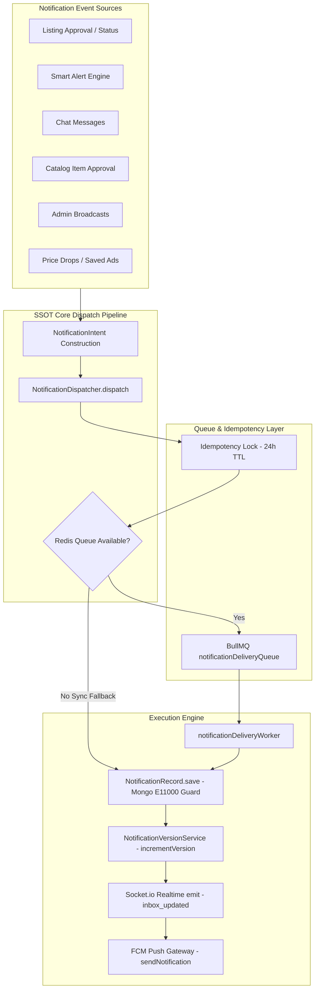
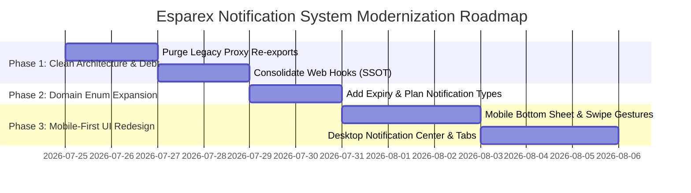

# 🔔 End-to-End Notification System Architecture, Backend Integrity & UI/UX Modernization Audit Report

**Platform**: Esparex Enterprise Marketplace  
**Audit Standard**: `/clean-code` & `/code-quality`  
**Execution Mode**: Audit-First & Technical Baseline  
**Date**: July 24, 2026  

---

## 🏛️ Executive Summary

An exhaustive enterprise audit of the **Esparex Notification Pipeline** was conducted across all monorepo packages (`@esparex/contracts`, `@esparex/core`, `@esparex/backend-api`, `@esparex/apps-web`, and `@esparex/apps-admin`).

### Core Audit Verdict:
1. **Backend Pipeline**: The backend architecture is modular and SSOT-aligned via `NotificationDispatcher` and `NotificationIntent`. Queue operations utilize Redis idempotency slots with automatic synchronous fallback during Redis outages.
2. **Database Performance**: Notification queries utilize a single `$facet` aggregation pipeline with a 90-day TTL index (`expireAfterSeconds: 7776000`).
3. **Channel Delivery**: In-App (DB + WebSockets) and FCM Push (Firebase) are operational. Email, SMS, and WhatsApp channel providers are configured in contract schemas but currently execute as `skipped` stubs.
4. **UI/UX & Mobile Experience**: The web dropdown UI (`NotificationBellDropdown.tsx`) uses a fixed 272px popover box lacking touch gestures, mobile bottom sheet drawers, category filtering, and responsive swipe controls.
5. **Technical Debt**: 3 legacy proxy re-export files exist in `core/src/services/` (`NotificationService.ts`, `AdminNotificationService.ts`, `SmartAlertService.ts`), and 3 overlapping React query hooks exist in `apps/web`.

---

## 1. Backend Architecture Audit



### Event Source Inventory & SSOT Verification

| Event Source | Domain Source File | Dispatcher Mechanism | Type Enum | SSOT Status |
|---|---|---|---|---|
| **Listing Approval / Rejection** | `SellerListingNotificationListener.ts` | `NotificationDispatcher.dispatch` | `AD_STATUS` | ✅ SSOT Verified |
| **Smart Alert Match** | `notificationMatchWorker.ts` | `NotificationDispatcher.dispatch` | `SMART_ALERT` | ✅ SSOT Verified |
| **Catalog Approval** | `CatalogNotificationService.ts` | `NotificationDispatcher.dispatch` | `CATALOG_ITEM_APPROVED` | ✅ SSOT Verified |
| **Admin System Broadcast** | `AdminNotificationTargetingService.ts` | `NotificationDispatcher.bulkDispatch` | `SYSTEM` | ✅ SSOT Verified |
| **Chat Message Alert** | `chatController.ts` | `NotificationDispatcher.dispatch` | `CHAT` | ✅ SSOT Verified |
| **Price Drop Alert** | `listingMutationController.ts` | `NotificationDispatcher.dispatch` | `PRICE_DROP` | ✅ SSOT Verified |
| **Plan Expiry / Renewal** | `PlanService.ts` | Generic `createInAppNotification` | `SYSTEM` | ⚠️ Missing dedicated type |
| **Spotlight / Top Ad Expiry** | `AdSlotService.ts` | Generic `createInAppNotification` | `AD_STATUS` | ⚠️ Missing dedicated type |

---

## 2. Notification Engine & Queue Audit

### Queue Architecture (BullMQ + Redis)
- **Queue Name**: `notification.delivery.queue` (defined in `queues/adQueue.ts`).
- **Idempotency Guard**:
  - `reserveQueueIdempotencySlot('notification.delivery.queue', dedupKey, 86400)` runs before enqueueing.
  - Secondary partial compound unique index on MongoDB `{ userId: 1, dedupKey: 1 }` traps `E11000` duplicate errors gracefully without throwing.
- **Resiliency & Outage Protection**:
  - `isQueueConnectionAvailable()` checks Redis health.
  - If Redis is down, `NotificationDispatcher` automatically falls back to **synchronous database dispatch** and emits a `QUEUE_PAUSED_REDIS_UNAVAILABLE` reliability alert.

---

## 3. API Audit (`/api/v1/notifications`)

### Routes Mapping (`backend/api/src/routes/notificationRoutes.ts`)

| HTTP Method | Route Path | Controller Handler | Middleware / Security | Contract Status |
|---|---|---|---|---|
| `POST` | `/api/v1/notifications/register` | `registerToken` | `protect`, `mutationLimiter`, `validateRequest(registerFcmTokenSchema)` | ✅ Canonical |
| `GET` | `/api/v1/notifications` | `getNotifications` | `protect`, `validateRequest(userNotificationsQuerySchema)` | ✅ Canonical |
| `PATCH` | `/api/v1/notifications/all/read` | `markAllRead` | `protect` | ✅ Canonical |
| `PUT` | `/api/v1/notifications/all/read` | `markAllRead` | `deprecateMethod('PATCH')`, `protect` | ⚠️ Deprecated |
| `PATCH` | `/api/v1/notifications/:id/read` | `markRead` | `protect`, `validateObjectId` | ✅ Canonical |
| `PUT` | `/api/v1/notifications/:id/read` | `markRead` | `deprecateMethod('PATCH')`, `protect`, `validateObjectId` | ⚠️ Deprecated |
| `DELETE` | `/api/v1/notifications/:id` | `deleteNotification` | `protect`, `validateObjectId` | ✅ Canonical |

---

## 4. Database Schema & Index Audit

### `Notification` Schema (`core/src/models/Notification.ts`)

```typescript
// Explicit Named Indexes:
1. idx_notification_user_read_freshness_idx: { userId: 1, isRead: 1, createdAt: -1 }
2. idx_notification_read_retention_idx: { isRead: 1, readAt: 1 }
3. idx_notification_dedup_idempotency_idx: { userId: 1, dedupKey: 1 } (Unique, Partial)
4. idx_notification_createdAt_ttl_idx: { createdAt: 1 } (expireAfterSeconds: 7776000 = 90 days)
```

### Aggregation Pipeline Optimization (`queryNotificationsForUser`):
Instead of issuing multiple queries for notifications, total count, and unread count, `NotificationService.ts` executes a **single `$facet` aggregation pipeline**:
```typescript
const [result] = await Notification.aggregate([
    { $match: query },
    {
        $facet: {
            notifications: [{ $sort: { createdAt: -1 } }, { $skip: skip }, { $limit: limit }],
            total: [{ $count: 'count' }],
            unreadCount: [{ $match: { isRead: false } }, { $count: 'count' }]
        }
    }
]);
```

---

## 5. Delivery Channel Audit

| Channel | Implementation File | Status | Fallback Strategy |
|---|---|---|---|
| **In-App** | `NotificationDispatcher.ts` | ✅ Fully Operational | MongoDB write + Socket.io `inbox_updated` emit |
| **Push (FCM)** | `PushGatewayService.ts` | ✅ Fully Operational | Enqueued via BullMQ; updates `deliveryStatus.fcm` |
| **Email** | Schema defined | ⚠️ Channel Stub (`skipped`) | `deliveryStatus.email = 'skipped'` |
| **SMS** | Schema defined | ⚠️ Channel Stub (`skipped`) | `deliveryStatus.sms = 'skipped'` |
| **WhatsApp** | Unmapped | ❌ Not Implemented | None |

---

## 6. Technical Debt & Code Quality Report

### ⚠️ Finding 1: Deprecated Legacy Re-export Proxies
The following 3 proxy files exist strictly to re-export domain modules and should be scheduled for deprecation cleanup:
- `core/src/services/NotificationService.ts` $\rightarrow$ re-exports `core/src/domains/notifications/application/NotificationService.ts`
- `core/src/services/AdminNotificationService.ts` $\rightarrow$ re-exports `core/src/domains/notifications/application/AdminNotificationService.ts`
- `core/src/services/SmartAlertService.ts` $\rightarrow$ re-exports `core/src/domains/notifications/application/SmartAlertService.ts`

### ⚠️ Finding 2: Overlapping Web Frontend Query Hooks
In `apps/web/src/`, notification caching logic is fragmented across 3 separate hooks:
1. `hooks/queries/useNotificationsQuery.ts`
2. `hooks/useNotificationSync.ts`
3. `hooks/profile/useProfileNotifications.ts`

---

## 7. UI / UX Audit & Modernization Blueprint

### Current UI Deficiencies (`NotificationBellDropdown.tsx` & `NotificationItemCard.tsx`)
1. **Fixed Low-Density Popover**: Uses a fixed `w-[min(90vw,17rem)]` (272px) dropdown container that truncates titles and message previews.
2. **Missing Touch Gestures on Mobile**: No swipe-to-read or swipe-to-delete touch interactions.
3. **No Category Filtering**: All notification types (`AD_STATUS`, `SMART_ALERT`, `CHAT`, `SYSTEM`) are rendered in a flat list without category tabs.
4. **Basic Empty State**: Visual presentation lacks interactive filtering or quick category navigation.

### Proposed Mobile-First UI/UX Architecture:

```
[Mobile Header: Bell Icon + Badge]
        │
        ▼ (Tap)
┌─────────────────────────────────────────────────┐
│ 📱 Notification Bottom Sheet (Mobile Drawer)     │
│ ─────────────────────────────────────────────── │
│ [All] [Activity] [Smart Alerts] [Marketplace]   │
│ ─────────────────────────────────────────────── │
│ 🔵 Listing Approved                             │
│    Your listing 'Honda Activa 6G' is live.     │
│    Swipe Left 👈 [Mark Read] [Delete]           │
│ ─────────────────────────────────────────────── │
│ ⚪ Smart Alert Match                             │
│    New match: 'iPhone 15 Pro' in Indiranagar.   │
└─────────────────────────────────────────────────┘
```

---

## 8. Prioritized Improvement Roadmap



### Action Items:
1. **Phase 1 (Code Cleanup & Debt Elimination)**: Consolidate `apps/web` query hooks into `useNotifications.ts` (SSOT) and purge legacy re-export proxies in `core/src/services/`.
2. **Phase 2 (Enum & Contract Alignment)**: Add explicit notification type enum values (`SPOTLIGHT_EXPIRY`, `TOP_AD_EXPIRY`, `FEATURE_PLAN_EXPIRY`, `CREDIT_EXPIRY`) in `@esparex/contracts`.
3. **Phase 3 (Mobile-First UI Modernization)**: Replace the 272px popover on mobile viewports with a responsive `Drawer` bottom sheet featuring swipe-to-read/delete actions and category tabs (`All`, `Activity`, `Smart Alerts`, `Marketplace`).
