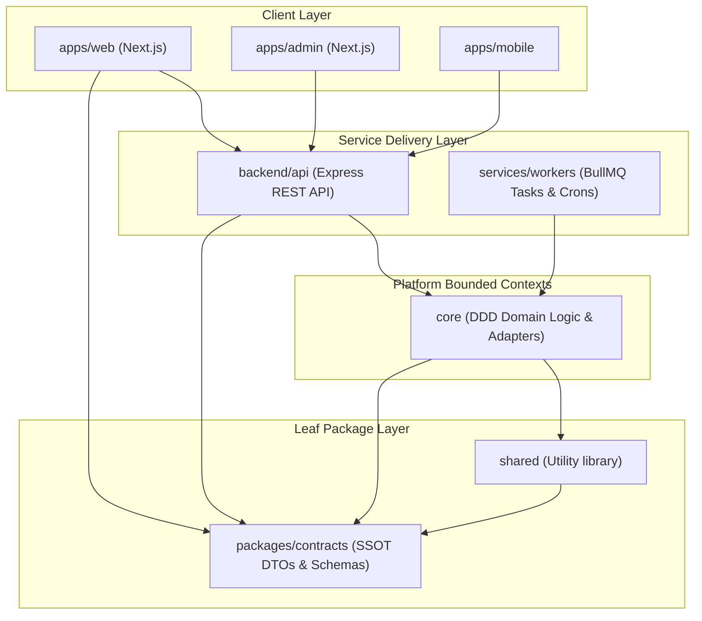

# Esparex Repository Discovery & Architecture Audit

This document establishes the baseline repository discovery, architecture audit, and system specification for the **Esparex Platform**. It captures the exact structure, package dependencies, business domains, data flows, and health metrics of the codebase at commit `8940ef6d` (2026-07-18).

---

## 1. Repository Structure (Phase 1)

The Esparex Platform is structured as an npm-managed monorepo. It organizes application UI entry points, backend services, core domain code, and shared utilities into workspaces under a flat, layered hierarchy.

```text
Esparex/
├── apps/                         # Frontend application entry points (UI & Client-side logic)
│   ├── web/                      # Main Next.js Web Client (consumer/seller marketplace)
│   ├── admin/                    # Next.js Admin Dashboard (management, moderation, operations)
│   └── mobile/                   # React Native / Capacitor mobile shell
│
├── backend/                      # HTTP/REST delivery and routing entry points
│   └── api/                      # Node/Express API Server (thin route-mapping and validation)
│
├── core/                         # Bounded contexts, domain business logic, Mongoose models
│   └── src/                      # Source tree for Domain services, adapters, and repositories
│
├── packages/                     # Sub-workspaces, helper packages, and domain stubs
│   ├── contracts/                # SSOT for DTOs, Zod schemas, API contracts, event payloads
│   ├── kernel/                   # DDD base primitives (Entity, ValueObject, DomainEvents)
│   ├── platform/                 # Bootstrapping, DI wiring, and Composition Roots
│   ├── feature-flags/            # Feature toggle management
│   ├── observability/            # Telemetry, OpenTelemetry, metrics, audit logs
│   ├── config/                   # Global configuration loading
│   ├── logger/                   # Universal logger client
│   ├── validation/               # Shared validation rules
│   ├── testing/                  # Testing helpers and mock utilities
│   └── domain/                   # Stub directories for future extracted domains (stubs only)
│       └── [admin, ai, catalog, chat, listings, users, payments, etc.]
│
├── shared/                       # Shared utility helpers and legacy proxy layer
│   └── src/                      # TypeScript utility code (geo, date, string formatting)
│
├── docs/                         # Platform documentation, specifications, ADRs, and audits
│   ├── adr/                      # Architectural Decision Records (ADR-001 through ADR-008)
│   ├── architecture/             # Enterprise Architecture Specifications (v1.0)
│   ├── governance/               # General agent governance and quality standards
│   └── reports/                  # Phase completion reports and baseline scorecards
│
├── scripts/                      # Maintenance tasks, database seeds, and pre-commit hooks
└── tooling/                      # Configuration files for linting, testing, and bundlers
```

### Folder Responsibilities & Dependency Rules

| Folder | Core Responsibility | Upstream Dependencies | Primary Consumers |
| :--- | :--- | :--- | :--- |
| `apps/` | Client UI rendering, state management, form inputs, Page Shells | `@esparex/shared`, `@esparex/contracts` | Browser / Mobile runtimes |
| `backend/` | REST endpoint routing, middleware, controllers, JWT validation | `@esparex/core`, `@esparex/contracts` | App clients (`apps/`) |
| `core/` | DDD domain models, database adapters, queues, background jobs | `@esparex/contracts`, `@esparex/shared` | `backend/api`, `services/workers` |
| `packages/` | Core platform libraries, kernel, SDK, and leaf utilities | None (Leaf packages) | `core/`, `backend/api`, `apps/` |
| `shared/` | Shared platform-agnostic utilities (geo, formatting) | `@esparex/contracts` | `apps/`, `core/`, `backend/api` |

---

## 2. Architecture & Layering Specification (Phase 5)

The Esparex Platform relies on a strict **DDD Ports & Adapters (Hexagonal) Architecture** layout. Dependencies are strictly directed inward, ensuring that outer delivery layers (Next.js, Express) depend on core application services, which interact with databases strictly through abstract interfaces (Ports).

### Monorepo Dependency Flow



* **Leaf Contracts Principle:** `@esparex/contracts` has zero external dependencies. It acts as the Single Source of Truth (SSOT).
* **Ports & Adapters Boundary:** `core/src/domains/[domain]/ports/` contains pure interfaces (e.g., `CategoryRepositoryPort`). Implementation details (`MongoCategoryRepositoryAdapter`) live under `core/src/adapters/outbound/database/` and are resolved only via the composition root (`core/src/composition/`).

---

## 3. Monorepo Package Map (Phase 3)

| Workspace Package | Responsibility | Classification | Public API | Consumers |
| :--- | :--- | :--- | :--- | :--- |
| `@esparex/contracts` | Canonical DTO definitions, request/response models, Zod validation schemas, event schemas | **Leaf / SSOT** | `./v1/common/schema`, `./v1/identity` | All packages |
| `@esparex/shared` | Platform-agnostic utilities (date math, location distances, text filters) | **Shared Utility** | `./src/location/location.utils`, `./src/utils/geoUtils` | `apps/`, `core/`, `backend/` |
| `@esparex/kernel` | Base DDD abstractions (Entity, ValueObject, Result) and event dispatching | **Kernel / Base** | `./src/domain`, `./src/events` | `core/`, `packages/domain-*` |
| `@esparex/observability`| OpenTelemetry tracing, monitoring, Sentry logging, and metric registries | **Platform Infrastructure** | `./src/metrics`, `./src/registry` | `core/`, `backend/` |
| `@esparex/config` | central `.env` loading and validation rules | **Platform Infrastructure** | `./src/validateEnv`, `./src/systemConfig` | `core/`, `backend/` |
| `@esparex/logger` | Structured JSON log output | **Platform Infrastructure** | `./src/logger` | All packages |
| `@esparex/validation` | ObjectId, phone number, and location validator helpers | **Platform Infrastructure** | `./src/objectId`, `./src/phone` | `core/`, `backend/` |
| `@esparex/core` | Core business operations, Mongoose schemas, repositories, composition DI roots | **Domain Core** | `./src/index`, `./src/domains/catalog` | `backend/api`, `services/workers` |
| `@esparex/backend-api` | Express server, controllers, JWT middleware, routes | **Service Delivery** | `./src/server`, `./src/app` | N/A (runtime process) |

---

## 4. Bounded Context & Domain Map (Phase 4)

Active domain business logic resides inside `core/src/domains/` and `backend/api/src/controllers/`. The packages located under `packages/domain/*` are stubs reserved for future extraction.

```text
core/src/domains/
├── admin/                     # Moderation workflows, system configs, platform activity
├── catalog/                   # Category hierarchy, brands, models, spare parts master data
├── chat/                      # P2P buyer-seller messaging, read tracking, blocklists
├── identity/                  # User credentials, OTP verification, mobile bindings
├── listings/                  # Ads (classified listings), boosts, status lifecycles
└── location/                  # Geo-hierarchies (India/Guntur, etc.), coordinates, geofences
```

### Domain Ownership Mapping

| Domain Context | Core DB Models | Frontend Interface | Core Services | API Endpoints |
| :--- | :--- | :--- | :--- | :--- |
| **Catalog** | `Category`, `Brand`, `Model`, `SparePart` | `apps/admin/categories`, `apps/web/post-ad` | `CatalogValidationService`, `CatalogOrchestrator` | `GET/POST /api/v1/catalog/*` |
| **Listings** | `Ad`, `AdReport`, `SavedSearch` | `apps/web/post-ad`, `apps/web/ads/[slug]` | `ListingMutationService`, `FeedService` | `/api/v1/listings/*`, `/api/v1/feeds` |
| **Chat** | `ChatConversation`, `ChatMessage` | `apps/web/chat`, `apps/web/account/messages` | `ChatConversationService`, `ChatAdminService` | `/api/v1/chats/*` |
| **Identity** | `User`, `UserSession` | `apps/web/login`, `apps/web/account/profile` | `AuthService`, `UserMutationController` | `/api/v1/auth/*`, `/api/v1/users/*` |
| **Location** | `Location`, `Geofence` | `apps/web/search`, `apps/admin/locations` | `LocationSearchService`, `GeoUtils` | `/api/v1/locations/*` |

---

## 5. End-to-End Feature Mapping (Phase 6)

### 5.1 Post Ad (Listing Creation) Flow
This feature orchestrates nested data selection, image processing, Zod-based validation, and background processing:
1. **Selection (Frontend):** The seller selects `Category` → `Brand` → `Model` → `Spare Parts` (populated via `/api/v1/catalog` read-endpoints).
2. **Validation (Zod):** The browser validates inputs using `AdPayloadSchema` imported from `@esparex/contracts`.
3. **Upload (Media):** Image files are POSTed to `/api/v1/upload/ad-image` which compresses and uploads them to S3/Cloudinary, returning secure URLs.
4. **Submission (API):** The browser POSTs the listing JSON to `/api/v1/listings/create`.
5. **Persistence (Core):** `ListingMutationService` instantiates a new `Ad` model, validates the catalog integrity via `CatalogValidationService`, and writes the record to MongoDB.
6. **Indexing (Background):** A BullMQ worker indexes the listing for text/vector search.

### 5.2 P2P Chat Messaging Flow
1. **Send Message:** A user submits text in `apps/web/chat/[conversationId]`.
2. **WebSocket & API:** The client POSTs the message to `/api/v1/chats/messages`.
3. **Core Processing:** `ChatConversationService` saves the message to `ChatMessage`, marks the conversation as unread, and fires a `ChatMessageSent` integration event.
4. **Dispatcher:** `NotificationDispatcher` receives the event and sends an SMS/Email alert to the offline recipient.

---

## 6. Request Lifecycle & Data Flows (Phase 7)

### 6.1 Listing Creation Request Lifecycle

```text
Browser                       API Gateway (Express)                Core Service (Domain)            Database (MongoDB)
   │                                     │                                    │                              │
   │─── 1. POST /api/v1/listings ───────>│                                    │                              │
   │    (AdPayload JSON)                 │── 2. Validate via ────────────────>│                              │
   │                                     │      AdPayloadSchema (contracts)   │                              │
   │                                     │                                    │                              │
   │                                     │── 3. Call ────────────────────────>│                              │
   │                                     │      ListingMutationService        │                              │
   │                                     │                                    │── 4. Verify Catalog ────────>│
   │                                     │                                    │      Constraints             │
   │                                     │                                    │                              │
   │                                     │                                    │── 5. Write Ad Entity ───────>│
   │                                     │                                    │                              │
   │<── 7. Respond with JSON (201) ──────│<── 6. Return Ad Document ──────────│                              │
```

### 6.2 Authentication and OTP Lifecycle
1. **Request OTP:** User inputs phone number -> API POST `/api/v1/auth/request-otp`.
2. **SMS Dispatch:** Core `AuthService` generates a secure verification token, stores the hash in Redis, and dispatches an SMS using Sns/Twilio adapter.
3. **Submit OTP:** User submits 6-digit code -> API POST `/api/v1/auth/verify-otp`.
4. **Token Issuance:** `AuthService` verifies OTP against Redis, issues short-lived JWT access and long-lived refresh tokens, and registers the session.

---

## 7. Technology Stack & Configurations (Phases 2, 8 & 9)

### 7.1 Frameworks & Libraries
* **Monorepo Engine:** npm Workspaces (v10.9.7), Node.js (v22.0.0+)
* **Frontend Web/Admin:** Next.js (v16.2.4), React, Tailwind CSS, React Query
* **Mobile Shell:** Capacitor, React Native
* **Backend API Server:** Node.js, Express (v4.21.2), TypeScript (v5.9.3)
* **Testing:** Jest, ts-jest, Madge, Playwright (E2E)

### 7.2 Infrastructure & Services
* **Primary Database:** MongoDB (Mongoose v8.12.0)
* **Cache & Queues:** Redis (ioredis v5.5.0), BullMQ for background queues
* **Configuration:** dotenv (`.env` validator script)
* **Media Storage:** AWS S3 / Cloudinary integration
* **Deployment Plan:** `render.yaml` infrastructure definitions

---

## 8. Governance & CI/CD Quality Gates (Phase 10)

Esparex enforces automated checks before commits are staged and before PRs can merge.

* **Commit Linting:** Enforced by `commitlint` and `husky` (`pre-commit` and `commit-msg` hooks).
* **Dependency Cruiser:** `npm run guard:dependencies` blocks illegal imports:
  - Frontend apps cannot import from `@esparex/core` (forces HTTP routing).
  - `@esparex/contracts` is kept strictly isolated as a leaf package.
  - `@esparex/shared` is blocked from importing core code.
* **Code Duplication Guard:** Enforced via `jscpd` (`.jscpd.json` rules).
* **Dead Code Sweeper:** `npm run guard:dead-code` detects unused exports and orphan source files.
* **Route Collision Guards:** Scripts in `scripts/` check for routing shadowing and naming integrity.

---

## 9. Repository Health Report (Phase 12)

A comprehensive snapshot of the codebase metrics post-Phase 1 contracts migration.

```text
--------------------------------------------------
METRIC                                  VALUE
--------------------------------------------------
TypeScript Compilation Errors           0
Circular Dependencies (Madge)           0
Orphan / Unused Files                   0
Workspace Build Status                  PASS (116.8 seconds)
Test Suites Passing (Core)              39 / 39 (246 tests)
Test Suites Passing (Backend API)       64 / 64 (320 tests)
Total Active Source Files               1,955
Active Workspace Packages               29 (including 19 domain stubs)
Dependency Cruiser Violations           0 Errors · 348 Warnings
--------------------------------------------------
```

> [!NOTE]
> The 348 warnings represent the deprecated proxy exports located inside `@esparex/shared/index.ts`. All 348 will be resolved in Phase 1.1 by moving remaining shared imports directly to `@esparex/contracts`.

---

## 10. Strategic Recommendations

1. **Prioritize Phase 1.1 Proxy Elimination:** Set a short 2-day sprint to migrate all remaining imports referencing `@esparex/shared` to `@esparex/contracts`, then remove the deprecated compatibility proxy exports completely and promote the Cruiser rule from `warn` to `error`.
2. **Post Ad Experience Audit:** Follow the refined end-to-end Post Ad audit prompt to eliminate validation discrepancy loops between client-side forms and API routes.
3. **Keep Domain Stubs Frozen:** Do not perform premature code refactoring on the `packages/domain/*` stubs until the core/API code is fully stabilized. Keep them as empty package definitions until active extraction work begins.
