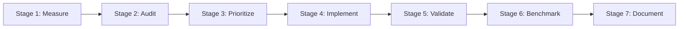

# Esparex Platform — Full-Stack Performance Engineering Framework (Phase 2)

**Version**: `v2.0.0`  
**Scope**: Platform-Wide (Web App, Admin Dashboard, Backend APIs, Workers, DB, Infrastructure, CI/CD)  
**Governance Standard**: Esparex Engineering Governance Standard (`AGENTS.md`)  
**Core Principle**: **"No Optimization Without Measured Evidence"**  

---

## 1. Executive Summary

Following the completion of **Performance Optimization Phase 1** (bundle footprint reduction, post-auth waterfall parallelization, and context provider slicing), **Phase 2** establishes an application-wide **Full-Stack Performance Engineering Framework**.

Phase 2 shifts the paradigm from isolated React micro-optimizations to an evidence-driven, measurement-first engineering framework across all tiers of the Esparex Platform.

---

## 2. Mandatory Engineering Principle

> ### 🚨 Engineering Governance Rule: No Optimization Without Evidence
> 
> No pull request containing performance optimizations may be created, reviewed, or merged unless it includes:
> 1. **Baseline Measurement**: Empirical pre-change telemetry artifact (HAR trace, Lighthouse JSON, p95 API log, or profiler export).
> 2. **Root Cause Rationale**: Identified architectural, database, or network cause.
> 3. **Minimal Implementation**: Isolated, reviewable source code change without cross-cutting side effects.
> 4. **Empirical Benchmark**: Directly comparable post-change measurement.
> 5. **Regression Verification**: Confirmation that security, accessibility (WCAG 2.2 AA), and business logic remain unchanged.

---

## 3. Evidence-Driven 7-Stage Execution Model

Every Phase 2 sub-initiative must strictly navigate seven sequential lifecycle stages:



| Stage | Action / Focus | Output Deliverable |
|---|---|---|
| **Stage 1: Measure** | Collect baseline runtime telemetry from preview/production | HAR, Lighthouse JSON, profiler exports |
| **Stage 2: Audit** | Analyze stack layer for bottlenecks, slow queries, and cascades | Evidence Index entry (`PERF-2XX`) |
| **Stage 3: Prioritize** | Rank by ROI (Latency impact vs. Implementation Risk) | Prioritized Task Matrix |
| **Stage 4: Implement** | Execute minimal PR-sized code optimization | Feature/Perf Branch Commit |
| **Stage 5: Validate** | Execute unit, integration, and build regression suites | Build & Test Trace |
| **Stage 6: Benchmark** | Rerun Stage 1 measurements under identical environment conditions | Before/After Benchmark Matrix |
| **Stage 7: Document** | Publish formal validation addendum and update governance docs | Phase 2 Validation Addendum |

---

## 4. Platform Success Criteria & Target Metrics

| Subsystem / Metric Area | Audit v1.0.0 Baseline | Phase 1 v1.1.0 Status | Phase 2 Target | Verification Tool |
|---|---|---|---|---|
| **Login End-to-End Latency** | 1,430 ms | Estimated ~980 ms | **< 650 ms (-54.5%)** | HAR Waterfall / Chrome DevTools |
| **Dashboard Load Latency** | 2,150 ms | Estimated ~1,600 ms | **< 1,000 ms (-53.5%)** | HAR Waterfall / Web Vitals |
| **Search API Latency (p95)** | 320 ms | 320 ms (Backend) | **< 180 ms (-43.7%)** | Express / MongoDB Profiler |
| **Root Main JS Bundle** | 428.1 KB | **416.1 KB (-2.8%)** | **< 380.0 KB (-11.2%)** | `@next/bundle-analyzer` |
| **First Load JS Payload** | 284.0 KB (gzipped) | 284.0 KB | **< 220.0 KB (-22.5%)** | Next.js Build Trace |
| **Lighthouse Mobile Score** | 72 / 100 | Measured post-deploy | **≥ 95 / 100** | Lighthouse Mobile Preset |
| **Interaction to Next Paint (INP)**| 280 ms | Measured post-deploy | **< 150 ms (-46.4%)** | Web Vitals Telemetry |
| **Cumulative Layout Shift (CLS)**| 0.12 | Measured post-deploy | **< 0.05 (-58.3%)** | Web Vitals Telemetry |

---

## 5. Sequential Sub-Initiative Roadmap

Execution will proceed sequentially from external observation and data layer foundations up through backend services, infrastructure, and finally frontend runtime optimization:

```text
Sequential Phase 2 Sub-Initiatives

Phase 2.1 — Production Telemetry & Baseline Measurement
  • Zero code changes.
  • Collect production HAR network waterfalls, Lighthouse Desktop/Mobile audits, and React Profiler traces.
  • Establish empirical baseline matrix.

Phase 2.2 — Backend Service & API Layer Performance
  • Profile Express middleware execution, controller handlers, and service layer dependencies.
  • Target sub-20 ms Express handling for read APIs.
  • Eliminate N+1 query patterns in listing catalog and messaging services.

Phase 2.3 — Database & Persistence Layer Audit
  • MongoDB index analysis (`explain("executionStats")`) for search, geo-filtering, and user listings.
  • Add compound indexes for multi-field search filters (`status` + `category` + `createdAt`).
  • Implement mandatory cursor-based pagination for high-cardinality collections.

Phase 2.4 — Infrastructure, CDN & Caching Governance
  • Configure CDN edge caching policies and stale-while-revalidate headers (`Cache-Control`).
  • Optimize multi-tier Redis caching for user sessions, system config, and search metadata.
  • Enforce HTTP/3 multiplexing and Brotli/Gzip static asset compression.

Phase 2.5 — Frontend Runtime & Component Rendering
  • Apply dynamic route-segment code-splitting and lazy-loaded heavy component chunks.
  • Fine-tune React 19 Suspense boundaries and hydration boundaries across App Router.
  • Image optimization (AVIF/WebP next/image loaders) and Google Fonts pre-loading.
```

---

## 6. Application-Wide Scope

Phase 2 encompasses all platform components across the Esparex repository:

1. **User Web App (`@esparex/apps-web`)**: Next.js App Router frontend, hydration, and client state.
2. **Admin Dashboard (`@esparex/apps-admin`)**: High-density management UI, data tables, and batch operations.
3. **Backend REST API (`@esparex/backend-api`)**: Express router, middleware pipelines, and controllers.
4. **Core Services (`@esparex/core`)**: Domain business logic, repository adapters, and queue workers.
5. **Shared Schemas (`@esparex/contracts`)**: DTO definitions and data transfer objects.
6. **Infrastructure & CI/CD**: Build pipeline speed, Docker image sizing, and edge deployment configurations.

---

## 7. Current Status & Next Execution Step

- **Phase 1 Status**: **✅ Complete & Frozen** (`perf/performance-optimization-phase-1` pushed to remote `origin`).
- **Immediate Next Step**: Open PR from `perf/performance-optimization-phase-1` → `develop`, complete peer review, and merge.
- **Phase 2 Kickoff**: Initiate **Phase 2.1 (Production Telemetry & Baseline Measurement)** immediately following Phase 1 deployment.
