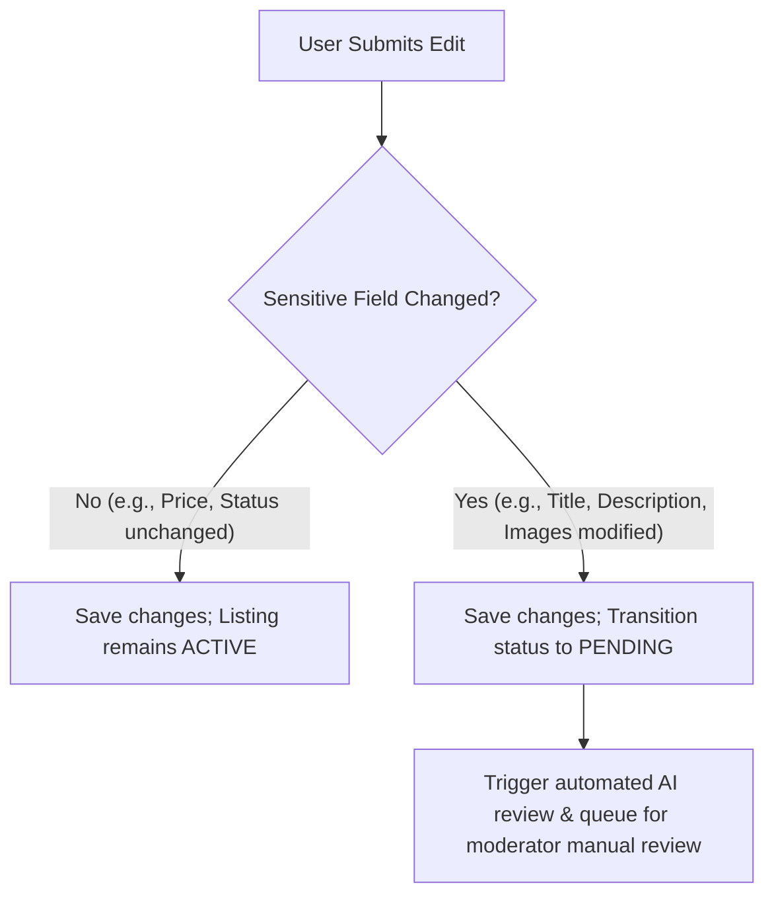

# Architecture Flow SSOT

This is the Tier 1 Canonical Single Source of Truth (SSOT) defining the official execution paths, interaction sequences, and coordination rules for the core transactions of the Esparex platform. All frontend workflows, routing boundaries, and service architectures must execute according to these unified paths.

---

## 1. Post & Edit Ad Transaction Flow

### 1.1 Wizard Data Hydration
1. **Hydration Gate**: The frontend navigates to the edit wizard and waits strictly for `.edit-ad-wrapper` to be visible, ensuring fully hydrated state before interaction.
2. **Locked Identity Fields**: During an edit flow, all primary Step 1 taxonomy fields (Category, Brand, Model, and Service Type buttons) are locked and disabled.

### 1.2 Sensitive vs Non-Sensitive Diffing
When a user updates a listing, the backend evaluates changes to determine if re-moderation is required:

- **Sensitive Fields**: `title`, `description`, `location.coordinates`, and `images`. Modifying any of these automatically flags the listing for re-moderation.
- **Non-Sensitive Fields**: `price`, `contactDetails`, `attributes`. Modifying these updates the database in place without changing active state.

### 1.3 Image Upload Pipeline
- **Local Compression**: Images are compressed locally before S3 upload.
- **Hydration Sync**: Display a local blob preview immediately (`img[src^="blob:"]`).
- **Submission Block**: The wizard block must wait for asynchronous S3 upload to complete (receiving target URL) before enabling the form Save button, preventing submission of raw blobs.

---

## 2. Location Services (Single Prompt Rule)

To protect user experience and avoid prompt collisions, the location prompt system enforces a strict single-prompt restriction:

- **Global Limit**: Users must only ever be presented with exactly **one** location permission prompt per viewport.
- **Desktop/Global**: Handled exclusively by the global `UserHeader` component.
- **Mobile**: Handled exclusively by the global `MobileHeader` component.
- **Content Exclusions**: Child viewports, lists, search feeds, and content components are strictly forbidden from initiating independent geolocations prompts.

---

## 3. Back-Office Admin Moderation & Approval Flow

### 3.1 Status Modification Path
- **Centralized API Client**: Admins must update listing states exclusively through versioned routes (`PATCH /api/v1/admin/listings/:id/status`). Action-specific endpoints (like `/approve` or `/reject`) are prohibited.
- **Enum Restriction**: Hardcoded status literals (e.g., `'approved'`, `'pending'`) are banned. Component state must bind to canonical enums imported from `@shared/contracts`.

### 3.2 Single Shared UI Composition Policy
To prevent double-renders, access violations, and header drift:
- **Layout Level Rendering**: Shared UI layout elements (e.g., module tabs, breadcrumbs, page headers, and global filter boxes) must be rendered strictly at the Next.js page layout wrapper level.
- **Content Component Exclusion**: Child page content components must never re-render or contain duplicate headers, tabs, or filter wrappers.

---

## 4. Spotlight & Promotion Flow

- **Slot Deduction Policy**: Spotlight slots must be deducted from the user's active wallet/package at the database level inside a Mongoose transaction when the promotion goes live.
- **Status Alignment**: A listing cannot transition to a Spotlight state unless its underlying status is `Active` and has passed all security/moderation checks.
