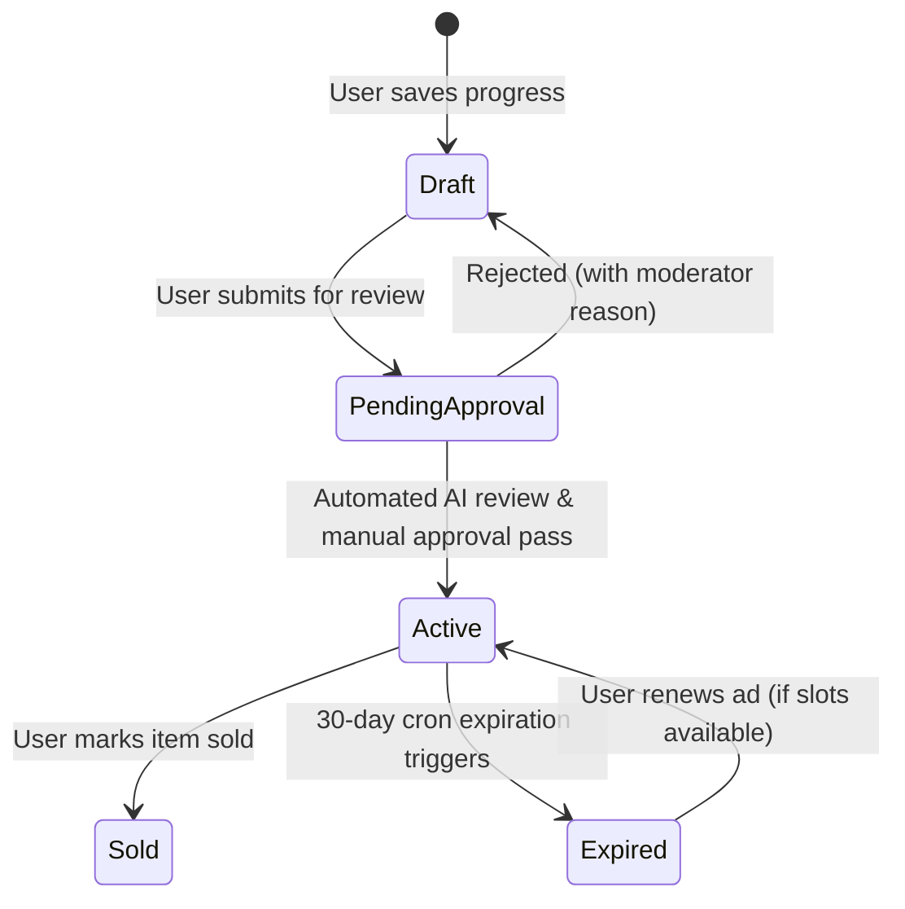

# Domain Model SSOT

This is the Tier 1 Canonical Single Source of Truth (SSOT) for the Esparex core business domains, user authorization roles, listing lifecycles, and database schema structures. All database definitions, validators, and backend schemas must conform to this document.

---

## 1. User Identity & Authorization

### 1.1 Roles and Hierarchy
The platform recognizes exactly four user roles:
1. **Super Admin**: Complete wildcard permission (`*`) over all system capabilities.
2. **Admin**: Platform administration, system settings modification, user moderation.
3. **Moderator**: Ad moderation, complaint review, report resolution.
4. **User**: Standard buyer, seller, and business profiles.

### 1.2 Authentication Resilience
- **Resilient Sessions**: Authentication checks must tolerate transient network errors (e.g. timeouts). Only hard `401 Unauthorized` or `403 Forbidden` responses from the API must trigger a session logout.
- **Direct Auth Cookie**: Cookies are strictly scoped to `.esparex.in` and must use `Secure` and `HttpOnly` flags in production.

---

## 2. Listing & Ad Lifecycle

### 2.1 Authorized Lifecycle States
Every ad listing must reside in exactly one of the following five lifecycle states:



- **Draft**: The listing is only visible to the owner. It is not indexable and cannot be searched.
- **Pending Approval**: The listing is locked for edits and is being analyzed by automated moderation screening (OpenAI/Gemini) and manual moderators.
- **Active**: The listing is live on the marketplace, searchable, and geo-indexed.
- **Sold**: The listing is marked as sold by the seller. It remains visible on the seller's dashboard but is removed from public search.
- **Expired**: The listing has completed its active duration (default: 30 days) and has been automatically deactivated by the Expiry Cron.

### 2.2 Canonical Lifecycle Rules
- **No Hard Deletes**: The deletion of a listing from the database is strictly forbidden. All deletions must be executed as soft-deletes by setting `isDeleted: true` on the database document.
- **Seller-Ownership Boundary**: A listing's seller identification (`sellerId` or `userId` depending on context) must be established at the API level from the authenticated session. Direct client mutation of `sellerId` is strictly prohibited.

---

## 3. Location Services & Database GeoJSON Standards

All geolocation-aware search engines and listings must store location data in strict compliance with the following GeoJSON formats:

### 3.1 Point Type
Every location-based field in Mongoose models (e.g. `location.coordinates` in `Listing` and `Business`) must be defined as a GeoJSON `Point`.

### 3.2 Geocoordinates Array
- Coordinates must be represented as a two-dimensional array of `[longitude, latitude]`.
- **CRITICAL**: Longitude MUST be index 0, and Latitude MUST be index 1.
- Range bounds: Longitude must be between `-180` and `180`. Latitude must be between `-90` and `90`.

### 3.3 2dsphere Indexes
- Every database collection performing proximity query searches (e.g. `$near`, `$nearSphere`, `$geoWithin`) MUST define a `2dsphere` index on its coordinate field.
- Model definitions:
  ```typescript
  listingSchema.index({ "location.coordinates": "2dsphere" });
  ```
- Enforced programmatically by `scripts/enforce-ad-ssot-guard.js`.

---

## 4. Database Canonical Mapping

| Asset / Schema | Mongoose Model | Database Collection | Authority |
| :--- | :--- | :--- | :--- |
| **Listing** | `Listing` | `listings` | Core |
| **User** | `User` | `users` | User DB |
| **Location** | `Location` | `locations` | Master Locations |
| **Business** | `Business` | `businesses` | Business DB |
